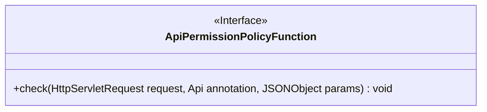
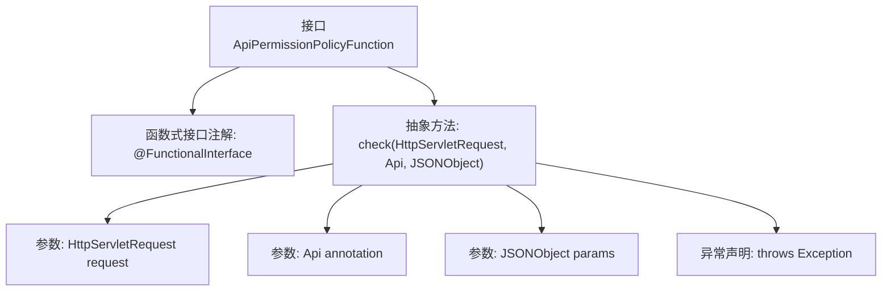

# 基础信息

|      |      |
|------|------|
| 名称 | ApiPermissionPolicyFunction |
| 编码语言 | .java |
| 代码路径 | WeFe/common/java/common-web/src/main/java/com/welab/wefe/common/web/function/ApiPermissionPolicyFunction.java |
| 包名 | com.welab.wefe.common.web.function |
| 依赖项 | ['javax.servlet.http.HttpServletRequest', 'com.alibaba.fastjson.JSONObject', 'com.welab.wefe.common.web.api.base.Api'] |
| 概述说明 | 这是一个函数式接口，定义了一个检查API权限的方法，接收请求、API注解和参数，可能抛出异常。 |

# 说明

这是一个名为ApiPermissionPolicyFunction的函数式接口，使用@FunctionalInterface注解标记。接口定义了一个check方法，接收HttpServletRequest请求对象、Api注解和JSONObject参数作为输入，可能抛出异常。该方法用于实现API权限检查逻辑，无返回值。

# 类列表 Class Summary

| 名称   | 类型  | 说明 |
|-------|------|-------------|
| ApiPermissionPolicyFunction | interface | Java函数式接口，定义检查API权限的方法，参数为请求、API注解和JSON参数，可能抛出异常。 |

## 类 ApiPermissionPolicyFunction

|      |      |
|------|------|
| 访问范围 | @FunctionalInterface;public |
| 类型 | interface |
| 名称 | ApiPermissionPolicyFunction |
| 说明 | Java函数式接口，定义检查API权限的方法，参数为请求、API注解和JSON参数，可能抛出异常。 |

### UML类图

这段代码定义了一个名为`ApiPermissionPolicyFunction`的函数式接口，使用`@FunctionalInterface`注解标记。该接口包含一个抽象方法`check`，接收`HttpServletRequest`、`Api`注解和`JSONObject`参数，无返回值但可能抛出异常。接口设计用于实现API权限校验策略，通过参数传递请求上下文、API元数据和JSON参数，供具体实现类进行权限验证。

### 内部方法调用关系图

该流程图展示了ApiPermissionPolicyFunction接口的结构，这是一个标记为@FunctionalInterface的函数式接口，核心是定义了check方法。该方法接收三个参数：HttpServletRequest请求对象、Api注解对象和JSONObject参数对象，并可能抛出Exception异常。由于是函数式接口，它隐含着只能有一个抽象方法的约束，适合用于Lambda表达式或方法引用场景。

### 字段列表 Field List

| 名称  | 类型  | 说明 |
|-------|-------|------|

### 方法列表

| 名称  | 类型  | 说明 |
|-------|-------|------|
| check | void | 检查HTTP请求、API注解和JSON参数，可能抛出异常。 |

