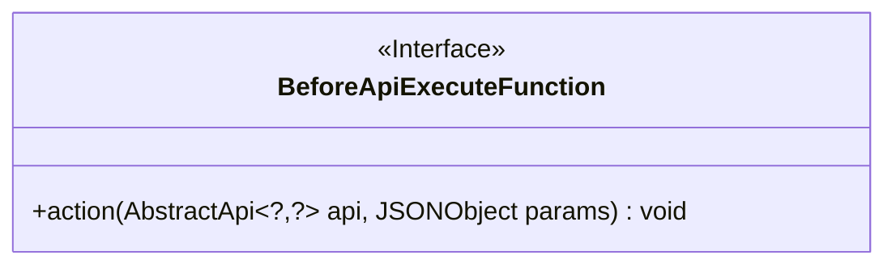
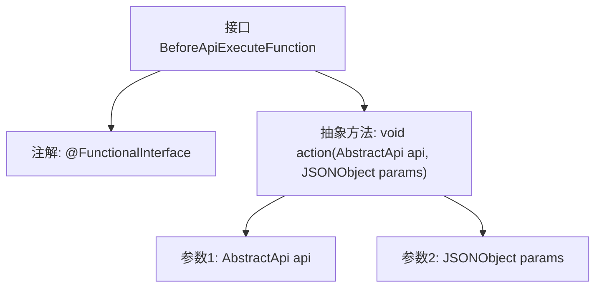

# 基础信息

|      |      |
|------|------|
| 名称 | BeforeApiExecuteFunction |
| 编码语言 | .java |
| 代码路径 | WeFe/common/java/common-web/src/main/java/com/welab/wefe/common/web/function/BeforeApiExecuteFunction.java |
| 包名 | com.welab.wefe.common.web.function |
| 依赖项 | ['com.alibaba.fastjson.JSONObject', 'com.welab.wefe.common.web.api.base.AbstractApi'] |
| 概述说明 | 这是一个函数式接口BeforeApiExecuteFunction，定义了一个action方法，用于在API执行前处理API实例和参数。 |

# 说明

这是一个名为BeforeApiExecuteFunction的函数式接口，使用@FunctionalInterface注解标记。该接口定义了一个名为action的抽象方法，接受两个参数：一个类型为AbstractApi<?, ?>的api对象和一个JSONObject类型的params对象。方法返回类型为void，表示执行操作但不返回结果。该接口设计用于在API执行前进行某些操作，参数类型使用泛型和JSON对象提供了灵活性。

# 类列表 Class Summary

| 名称   | 类型  | 说明 |
|-------|------|-------------|
| BeforeApiExecuteFunction | interface | Java函数式接口BeforeApiExecuteFunction，定义action方法，接收AbstractApi和JSONObject参数，无返回值。 |

## 类 BeforeApiExecuteFunction

|      |      |
|------|------|
| 访问范围 | @FunctionalInterface;public |
| 类型 | interface |
| 名称 | BeforeApiExecuteFunction |
| 说明 | Java函数式接口BeforeApiExecuteFunction，定义action方法，接收AbstractApi和JSONObject参数，无返回值。 |

### UML类图

这段代码定义了一个函数式接口`BeforeApiExecuteFunction`，该接口包含一个抽象方法`action`，用于在API执行前执行某些操作。接口使用了泛型参数`AbstractApi<?,?>`表示可以接受任意类型的API对象，同时接收一个JSONObject作为参数。作为函数式接口，它适合用于实现回调或拦截器模式，通常在API调用链中作为前置处理器使用。

### 内部方法调用关系图

该流程图展示了一个函数式接口`BeforeApiExecuteFunction`的结构。顶部标注了`@FunctionalInterface`注解，表明这是一个函数式接口。核心部分是一个名为`action`的抽象方法，该方法接收两个参数：泛型类型的`AbstractApi`对象和`JSONObject`参数。由于是函数式接口，该接口只能包含这一个抽象方法，适用于Lambda表达式或方法引用场景。

### 字段列表 Field List

| 名称  | 类型  | 说明 |
|-------|-------|------|

### 方法列表

| 名称  | 类型  | 说明 |
|-------|-------|------|
| action | void | 抽象API操作方法，接收任意类型API对象和JSON参数。 |

