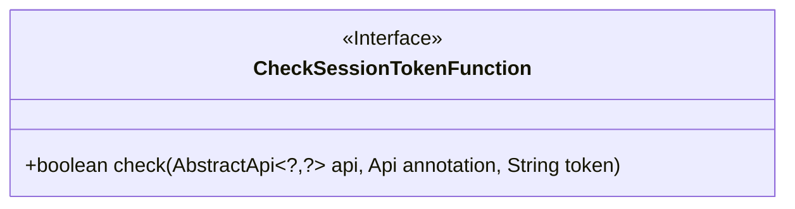
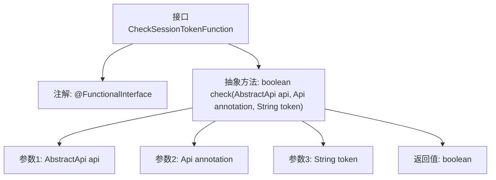

# 基础信息

|      |      |
|------|------|
| 名称 | CheckSessionTokenFunction |
| 编码语言 | .java |
| 代码路径 | WeFe/common/java/common-web/src/main/java/com/welab/wefe/common/web/function/CheckSessionTokenFunction.java |
| 包名 | com.welab.wefe.common.web.function |
| 依赖项 | ['com.welab.wefe.common.web.api.base.AbstractApi', 'com.welab.wefe.common.web.api.base.Api'] |
| 概述说明 | Java函数式接口CheckSessionTokenFunction，定义check方法，用于验证API会话令牌，参数为API实例、注解及令牌字符串，返回布尔值。 |

# 说明

这是一个名为CheckSessionTokenFunction的函数式接口，用于检查会话令牌的有效性。接口包含一个抽象方法check，接收三个参数：AbstractApi类型的api对象、Api类型的注解对象和表示身份标识的字符串token。方法返回布尔值表示验证结果。接口标注了@FunctionalInterface表明它是函数式接口，仅包含一个抽象方法。注释简要说明了参数用途，其中token参数用于身份识别。该接口设计简洁，专注于令牌验证功能。

# 类列表 Class Summary

| 名称   | 类型  | 说明 |
|-------|------|-------------|
| CheckSessionTokenFunction | interface | 功能接口CheckSessionTokenFunction定义检查会话令牌方法，接收API实例、注解及令牌参数，返回布尔值。 |

## 类 CheckSessionTokenFunction

|      |      |
|------|------|
| 访问范围 | @FunctionalInterface;public |
| 类型 | interface |
| 名称 | CheckSessionTokenFunction |
| 说明 | 功能接口CheckSessionTokenFunction定义检查会话令牌方法，接收API实例、注解及令牌参数，返回布尔值。 |

### UML类图

这段代码定义了一个函数式接口`CheckSessionTokenFunction`，该接口包含一个抽象方法`check`，用于验证会话令牌。方法接收三个参数：一个泛型`AbstractApi`实例、`Api`注解对象和字符串类型的令牌，返回布尔值表示验证结果。接口使用`@FunctionalInterface`注解标记，表明它是函数式接口，适合用于Lambda表达式或方法引用场景。类图清晰地展示了接口的结构和单一抽象方法的签名。

### 内部方法调用关系图

这段代码定义了一个函数式接口CheckSessionTokenFunction，使用@FunctionalInterface注解标记，表示该接口只能包含一个抽象方法。接口的核心功能是通过check方法验证会话令牌，接收三个参数：一个泛型抽象API对象、API注解和令牌字符串，返回布尔类型验证结果。该设计常用于需要动态注入令牌验证逻辑的场景，如API网关或权限控制层。

### 字段列表 Field List

| 名称  | 类型  | 说明 |
|-------|-------|------|

### 方法列表

| 名称  | 类型  | 说明 |
|-------|-------|------|
| check | boolean | 检查API与注解是否匹配，验证token有效性。 |

