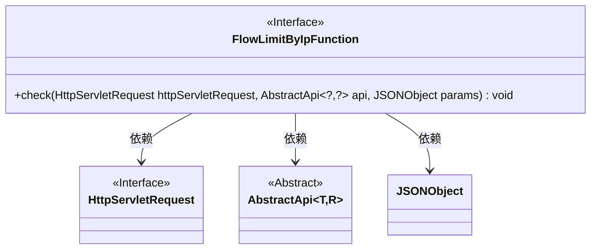
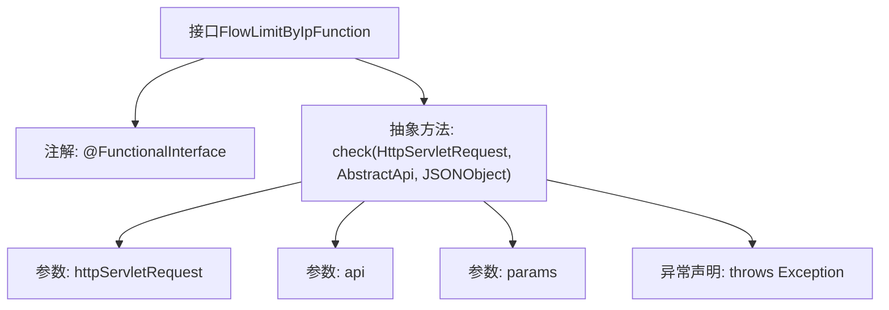

# 基础信息

|      |      |
|------|------|
| 名称 | FlowLimitByIpFunction |
| 编码语言 | .java |
| 代码路径 | WeFe/common/java/common-web/src/main/java/com/welab/wefe/common/web/function/FlowLimitByIpFunction.java |
| 包名 | com.welab.wefe.common.web.function |
| 依赖项 | ['com.alibaba.fastjson.JSONObject', 'com.welab.wefe.common.web.api.base.AbstractApi', 'javax.servlet.http.HttpServletRequest'] |
| 概述说明 | FlowLimitByIpFunction是函数式接口，定义check方法用于IP限流检查，参数为请求、API和JSON参数，可能抛出异常。 |

# 说明

这是一个名为FlowLimitByIpFunction的函数式接口，使用@FunctionalInterface注解标记。它定义了一个check方法，接收三个参数：HttpServletRequest对象、AbstractApi泛型对象和JSONObject对象。该方法用于检查逻辑，可能涉及基于IP的流量限制，执行时可能抛出异常。接口设计简洁，专注于单一职责，适用于Lambda表达式实现。

# 类列表 Class Summary

| 名称   | 类型  | 说明 |
|-------|------|-------------|
| FlowLimitByIpFunction | interface | Java函数式接口FlowLimitByIpFunction，定义check方法，用于基于IP的流量限制检查，参数包括HttpServletRequest、AbstractApi和JSONObject，可能抛出异常。 |

## 类 FlowLimitByIpFunction

|      |      |
|------|------|
| 访问范围 | @FunctionalInterface;public |
| 类型 | interface |
| 名称 | FlowLimitByIpFunction |
| 说明 | Java函数式接口FlowLimitByIpFunction，定义check方法，用于基于IP的流量限制检查，参数包括HttpServletRequest、AbstractApi和JSONObject，可能抛出异常。 |

### UML类图

这段类图展示了一个函数式接口`FlowLimitByIpFunction`及其依赖关系。该接口定义了唯一抽象方法`check()`，接收`HttpServletRequest`、泛型抽象类`AbstractApi`和`JSONObject`作为参数。其中`HttpServletRequest`是Servlet规范中的接口，`AbstractApi`使用泛型参数表示请求/响应类型，`JSONObject`用于处理JSON数据。整个设计体现了基于IP的流量检查功能的核心契约。

### 内部方法调用关系图

该流程图展示了FlowLimitByIpFunction接口的结构，它是一个函数式接口（标注@FunctionalInterface），核心是定义了check方法。该方法接收三个参数：HttpServletRequest对象、泛型AbstractApi对象和JSONObject参数，并可能抛出Exception异常。图中清晰呈现了接口的注解、方法签名、参数列表和异常声明之间的层级关系，符合函数式接口的单一抽象方法特征。

### 字段列表 Field List

| 名称  | 类型  | 说明 |
|-------|-------|------|

### 方法列表

| 名称  | 类型  | 说明 |
|-------|-------|------|
| check | void | 检查HTTP请求、API对象和JSON参数的方法，可能抛出异常。 |

