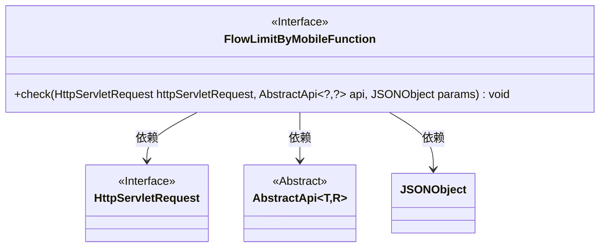
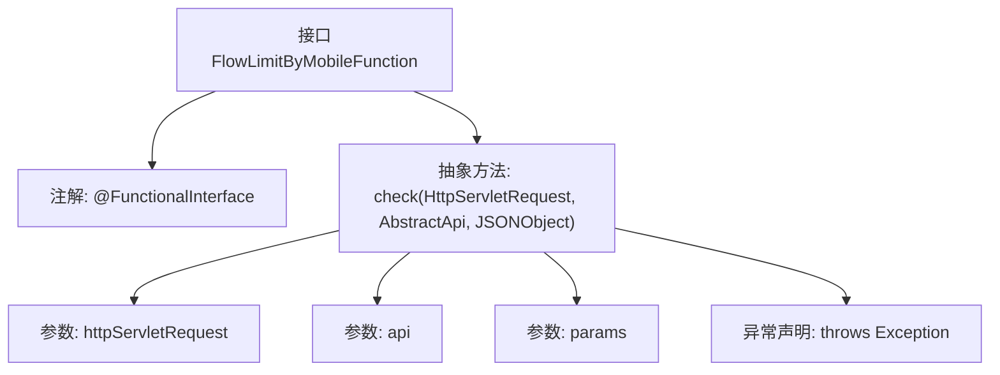

# 基础信息

|      |      |
|------|------|
| 名称 | FlowLimitByMobileFunction |
| 编码语言 | .java |
| 代码路径 | WeFe/common/java/common-web/src/main/java/com/welab/wefe/common/web/function/FlowLimitByMobileFunction.java |
| 包名 | com.welab.wefe.common.web.function |
| 依赖项 | ['com.alibaba.fastjson.JSONObject', 'com.welab.wefe.common.web.api.base.AbstractApi', 'javax.servlet.http.HttpServletRequest'] |
| 概述说明 | 这是一个函数式接口，用于通过手机号进行流量限制检查，接收请求、API和参数，可能抛出异常。 |

# 说明

这是一个名为FlowLimitByMobileFunction的函数式接口，使用@FunctionalInterface注解标记。该接口定义了一个check方法，接收三个参数：HttpServletRequest类型的httpServletRequest、AbstractApi<?, ?>类型的api和JSONObject类型的params。方法可能抛出Exception异常。该接口主要用于基于移动设备的流量限制检查功能。

# 类列表 Class Summary

| 名称   | 类型  | 说明 |
|-------|------|-------------|
| FlowLimitByMobileFunction | interface | 这是一个函数式接口，定义了一个基于手机号的流量限制检查方法，接收请求对象、API和参数，可能抛出异常。 |

## 类 FlowLimitByMobileFunction

|      |      |
|------|------|
| 访问范围 | @FunctionalInterface;public |
| 类型 | interface |
| 名称 | FlowLimitByMobileFunction |
| 说明 | 这是一个函数式接口，定义了一个基于手机号的流量限制检查方法，接收请求对象、API和参数，可能抛出异常。 |

### UML类图

该图展示了一个函数式接口`FlowLimitByMobileFunction`及其依赖关系。接口定义了`check`方法，接收`HttpServletRequest`、泛型抽象类`AbstractApi`和`JSONObject`参数。`HttpServletRequest`和`AbstractApi`均为接口/抽象类，用特殊标记标注。箭头表示`FlowLimitByMobileFunction`对这三个类的单向依赖关系，用于方法参数传递。

### 内部方法调用关系图

该流程图展示了一个函数式接口`FlowLimitByMobileFunction`的结构，包含`@FunctionalInterface`注解和唯一的抽象方法`check`。方法接收三个参数：`HttpServletRequest`请求对象、泛型`AbstractApi`接口对象和`JSONObject`参数对象，并声明可能抛出`Exception`异常。该接口设计用于移动端流量限制校验场景，符合函数式编程规范。

### 字段列表 Field List

| 名称  | 类型  | 说明 |
|-------|-------|------|

### 方法列表

| 名称  | 类型  | 说明 |
|-------|-------|------|
| check | void | 检查HTTP请求、API对象和JSON参数的方法，可能抛出异常。 |

