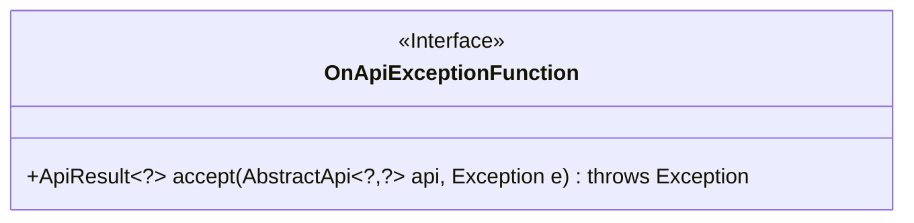
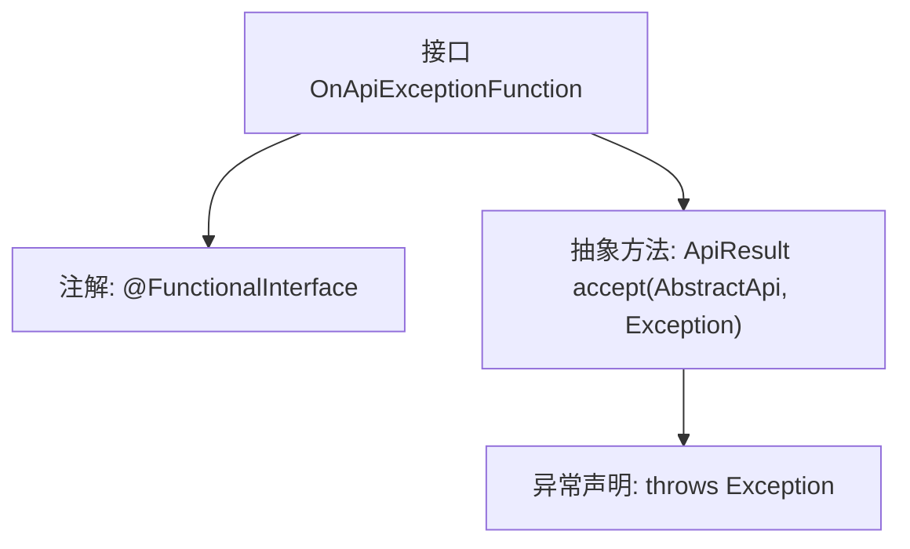

# 基础信息

|      |      |
|------|------|
| 名称 | OnApiExceptionFunction |
| 编码语言 | .java |
| 代码路径 | WeFe/common/java/common-web/src/main/java/com/welab/wefe/common/web/function/OnApiExceptionFunction.java |
| 包名 | com.welab.wefe.common.web.function |
| 依赖项 | ['com.welab.wefe.common.web.api.base.AbstractApi', 'com.welab.wefe.common.web.dto.ApiResult'] |
| 概述说明 | 函数式接口，定义异常处理函数，接收API和异常，返回结果或抛出异常。 |

# 说明

这是一个名为OnApiExceptionFunction的函数式接口，用于处理API异常情况。它定义了一个accept方法，接收两个参数：AbstractApi类型的api对象和Exception类型的异常对象。该方法返回一个泛型化的ApiResult对象，并可能抛出Exception异常。该接口被@FunctionalInterface注解标记，表示它可以用作lambda表达式或方法引用的目标。主要用途是在API调用发生异常时提供统一的异常处理机制。

# 类列表 Class Summary

| 名称   | 类型  | 说明 |
|-------|------|-------------|
| OnApiExceptionFunction | interface | 函数式接口OnApiExceptionFunction定义异常处理方法，接收api和异常参数，返回ApiResult或抛出异常。 |

## 类 OnApiExceptionFunction

|      |      |
|------|------|
| 访问范围 | @FunctionalInterface;public |
| 类型 | interface |
| 名称 | OnApiExceptionFunction |
| 说明 | 函数式接口OnApiExceptionFunction定义异常处理方法，接收api和异常参数，返回ApiResult或抛出异常。 |

### UML类图

这段代码定义了一个名为`OnApiExceptionFunction`的函数式接口，使用`@FunctionalInterface`注解标记。该接口包含一个抽象方法`accept`，该方法接收一个`AbstractApi`泛型对象和一个`Exception`对象作为参数，返回一个`ApiResult`泛型对象，并可能抛出异常。接口设计用于处理API异常场景，通过泛型参数（`?`表示未知类型）提供了类型灵活性。类图中清晰地展示了接口的结构和方法的签名细节。

### 内部方法调用关系图

该流程图描述了OnApiExceptionFunction接口的结构，它是一个函数式接口（标注@FunctionalInterface），包含一个accept抽象方法。该方法接收AbstractApi泛型对象和Exception参数，返回ApiResult泛型结果，并声明可能抛出Exception异常。整个设计用于统一处理API调用时的异常场景，通过函数式编程实现灵活的错误处理逻辑。

### 字段列表 Field List

| 名称  | 类型  | 说明 |
|-------|-------|------|

### 方法列表

| 名称  | 类型  | 说明 |
|-------|-------|------|
| accept | ApiResult<?> | 接口方法：接受API和异常参数，返回泛型结果，可能抛出异常。 |

