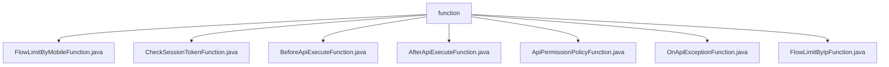

# 基础信息

|      |      |
|------|------|
| 名称 | function |
| 编码语言 | .java |
| 代码路径 | WeFe/common/java/common-web/src/main/java/com/welab/wefe/common/web/function |
| 包名 | docs.common.java.common-web.src.main.java.com.welab.wefe.common.web.function |
| 概述说明 | FlowLimitByMobileFunction检查移动设备流量限制。CheckSessionTokenFunction验证会话令牌有效性。BeforeApiExecuteFunction在API执行前操作。AfterApiExecuteFunction处理API执行后回调。ApiPermissionPolicyFunction检查API权限。OnApiExceptionFunction处理API异常。FlowLimitByIpFunction检查IP流量限制。 |

# 说明

## 概述  
该模块核心职责是提供Web API执行过程中的各类Hook函数，类似中间件机制，涵盖权限校验、流量控制、异常处理等环节。接口规范统一采用函数式接口设计，均标注@FunctionalInterface，包含check/action/accept等单方法，参数多组合HttpServletRequest、AbstractApi和JSONObject。关键数据结构包括ApiResult（异常处理返回）、Api注解（权限元数据）和JSONObject（参数容器）。外部依赖仅Servlet API和JSON库。例如FlowLimitByIpFunction实现IP限流，OnApiExceptionFunction统一捕获异常。

## 主要业务场景  
模块支撑API全生命周期管理，形成"校验-前置-执行-后置-异常"完整链路。典型如先通过CheckSessionTokenFunction验证令牌，再经BeforeApiExecuteFunction预处理参数，最终由AfterApiExecuteFunction记录日志。交互模式类似责任链，各函数可插拔组合。例如ApiPermissionPolicyFunction实现RBAC权限控制，FlowLimitByMobileFunction进行设备级限流。集成案例包括校验IP与移动端双维度流量（FlowLimitByIpFunction+FlowLimitByMobileFunction），以及异常时返回友好错误（OnApiExceptionFunction）。

### 包内部结构视图

该流程图展示了WeFe项目中common-web模块下function目录的结构关系。根节点function包含7个直接子节点，均为实现不同功能的Java类文件，包括流控、会话校验、API执行前后处理、权限策略和异常处理等功能接口。所有类文件均位于同一层级，没有嵌套子目录结构，体现了函数式编程接口的扁平化设计。

# 文件列表

| 名称   | 类型  | 说明 |
|-------|------|-------------|
| [FlowLimitByMobileFunction.java](FlowLimitByMobileFunction.md) | file | 这是一个函数式接口，用于通过手机号进行流量限制检查，接收请求、API和参数，可能抛出异常。 |
| [CheckSessionTokenFunction.java](CheckSessionTokenFunction.md) | file | Java函数式接口CheckSessionTokenFunction，定义check方法，用于验证API会话令牌，参数为API实例、注解及令牌字符串，返回布尔值。 |
| [BeforeApiExecuteFunction.java](BeforeApiExecuteFunction.md) | file | 这是一个函数式接口BeforeApiExecuteFunction，定义了一个action方法，用于在API执行前处理API实例和参数。 |
| [AfterApiExecuteFunction.java](AfterApiExecuteFunction.md) | file | 这是一个函数式接口，定义API执行后的回调方法，参数包括请求对象、起始时间、API实例、参数和结果。 |
| [ApiPermissionPolicyFunction.java](ApiPermissionPolicyFunction.md) | file | 这是一个函数式接口，定义了一个检查API权限的方法，接收请求、API注解和参数，可能抛出异常。 |
| [OnApiExceptionFunction.java](OnApiExceptionFunction.md) | file | 函数式接口，定义异常处理函数，接收API和异常，返回结果或抛出异常。 |
| [FlowLimitByIpFunction.java](FlowLimitByIpFunction.md) | file | FlowLimitByIpFunction是函数式接口，定义check方法用于IP限流检查，参数为请求、API和JSON参数，可能抛出异常。 |

