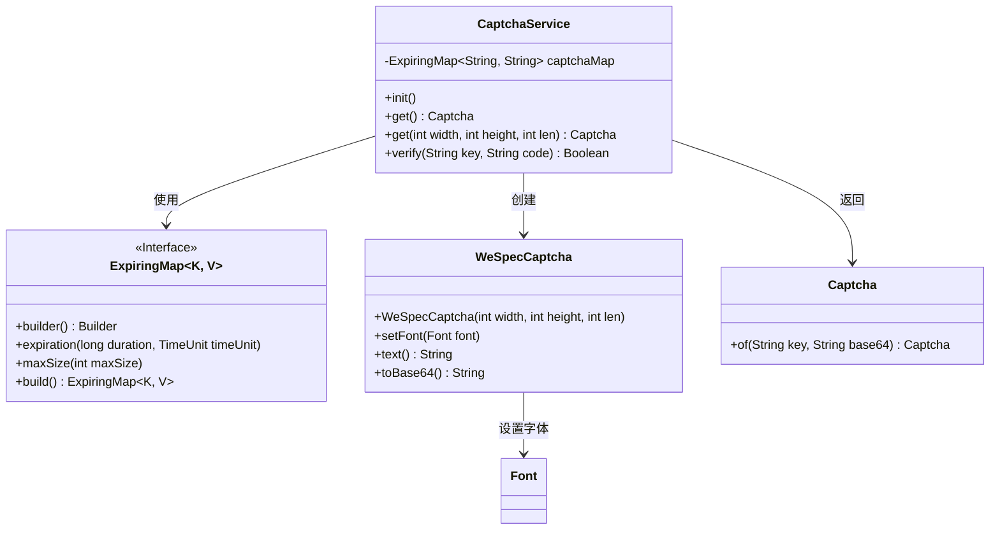
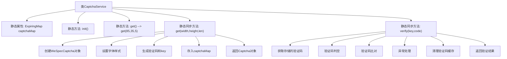

# 基础信息

|      |      |
|------|------|
| 名称 | CaptchaService |
| 编码语言 | .java |
| 代码路径 | WeFe/common/java/common-web/src/main/java/com/welab/wefe/common/web/service/CaptchaService.java |
| 包名 | com.welab.wefe.common.web.service |
| 依赖项 | ['com.welab.wefe.common.WeSpecCaptcha', 'com.welab.wefe.common.web.dto.Captcha', 'net.jodah.expiringmap.ExpiringMap', 'org.slf4j.Logger', 'org.slf4j.LoggerFactory', 'java.awt', 'java.util.UUID', 'java.util.concurrent.TimeUnit'] |
| 概述说明 | CaptchaService类提供验证码功能，包括生成、存储和验证。验证码60秒过期，最大存储10000个。生成方法支持自定义宽高和长度，验证方法检查后删除验证码。 |

# 说明

CaptchaService是一个验证码服务类，使用ExpiringMap存储验证码，有效期60秒，最大容量10000。提供获取和验证验证码功能。获取验证码时可指定宽度、高度和长度，默认85x35像素和5位长度，生成楷体24号字的验证码图片并转为Base64，同时生成唯一key存入映射表。验证时根据key获取验证码，与输入比对后无论成功与否都移除该key。异常时记录日志。所有操作线程安全。

# 类列表 Class Summary

| 名称   | 类型  | 说明 |
|-------|------|-------------|
| CaptchaService | class | CaptchaService类提供验证码生成与验证功能，使用ExpiringMap存储验证码（60秒过期），支持自定义尺寸和长度，验证后自动移除。 |

## 类 CaptchaService

|      |      |
|------|------|
| 访问范围 | public |
| 类型 | class |
| 名称 | CaptchaService |
| 说明 | CaptchaService类提供验证码生成与验证功能，使用ExpiringMap存储验证码（60秒过期），支持自定义尺寸和长度，验证后自动移除。 |

### UML类图

这段代码展示了一个验证码服务系统，核心类CaptchaService通过ExpiringMap管理验证码的生命周期，使用WeSpecCaptcha生成图形验证码，并通过Captcha类封装返回结果。系统提供验证码生成（支持自定义尺寸和长度）和验证功能，具有线程安全设计和自动过期清理机制。ExpiringMap作为核心存储组件，确保验证码60秒后自动失效，同时限制最大存储量防止内存溢出。整个架构体现了高内聚低耦合的设计原则。

### 内部方法调用关系图

该流程图展示了CaptchaService类的完整工作流程。类核心功能包括：1) 通过get方法生成带过期时间的图形验证码，涉及WeSpecCaptcha对象创建、样式设置和缓存存储；2) 通过verify方法进行验证码校验，包含异常处理和自动清理机制。验证码采用UUID作为key存储于ExpiringMap，默认60秒过期，最大容量10000条，所有关键操作均通过同步方法保证线程安全。

### 字段列表 Field List

| 名称  | 类型  | 说明 |
|-------|-------|------|
| LOG = LoggerFactory.getLogger(CaptchaService.class) | Logger | CaptchaService类中定义了一个静态不可变的日志记录器实例LOG。 |
| captchaMap = ExpiringMap            .builder()            .expiration(60, TimeUnit.SECONDS)            .maxSize(10000)            .build() | ExpiringMap<String, String> | 创建了一个静态的ExpiringMap实例captchaMap，用于存储验证码，60秒后自动过期，最大容量为10000。 |

### 方法列表

| 名称  | 类型  | 说明 |
|-------|-------|------|
| get | Captcha | 获取验证码实例，默认参数宽85高35字符数5。 |
| get | Captcha | 静态同步方法生成验证码，设置宽高长度和楷体字体，生成小写验证码和随机键存入映射，返回键和Base64编码的验证码。 |
| init | void | 空初始化方法，无参数无操作。 |
| verify | Boolean | 同步静态方法验证码校验，检查key对应code是否匹配，匹配返回true，否则false，异常记录日志并清理缓存。 |

