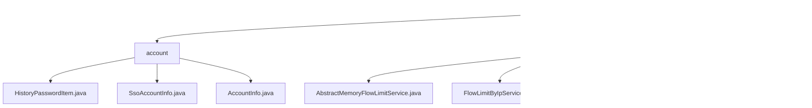

# 基础信息

|      |      |
|------|------|
| 名称 | service |
| 编码语言 | .java |
| 代码路径 | WeFe/common/java/common-web/src/main/java/com/welab/wefe/common/web/service |
| 包名 | docs.common.java.common-web.src.main.java.com.welab.wefe.common.web.service |
| 概述说明 | 账户管理模块统一管理用户信息和密码安全，提供标准化接口和数据结构。流量限制模块基于键值策略控制API访问频率，支持IP和手机号限流。验证码服务生成并验证Base64图片验证码，有效期60秒，线程安全。 |

# 说明

## 概述  
该模块包含三大核心组件：账户管理、流量控制和验证码服务。账户管理组件负责用户信息及密码安全的全生命周期管理，提供标准数据结构如AccountInfo和HistoryPasswordItem，依赖JSON处理库。流量控制组件采用类似令牌桶模式，通过ConcurrentHashMap实现多维度限流（如IP/手机号），依赖HttpServletRequest等。验证码服务使用ExpiringMap存储临时验证码，支持生成Base64图片和校验。例如密码修改自动归档历史记录，IP限流通过注解配置策略。

## 主要业务场景  
账户管理适用于注册、登录和状态流转场景，如通过adminRoleFlag控制权限。流量控制实现同步检查-阻断流程，例如手机号超限返回提示。验证码服务用于人机校验，生成后自动过期。典型模式包括：组合SsoAccountInfo扩展单点登录、滑动窗口算法计数限流、线程安全的验证码存取。API集成通过继承抽象类（如FlowLimitByIpService）或直接调用CaptchaService实现，涵盖CRUD、策略配置和实时校验等功能。

### 包内部结构视图

该流程图展示了WeFe项目中common-web模块下的服务类结构。根节点为service目录，包含account、flowlimit两个子目录和CaptchaService.java文件。account目录下有三个账户相关的实体类，flowlimit目录下包含四个流量限制相关的抽象类和实现类。整体结构清晰地反映了Web服务层的功能模块划分。

# 文件列表

| 名称   | 类型  | 说明 |
|-------|------|-------------|
| [CaptchaService.java](CaptchaService.md) | file | CaptchaService类提供验证码功能，包括生成、存储和验证。验证码60秒过期，最大存储10000个。生成方法支持自定义宽高和长度，验证方法检查后删除验证码。 |
| [flowlimit](flowlimit/_module.md) | package | AbstractMemoryFlowLimitService是抽象类，继承AbstractFlowLimitService，用ConcurrentHashMap缓存流量记录，后台线程清理过期数据。FlowLimitByIpService基于IP限流，通过请求获取IP生成唯一键。AbstractFlowLimitService提供基础限流机制，含check()方法和抽象策略定义。FlowLimitByMobileService基于手机号限流，从请求参数获取手机号生成限流键。 |
| [account](account/_module.md) | package | HistoryPasswordItem类存储密码和盐值，提供构造方法。SsoAccountInfo类管理单点登录用户信息，含ID、姓名、手机和邮箱字段。AccountInfo类定义账号数据结构，包含基础字段、业务属性和历史密码管理功能。 |

