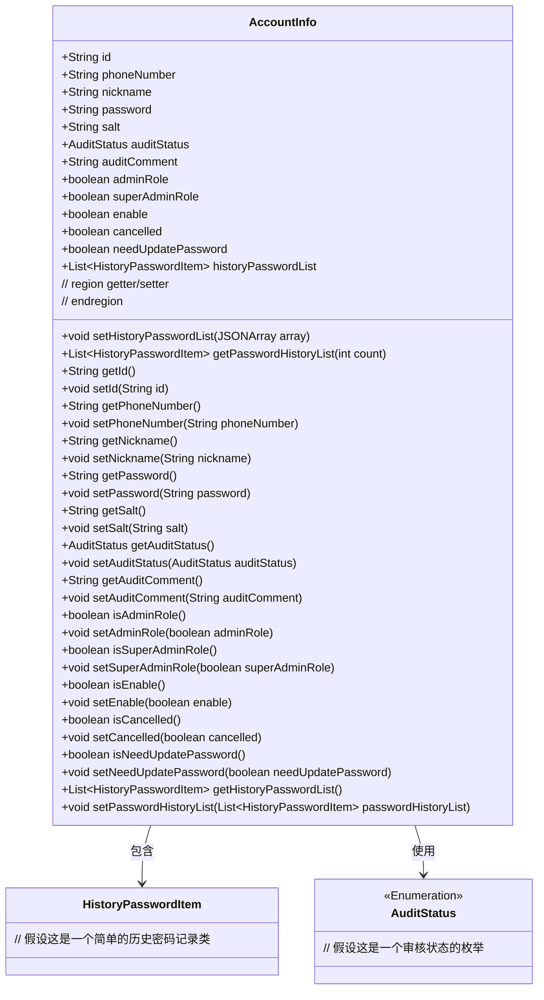
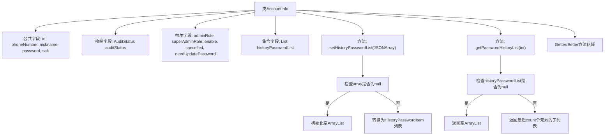

# 基础信息

|      |      |
|------|------|
| 名称 | AccountInfo |
| 编码语言 | .java |
| 代码路径 | WeFe/common/java/common-web/src/main/java/com/welab/wefe/common/web/service/account/AccountInfo.java |
| 包名 | com.welab.wefe.common.web.service.account |
| 依赖项 | ['com.alibaba.fastjson.JSONArray', 'com.welab.wefe.common.wefe.enums.AuditStatus', 'java.util.ArrayList', 'java.util.List'] |
| 概述说明 | AccountInfo类包含账号基础信息、审核状态、角色权限、密码历史等字段，提供getter/setter方法。 |

# 说明

AccountInfo类定义了账号信息的数据结构，包含id、手机号、昵称、密码、加密盐等基础字段。提供了账号审核状态、审核评论、管理员角色标识、启用状态、注销状态、密码修改标志等业务属性。维护了历史密码列表，支持通过JSON数组初始化历史密码数据，并提供获取最近N条历史密码的方法。类中为所有字段实现了标准的getter和setter方法，确保数据访问的封装性。该结构全面覆盖了账号管理相关的核心属性和操作需求。

# 类列表 Class Summary

| 名称   | 类型  | 说明 |
|-------|------|-------------|
| AccountInfo | class | AccountInfo类包含账号ID、手机号、昵称、密码、加密盐、审核状态、管理员标识、启用状态、注销状态及历史密码列表等属性，并提供相关getter/setter方法。 |

## 类 AccountInfo

|      |      |
|------|------|
| 访问范围 | public |
| 类型 | class |
| 名称 | AccountInfo |
| 说明 | AccountInfo类包含账号ID、手机号、昵称、密码、加密盐、审核状态、管理员标识、启用状态、注销状态及历史密码列表等属性，并提供相关getter/setter方法。 |

### UML类图

这段代码定义了一个账户信息类(AccountInfo)，包含用户基础信息、权限状态、审核状态以及历史密码记录等功能。该类通过多个公有字段存储账户核心数据，并提供了完整的getter/setter方法进行封装。特别包含了对历史密码列表的特殊处理方法(setHistoryPasswordList和getPasswordHistoryList)，能够处理JSON数据转换和分页查询。类图中显示了AccountInfo与HistoryPasswordItem、AuditStatus的关联关系，整体结构清晰展现了账户管理领域的核心数据模型。

### 内部方法调用关系图

该流程图展示了AccountInfo类的完整结构，包含12个字段（5个字符串、1个枚举、6个布尔值和1个集合）的核心数据模型，重点突出了两个特殊方法：setHistoryPasswordList处理JSON数组转换，getPasswordHistoryList实现历史密码记录的分页获取。所有字段均配有标准Getter/Setter方法，整体构成一个典型的账户信息管理实体类，适用于需要细粒度权限控制和密码历史追踪的系统。

### 字段列表 Field List

| 名称  | 类型  | 说明 |
|-------|-------|------|
| auditStatus | AuditStatus | 审计状态字段，表示对象的审核状态。 |
| needUpdatePassword | boolean | 布尔变量needUpdatePassword表示是否需要更新密码。 |
| nickname | String | 声明一个公开的字符串类型变量nickname。 |
| adminRole | boolean | 该代码定义了一个布尔类型的公共变量adminRole，用于表示管理员角色状态。 |
| password | String | 公开字符串类型变量password。 |
| historyPasswordList | List<HistoryPasswordItem> | 历史密码列表，存储HistoryPasswordItem对象。 |
| enable | boolean | 布尔型变量enable，表示启用状态。 |
| superAdminRole | boolean | 声明一个布尔类型变量superAdminRole，表示是否为超级管理员角色。 |
| id | String | 声明一个公开的字符串类型变量id。 |
| cancelled | boolean | 布尔变量cancelled，表示取消状态。 |
| phoneNumber | String | 公开字符串变量phoneNumber，用于存储电话号码。 |
| salt | String | 声明一个公开的字符串变量salt。 |
| auditComment | String | 类中定义了一个公开的字符串类型成员变量auditComment。 |

### 方法列表

| 名称  | 类型  | 说明 |
|-------|-------|------|
| getNickname | String | 方法返回用户昵称字符串。 |
| setId | void | 设置对象ID的方法，将参数id赋值给当前对象的id属性。 |
| setPhoneNumber | void | 设置电话号码的方法，将输入参数赋值给类成员变量phoneNumber。 |
| getAuditComment | String | 获取审计评语的方法，返回auditComment字符串。 |
| setAuditComment | void | 这是一个Java方法，用于设置auditComment属性的值。方法接收一个字符串参数auditComment，并将其赋值给类的同名成员变量。 |
| getPasswordHistoryList | List<HistoryPasswordItem> | 获取密码历史记录列表，最多返回指定数量的条目。若列表为空则返回空列表。 |
| isSuperAdminRole | boolean | 检查是否为超级管理员角色。 |
| setAdminRole | void | 定义方法设置管理员角色，参数为布尔值adminRole，赋值给类成员变量adminRole。 |
| setSuperAdminRole | void | 设置用户是否为超级管理员角色的方法，参数为布尔值。 |
| isAdminRole | boolean | 检查是否为管理员角色，返回布尔值adminRole。 |
| getAuditStatus | AuditStatus | 获取审计状态的方法，返回auditStatus值。 |
| setPassword | void | 设置密码方法，将输入字符串赋值给类成员变量password。 |
| getId | String | 方法getId返回字符串类型的id值。 |
| setHistoryPasswordList | void | 方法`setHistoryPasswordList`接收一个JSON数组参数，若为空则初始化空列表，否则将其转换为`HistoryPasswordItem`类型的列表并赋值给成员变量。 |
| setNickname | void | 设置用户昵称的方法，将输入参数赋值给对象的nickname属性。 |
| setAuditStatus | void | 设置审计状态的方法，将传入的auditStatus赋值给当前对象的auditStatus属性。 |
| setSalt | void | 设置字符串类型的盐值属性。 |
| isCancelled | boolean | 方法返回布尔值，表示是否已取消。 |
| setCancelled | void | 设置取消状态的公共方法，参数为布尔值cancelled，用于更新内部状态。 |
| isNeedUpdatePassword | boolean | 该方法返回布尔值needUpdatePassword，表示是否需要更新密码。 |
| setNeedUpdatePassword | void | 设置密码更新需求的方法，通过布尔参数控制是否需要更新密码。 |
| getHistoryPasswordList | List<HistoryPasswordItem> | 获取历史密码列表的方法，返回HistoryPasswordItem类型的列表。 |
| setPasswordHistoryList | void | 设置密码历史列表的方法，将输入的密码历史项列表赋值给类的历史密码列表变量。 |
| isEnable | boolean | 方法isEnable返回布尔值enable的状态。 |
| setEnable | void | 设置启用状态的布尔值方法。 |
| getPassword | String | 获取密码字符串的方法。 |
| getPhoneNumber | String | 这是一个Java方法，返回字符串类型的phoneNumber变量值。 |
| getSalt | String | 获取salt值的公共方法。 |

