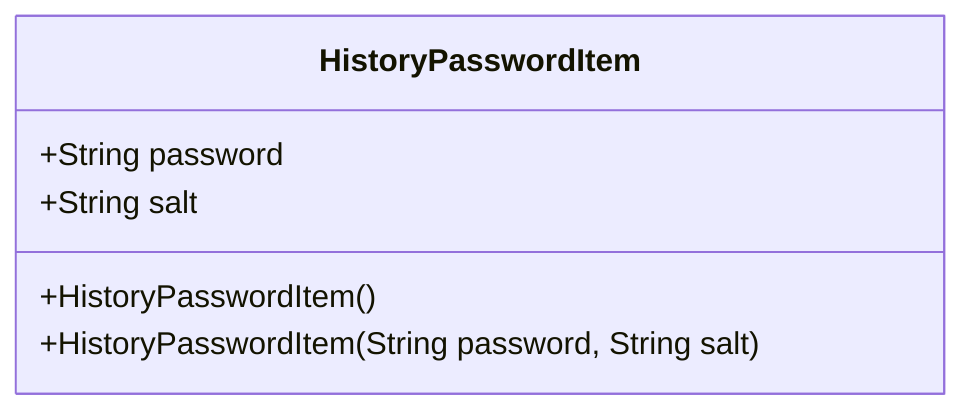
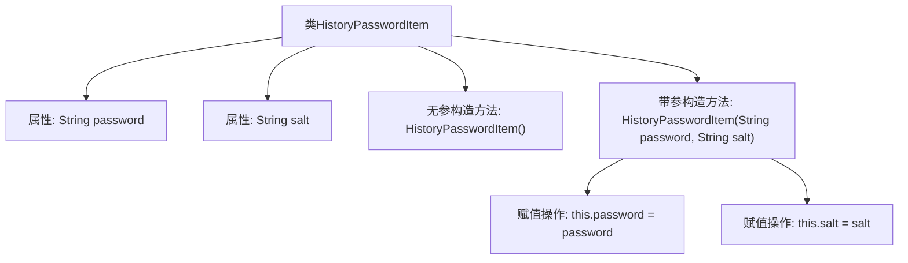

# 基础信息

|      |      |
|------|------|
| 名称 | HistoryPasswordItem |
| 编码语言 | .java |
| 代码路径 | WeFe/common/java/common-web/src/main/java/com/welab/wefe/common/web/service/account/HistoryPasswordItem.java |
| 包名 | com.welab.wefe.common.web.service.account |
| 依赖项 | [] |
| 概述说明 | HistoryPasswordItem类包含密码和盐值字段，提供无参和带参构造函数。 |

# 说明

HistoryPasswordItem是一个Java类，用于存储历史密码信息。该类包含两个字符串类型成员变量：password表示密码内容，salt表示加密盐值。提供了两个构造方法：一个无参构造方法用于默认初始化，另一个构造方法接收password和salt参数进行初始化。

# 类列表 Class Summary

| 名称   | 类型  | 说明 |
|-------|------|-------------|
| HistoryPasswordItem | class | HistoryPasswordItem类存储历史密码和盐值，包含无参构造方法和带参构造方法。 |

## 类 HistoryPasswordItem

|      |      |
|------|------|
| 访问范围 | public |
| 类型 | class |
| 名称 | HistoryPasswordItem |
| 说明 | HistoryPasswordItem类存储历史密码和盐值，包含无参构造方法和带参构造方法。 |

### UML类图

这段代码定义了一个名为HistoryPasswordItem的类，用于存储历史密码及其对应的盐值。该类包含两个公有字符串字段(password和salt)，以及两个构造函数(一个无参构造函数和一个带参数的构造函数)。这个类的主要作用是封装历史密码数据，可以用于密码修改历史记录、密码安全性检查等场景。类设计简单直接，所有字段均为公有，便于外部直接访问和修改。

### 内部方法调用关系图

这段代码定义了一个名为HistoryPasswordItem的类，用于存储历史密码及其对应的盐值。类中包含两个字符串属性password和salt，以及两个构造方法：一个无参构造方法用于创建空对象，另一个带参构造方法用于初始化password和salt属性。流程图清晰地展示了类结构与构造方法的内部赋值逻辑，体现了对象初始化的两种方式。

### 字段列表 Field List

| 名称  | 类型  | 说明 |
|-------|-------|------|
| salt | String | 声明一个公开的字符串变量salt。 |
| password | String | 公开字符串类型变量password，存储密码信息。 |

### 方法列表

| 名称  | 类型  | 说明 |
|-------|-------|------|

