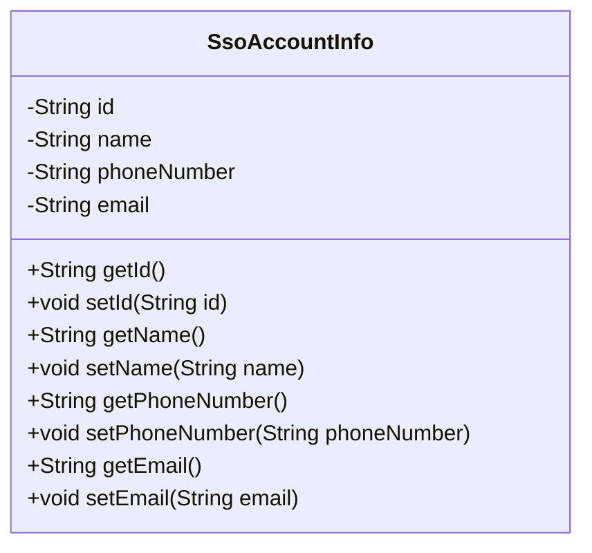
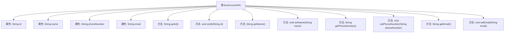

# 基础信息

|      |      |
|------|------|
| 名称 | SsoAccountInfo |
| 编码语言 | .java |
| 代码路径 | WeFe/common/java/common-web/src/main/java/com/welab/wefe/common/web/service/account/SsoAccountInfo.java |
| 包名 | com.welab.wefe.common.web.service.account |
| 依赖项 | [] |
| 概述说明 | SSO账户信息类，包含用户ID、姓名、手机号和邮箱字段及对应getter/setter方法。 |

# 说明

这是一个名为SsoAccountInfo的Java类，用于存储单点登录系统的用户账户信息。该类包含四个私有字符串类型字段：id表示用户唯一标识，name存储用户名，phoneNumber记录用户手机号，email保存用户邮箱地址。每个字段都配有对应的getter和setter方法，用于获取和设置字段值。这个类提供了对用户基本信息的封装和管理功能。

# 类列表 Class Summary

| 名称   | 类型  | 说明 |
|-------|------|-------------|
| SsoAccountInfo | class | SSO账户信息类，包含用户ID、姓名、手机号和邮箱字段及对应getter/setter方法。 |

## 类 SsoAccountInfo

|      |      |
|------|------|
| 访问范围 | public |
| 类型 | class |
| 名称 | SsoAccountInfo |
| 说明 | SSO账户信息类，包含用户ID、姓名、手机号和邮箱字段及对应getter/setter方法。 |

### UML类图

这段代码定义了一个名为SsoAccountInfo的类，用于存储单点登录系统的用户账户信息。该类包含四个私有属性：id（用户唯一标识）、name（用户名）、phoneNumber（手机号）和email（电子邮箱），并为每个属性提供了对应的getter和setter方法。这个类主要用于封装用户基本信息，便于在系统中传递和处理用户数据，体现了面向对象编程的封装特性。

### 内部方法调用关系图

该流程图展示了SsoAccountInfo类的完整结构，包含4个私有属性(id/name/phoneNumber/email)和对应的8个getter/setter方法。每个属性都有独立的方法对进行读写操作，形成标准的JavaBean模式。类结构清晰，属性与方法通过箭头连接，体现了面向对象封装特性。

### 字段列表 Field List

| 名称  | 类型  | 说明 |
|-------|-------|------|
| id | String | 私有字符串类型变量id。 |
| phoneNumber | String | 私有字符串类型变量phoneNumber |
| email | String | 定义私有字符串类型变量email。 |
| name | String | 声明一个私有字符串变量name。 |

### 方法列表

| 名称  | 类型  | 说明 |
|-------|-------|------|
| getName | String | 获取名称的方法，返回字符串类型的name变量值。 |
| setName | void | 设置对象名称的方法，将参数name赋值给对象的name属性。 |
| getPhoneNumber | String | 获取电话号码的方法，直接返回存储的phoneNumber字符串。 |
| getId | String | 获取对象ID的方法，返回字符串类型的id值。 |
| setId | void | 这是一个Java方法，用于设置对象的id属性。方法接收一个字符串参数id，并将其赋值给当前对象的id成员变量。 |
| setPhoneNumber | void | 设置电话号码的方法，将输入参数赋值给类的成员变量。 |
| getEmail | String | 获取email字符串的方法。 |
| setEmail | void | 设置对象邮箱属性的方法，参数为字符串类型的email。 |

