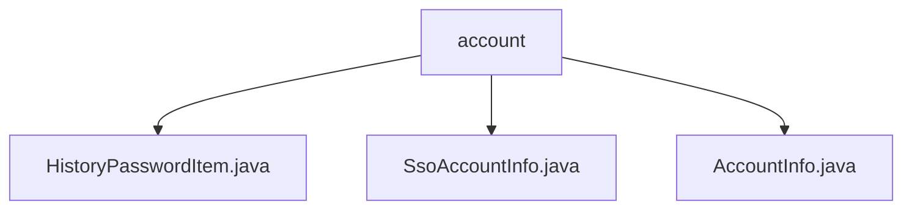

# 基础信息

|      |      |
|------|------|
| 名称 | account |
| 编码语言 | .java |
| 代码路径 | WeFe/common/java/common-web/src/main/java/com/welab/wefe/common/web/service/account |
| 包名 | docs.common.java.common-web.src.main.java.com.welab.wefe.common.web.service.account |
| 概述说明 | HistoryPasswordItem类存储密码和盐值，提供构造方法。SsoAccountInfo类管理单点登录用户信息，含ID、姓名、手机和邮箱字段。AccountInfo类定义账号数据结构，包含基础字段、业务属性和历史密码管理功能。 |

# 说明

## 概述  
该模块核心职责是统一管理用户账户信息及密码安全数据，提供标准化的数据结构与访问接口。接口规范包括基础字段的getter/setter方法、历史密码管理（如JSON数组初始化）和状态标识操作。关键数据结构包含AccountInfo（主账号模型）、SsoAccountInfo（单点登录扩展信息）和HistoryPasswordItem（密码历史记录）。外部依赖仅为JSON处理库。例如AccountInfo通过List<HistoryPasswordItem>维护密码变更历史，支持获取最近N条记录。

## 主要业务场景  
模块适用于账户全生命周期管理，包括注册信息存储（如手机号/邮箱）、登录凭证维护（密码+盐值）和状态流转（审核/启用/注销）。采用类似数据聚合模式，通过组合SsoAccountInfo扩展单点登录能力。典型应用如：密码修改时自动归档旧密码至HistoryPasswordItem，或通过AccountInfo的adminRoleFlag实现权限控制。API类型涵盖基础CRUD操作与业务状态查询，例如获取用户最近3次历史密码用于安全校验。

### 包内部结构视图

该流程图展示了account目录下的三个Java文件：HistoryPasswordItem.java、SsoAccountInfo.java和AccountInfo.java。这些文件都属于同一个层级，直接位于account服务目录下，没有更深层的嵌套结构。每个文件都代表不同的账户相关功能实现，包括历史密码记录、SSO账户信息和基础账户信息等功能模块。

# 文件列表

| 名称   | 类型  | 说明 |
|-------|------|-------------|
| [HistoryPasswordItem.java](HistoryPasswordItem.md) | file | HistoryPasswordItem类包含密码和盐值字段，提供无参和带参构造函数。 |
| [SsoAccountInfo.java](SsoAccountInfo.md) | file | SSO账户信息类，包含用户ID、姓名、手机号和邮箱字段及对应getter/setter方法。 |
| [AccountInfo.java](AccountInfo.md) | file | AccountInfo类包含账号基础信息、审核状态、角色权限、密码历史等字段，提供getter/setter方法。 |

