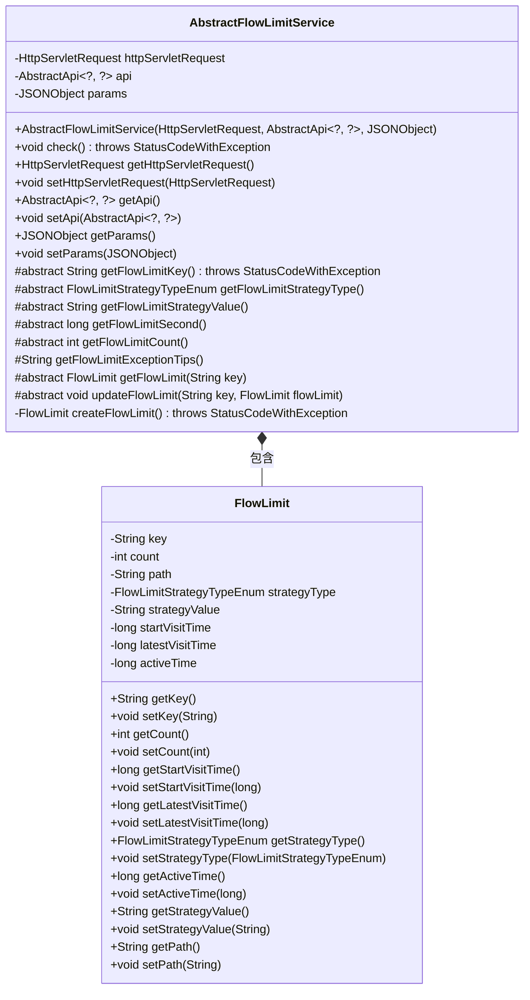
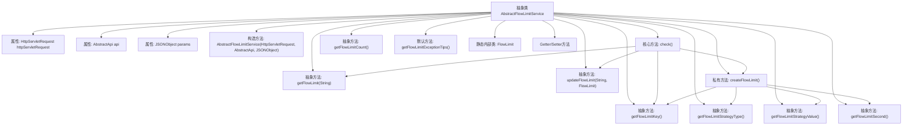

# 基础信息

|      |      |
|------|------|
| 名称 | AbstractFlowLimitService |
| 编码语言 | .java |
| 代码路径 | WeFe/common/java/common-web/src/main/java/com/welab/wefe/common/web/service/flowlimit/AbstractFlowLimitService.java |
| 包名 | com.welab.wefe.common.web.service.flowlimit |
| 依赖项 | ['com.alibaba.fastjson.JSONObject', 'com.welab.wefe.common.StatusCode', 'com.welab.wefe.common.exception.StatusCodeWithException', 'com.welab.wefe.common.web.api.base.AbstractApi', 'com.welab.wefe.common.web.api.base.Api', 'com.welab.wefe.common.wefe.enums.FlowLimitStrategyTypeEnum', 'javax.servlet.http.HttpServletRequest'] |
| 概述说明 | 抽象类AbstractFlowLimitService实现流量限制功能，通过同步块检查访问次数，超限抛出异常。包含FlowLimit内部类记录访问信息，需子类实现关键方法如获取限制键、策略类型等。 |

# 说明

AbstractFlowLimitService是一个抽象类，用于实现流量限制功能。它包含HttpServletRequest、AbstractApi和JSONObject三个成员变量，并通过构造函数初始化。核心方法check()通过同步块确保线程安全，检查访问频率是否超过限制，若超过则抛出异常。类中定义了多个抽象方法，如获取限流键值、策略类型、策略值、限流时长和访问次数限制等。内部类FlowLimit用于存储限流信息，包括键值、访问次数、API路径、策略类型、策略值、起始访问时间、最后访问时间和活跃时间等。该类提供了完整的流量控制机制，支持自定义限流策略和异常提示信息。

# 类列表 Class Summary

| 名称   | 类型  | 说明 |
|-------|------|-------------|
| AbstractFlowLimitService | class | 抽象类AbstractFlowLimitService实现流量限制功能，通过同步块检查访问频率，超限抛出异常。包含FlowLimit内部类记录访问次数、时间等数据。需子类实现限流键、策略类型、时长等抽象方法。 |

## 类 AbstractFlowLimitService

|      |      |
|------|------|
| 访问范围 | public abstract |
| 类型 | class |
| 名称 | AbstractFlowLimitService |
| 说明 | 抽象类AbstractFlowLimitService实现流量限制功能，通过同步块检查访问频率，超限抛出异常。包含FlowLimit内部类记录访问次数、时间等数据。需子类实现限流键、策略类型、时长等抽象方法。 |

### UML类图

这段代码描述了一个抽象的流量限制服务类AbstractFlowLimitService及其内部静态类FlowLimit。AbstractFlowLimitService通过同步块实现线程安全的流量控制逻辑，包含检查访问频率、创建流量限制对象等核心功能，并通过抽象方法强制子类实现特定策略。FlowLimit类则封装了流量限制的关键数据，如访问次数、时间戳和策略信息。该设计实现了可扩展的流量控制框架，子类只需实现特定策略即可完成定制化限流功能。

### 内部方法调用关系图

这段代码实现了一个抽象的流量限制服务框架，通过同步块保证线程安全，采用令牌桶算法进行流量控制。核心流程包括：获取唯一限流键、查询限流记录、创建新记录（如不存在）、检查访问频率、更新访问计数和最后访问时间。抽象方法需要子类实现具体策略，包括限流键生成规则、限流时间窗口、最大访问次数等。内部类FlowLimit封装了限流状态信息，包含访问计数、时间戳等关键字段。

### 字段列表 Field List

| 名称  | 类型  | 说明 |
|-------|-------|------|
| api | AbstractApi<?, ?> | 私有成员变量api，类型为AbstractApi，支持泛型参数。 |
| params | JSONObject | 私有JSONObject参数对象。 |
| httpServletRequest | HttpServletRequest | 私有HTTP请求对象，用于处理客户端请求数据。 |

### 方法列表

| 名称  | 类型  | 说明 |
|-------|-------|------|
| updateFlowLimit | void | 抽象方法，用于更新指定键的流控限制参数。 |
| getFlowLimit | FlowLimit | 抽象方法，根据key获取流量限制配置。 |
| createFlowLimit | FlowLimit | 创建FlowLimit对象，设置键、计数、路径、策略类型、策略值、起始和最新访问时间及活动时长。 |
| getFlowLimitCount | int | 抽象方法，获取流量限制数量，返回整数类型。 |
| getHttpServletRequest | HttpServletRequest | 获取HTTP请求对象的方法，返回当前HttpServletRequest实例。 |
| getFlowLimitStrategyType | FlowLimitStrategyTypeEnum | 获取流量限制策略类型的抽象方法。 |
| getFlowLimitExceptionTips | String | 方法返回访问频繁提示信息："访问次数过于频繁，请稍后再试"。 |
| getFlowLimitSecond | long | 抽象方法，返回流控限制时间（秒）。 |
| getFlowLimitStrategyValue | String | 抽象方法，返回流控策略值字符串。 |
| getFlowLimitKey | String | 抽象方法，返回流控键值，可能抛出状态码异常。 |
| check | void | 方法check()同步检查流量限制，若超限抛出异常，否则更新计数或重置时间戳。 |
| setHttpServletRequest | void | 这是一个Java方法，用于设置HttpServletRequest对象实例变量。方法接收一个HttpServletRequest参数并赋值给当前类的成员变量。 |
| getApi | AbstractApi<?, ?> | 获取当前API实例的方法，返回类型为泛型AbstractApi。 |
| setApi | void | 该方法用于设置抽象API实例，将传入的AbstractApi对象赋值给当前对象的api属性。 |
| getParams | JSONObject | 方法返回JSONObject类型的params对象。 |
| setParams | void | 这是一个Java方法，用于设置类中的params属性，参数类型为JSONObject。 |

