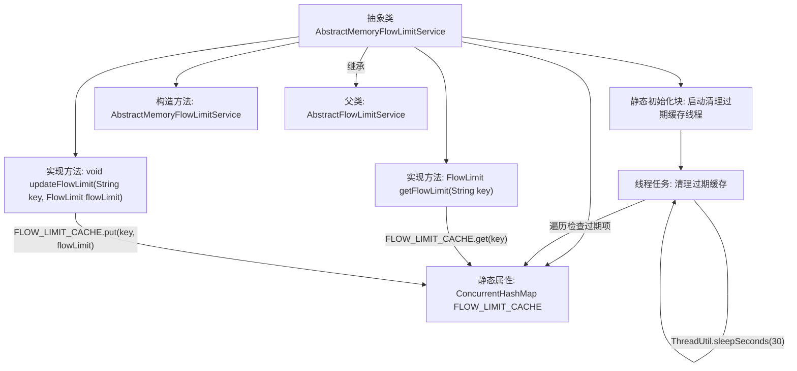

# 基础信息

|      |      |
|------|------|
| 名称 | AbstractMemoryFlowLimitService |
| 编码语言 | .java |
| 代码路径 | WeFe/common/java/common-web/src/main/java/com/welab/wefe/common/web/service/flowlimit/AbstractMemoryFlowLimitService.java |
| 包名 | com.welab.wefe.common.web.service.flowlimit |
| 依赖项 | ['com.alibaba.fastjson.JSONObject', 'com.welab.wefe.common.util.ThreadUtil', 'com.welab.wefe.common.web.api.base.AbstractApi', 'javax.servlet.http.HttpServletRequest', 'java.util.Iterator', 'java.util.Map', 'java.util.concurrent.ConcurrentHashMap'] |
| 概述说明 | 抽象类AbstractMemoryFlowLimitService继承AbstractFlowLimitService，使用ConcurrentHashMap缓存流控记录，后台线程定期清理过期缓存，提供获取和更新流控记录的方法。 |

# 说明

这是一个抽象类AbstractMemoryFlowLimitService，继承自AbstractFlowLimitService，用于实现基于内存的流量限制服务。它使用ConcurrentHashMap作为缓存存储流量限制记录，并通过静态代码块启动一个后台线程定期清理过期缓存。该类提供了获取和更新流量限制记录的方法，通过键值对管理流量限制数据。构造函数接收HTTP请求、API对象和参数JSON对象。

# 类列表 Class Summary

| 名称   | 类型  | 说明 |
|-------|------|-------------|
| AbstractMemoryFlowLimitService | class | 抽象类AbstractMemoryFlowLimitService继承AbstractFlowLimitService，使用ConcurrentHashMap缓存流控记录，后台线程定期清理过期缓存，提供获取和更新流控记录的方法。 |


## 类 AbstractMemoryFlowLimitService

|      |      |
|------|------|
| 访问范围 | public abstract |
| 类型 | class |
| 名称 | AbstractMemoryFlowLimitService |
| 说明 | 抽象类AbstractMemoryFlowLimitService继承AbstractFlowLimitService，使用ConcurrentHashMap缓存流控记录，后台线程定期清理过期缓存，提供获取和更新流控记录的方法。 |


### UML类图

```mermaid
classDiagram
    class AbstractFlowLimitService {
        <<abstract>>
        +AbstractFlowLimitService(HttpServletRequest httpServletRequest, AbstractApi~?,?~ api, JSONObject params)
        #FlowLimit getFlowLimit(String key)
        #void updateFlowLimit(String key, FlowLimit flowLimit)
    }

    class AbstractMemoryFlowLimitService {
        -ConcurrentHashMap~String,FlowLimit~ FLOW_LIMIT_CACHE
        +AbstractMemoryFlowLimitService(HttpServletRequest httpServletRequest, AbstractApi~?,?~ api, JSONObject params)
        #FlowLimit getFlowLimit(String key)
        #void updateFlowLimit(String key, FlowLimit flowLimit)
    }

    class FlowLimit {
        <<inner>>
        +long getLatestVisitTime()
        +long getActiveTime()
    }

    AbstractMemoryFlowLimitService --|> AbstractFlowLimitService : 继承
    AbstractMemoryFlowLimitService *-- FlowLimit : 包含

    // 使用ConcurrentHashMap缓存流控记录
    // 通过后台线程定期清理过期缓存
    // 实现基于内存的流控服务基础功能
```

这段类图展示了基于内存的流量限制服务实现。AbstractMemoryFlowLimitService继承自抽象基类AbstractFlowLimitService，通过ConcurrentHashMap缓存流控记录(FlowLimit)，并启动后台线程定期清理过期条目。该类实现了获取和更新流控记录的核心方法，其中FlowLimit作为内部类存储访问时间和活跃周期信息。整个设计采用线程安全的数据结构，适用于高并发场景下的流量控制需求。


### 内部方法调用关系图



这段代码展示了一个基于内存的流量限制服务实现，通过ConcurrentHashMap缓存流量限制记录，并启动后台线程定期清理过期记录。流程图清晰呈现了类结构、静态初始化过程、缓存操作方法和清理线程的循环逻辑，体现了流量控制的核心机制。该设计实现了线程安全的缓存管理，通过继承抽象父类完成特定业务逻辑的扩展。

### 字段列表 Field List

| 名称  | 类型  | 说明 |
|-------|-------|------|
| FLOW_LIMIT_CACHE = new ConcurrentHashMap<>(16) | ConcurrentHashMap<String, AbstractFlowLimitService.FlowLimit> | 定义一个线程安全的静态哈希表FLOW_LIMIT_CACHE，初始容量16，存储字符串到流控对象的映射。 |

### 方法列表

| 名称  | 类型  | 说明 |
|-------|-------|------|
| getFlowLimit | FlowLimit | 从缓存获取指定key的流量限制对象。 |
| updateFlowLimit | void | 更新流控限制：将键值对存入缓存FLOW_LIMIT_CACHE。 |


