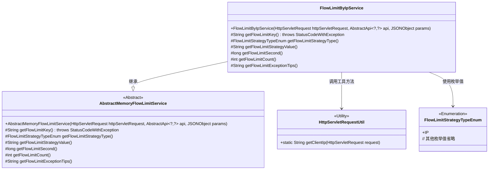

# 基础信息

|      |      |
|------|------|
| 名称 | FlowLimitByIpService |
| 编码语言 | .java |
| 代码路径 | WeFe/common/java/common-web/src/main/java/com/welab/wefe/common/web/service/flowlimit/FlowLimitByIpService.java |
| 包名 | com.welab.wefe.common.web.service.flowlimit |
| 依赖项 | ['com.alibaba.fastjson.JSONObject', 'com.welab.wefe.common.exception.StatusCodeWithException', 'com.welab.wefe.common.web.api.base.AbstractApi', 'com.welab.wefe.common.web.api.base.Api', 'com.welab.wefe.common.web.api.base.FlowLimitByIp', 'com.welab.wefe.common.web.util.HttpServletRequestUtil', 'com.welab.wefe.common.wefe.enums.FlowLimitStrategyTypeEnum', 'javax.servlet.http.HttpServletRequest'] |
| 概述说明 | FlowLimitByIpService类基于IP实现流量限制，通过注解配置限流时间和次数，返回IP访问频繁提示。 |

# 说明

FlowLimitByIpService是一个基于IP地址进行流量限制的服务类，继承自AbstractMemoryFlowLimitService。它通过HttpServletRequest获取客户端IP地址，结合API路径和策略类型生成唯一的流量限制键。该类实现了获取流量限制策略类型、策略值（IP地址）、限制时间窗口（秒）、允许的请求次数以及超出限制时的提示信息等功能。具体参数通过FlowLimitByIp注解从API类中获取，最终实现针对单个IP地址的访问频率控制。

# 类列表 Class Summary

| 名称   | 类型  | 说明 |
|-------|------|-------------|
| FlowLimitByIpService | class | FlowLimitByIpService类基于IP实现流量限制，通过注解配置限流时间和次数，返回IP访问频繁提示。 |

## 类 FlowLimitByIpService

|      |      |
|------|------|
| 访问范围 | public |
| 类型 | class |
| 名称 | FlowLimitByIpService |
| 说明 | FlowLimitByIpService类基于IP实现流量限制，通过注解配置限流时间和次数，返回IP访问频繁提示。 |

### UML类图

这段代码展示了一个基于IP地址的流量限制服务实现。FlowLimitByIpService继承自抽象类AbstractMemoryFlowLimitService，通过重写父类的抽象方法实现了基于IP地址的流量控制策略。核心功能包括：通过HttpServletRequest获取客户端IP作为限流键值，从注解中读取限流时间窗口和次数阈值，并返回定制化的限流提示信息。类图中清晰地展示了继承关系、工具类依赖和枚举使用，体现了策略模式在流量控制场景中的应用。

### 内部方法调用关系图

流程图描述：该流程图展示了FlowLimitByIpService类的完整结构，该类继承自AbstractMemoryFlowLimitService，包含构造方法和6个核心方法。主要逻辑是通过HTTP请求获取客户端IP，结合API路径和注解配置生成限流键值，实现基于IP地址的流量控制策略。各方法分工明确，分别处理限流键生成、策略类型返回、策略值获取、时间间隔设定、访问次数限制和异常提示信息。所有方法最终返回特定类型的值供上层调用。

### 字段列表 Field List

| 名称  | 类型  | 说明 |
|-------|-------|------|

### 方法列表

| 名称  | 类型  | 说明 |
|-------|-------|------|
| getFlowLimitKey | String | 方法重写生成流控键：组合API路径、IP策略类型及客户端IP。 |
| getFlowLimitCount | int | Java方法重写，通过注解获取IP流量限制次数。 |
| getFlowLimitSecond | long | 该方法重写获取流控时间限制，返回FlowLimitByIp注解中定义的秒数值。 |
| getFlowLimitStrategyType | FlowLimitStrategyTypeEnum | 方法重写返回IP限流策略类型。 |
| getFlowLimitStrategyValue | String | 该方法重写获取流控策略值，返回当前HTTP请求的客户端IP地址。 |
| getFlowLimitExceptionTips | String | Java方法重写，返回IP访问频繁提示信息。 |

