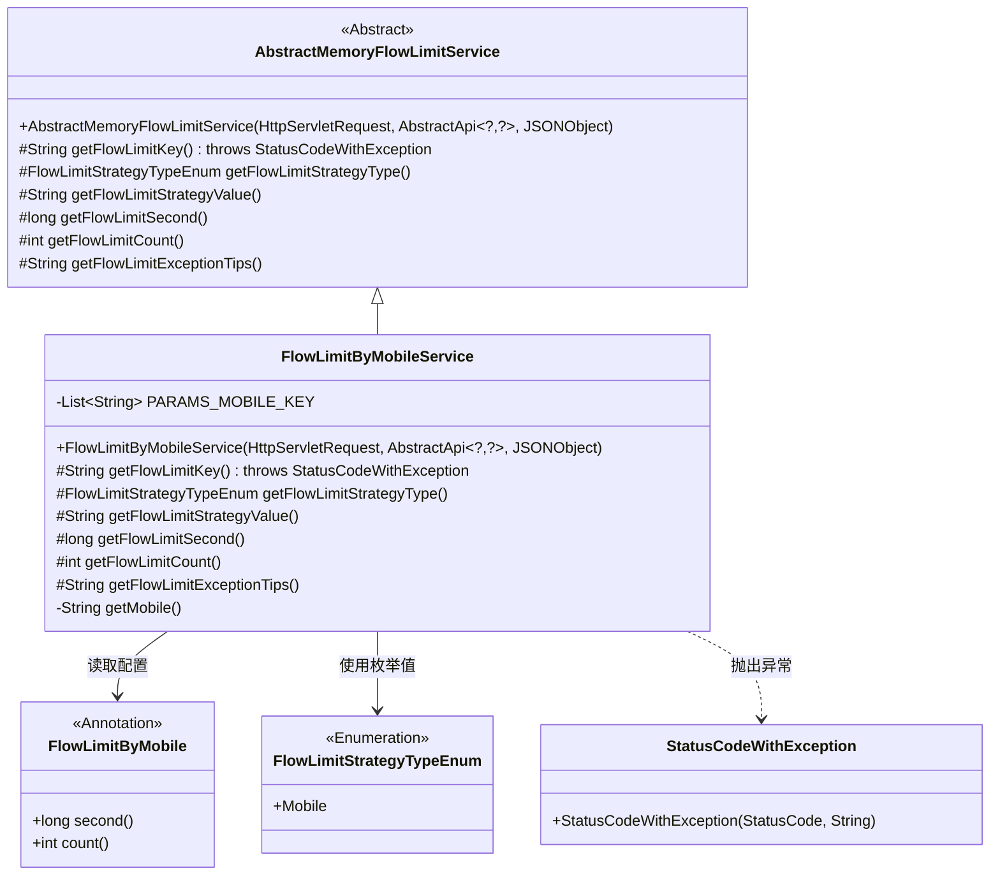
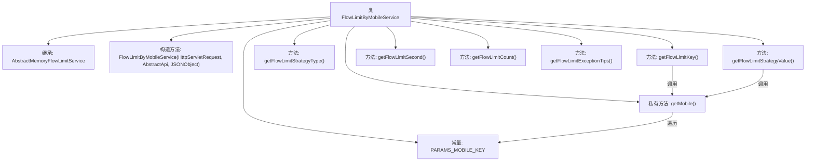
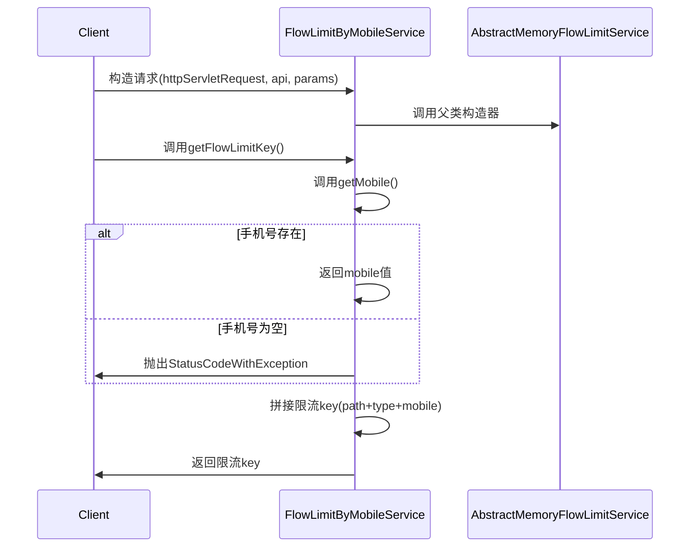

# 基础信息

|      |      |
|------|------|
| 名称 | FlowLimitByMobileService |
| 编码语言 | .java |
| 代码路径 | WeFe/common/java/common-web/src/main/java/com/welab/wefe/common/web/service/flowlimit/FlowLimitByMobileService.java |
| 包名 | com.welab.wefe.common.web.service.flowlimit |
| 依赖项 | ['com.alibaba.fastjson.JSONObject', 'com.welab.wefe.common.StatusCode', 'com.welab.wefe.common.exception.StatusCodeWithException', 'com.welab.wefe.common.util.StringUtil', 'com.welab.wefe.common.web.api.base.AbstractApi', 'com.welab.wefe.common.web.api.base.Api', 'com.welab.wefe.common.web.api.base.FlowLimitByMobile', 'com.welab.wefe.common.wefe.enums.FlowLimitStrategyTypeEnum', 'javax.servlet.http.HttpServletRequest', 'java.util.Arrays', 'java.util.List'] |
| 概述说明 | FlowLimitByMobileService类基于手机号实现流量限制，通过检查参数中的手机号字段生成限流键，并设置访问频率限制及提示信息。 |

# 说明

FlowLimitByMobileService是一个基于手机号进行流量限制的服务类，继承自AbstractMemoryFlowLimitService。它通过检查请求参数中的mobile、phoneNumber或phone_number字段获取手机号，若为空则抛出异常。流量限制的key由API路径、Mobile策略类型和手机号拼接而成。限制策略包括时间窗口秒数和允许的访问次数，均从FlowLimitByMobile注解中获取。当触发限制时返回提示信息"该手机号访问次数过于频繁，请稍后再试"。

# 类列表 Class Summary

| 名称   | 类型  | 说明 |
|-------|------|-------------|
| FlowLimitByMobileService | class | FlowLimitByMobileService类通过手机号实现流量限制，检查参数中的手机号字段，生成限流键并设置限流策略、时间和次数。 |

## 类 FlowLimitByMobileService

|      |      |
|------|------|
| 访问范围 | public |
| 类型 | class |
| 名称 | FlowLimitByMobileService |
| 说明 | FlowLimitByMobileService类通过手机号实现流量限制，检查参数中的手机号字段，生成限流键并设置限流策略、时间和次数。 |

### UML类图

该类图展示了基于手机号的流量限制服务实现。FlowLimitByMobileService继承自抽象类AbstractMemoryFlowLimitService，实现了流量限制的核心方法。通过读取FlowLimitByMobile注解配置限制参数，使用FlowLimitStrategyTypeEnum.Mobile作为策略类型，并在验证失败时抛出StatusCodeWithException异常。系统支持通过多种参数名（mobile/phoneNumber等）获取手机号，实现了灵活的手机号流量控制功能。

### 内部方法调用关系图

流程图描述：该流程图展示了FlowLimitByMobileService类的结构及其方法调用关系。该类继承自AbstractMemoryFlowLimitService，包含一个常量PARAMS_MOBILE_KEY和多个方法。关键方法getFlowLimitKey()会调用getMobile()来获取手机号，若手机号为空则抛出异常，否则拼接限流key返回。时序图则详细描述了从客户端请求到服务响应的完整流程，包括构造初始化、手机号验证和限流key生成等关键步骤。

### 字段列表 Field List

| 名称  | 类型  | 说明 |
|-------|-------|------|
| PARAMS_MOBILE_KEY = Arrays.asList("mobile", "phoneNumber", "phone_number") | List<String> | 定义静态常量列表PARAMS_MOBILE_KEY，包含手机号参数的三种常见命名：mobile、phoneNumber、phone_number。 |

### 方法列表

| 名称  | 类型  | 说明 |
|-------|-------|------|
| getFlowLimitKey | String | 方法重写获取限流键：检查手机号非空后，返回API路径_手机类型_手机号的组合键。若手机号为空则抛出权限异常。 |
| getFlowLimitSecond | long | Java方法重写，通过反射获取FlowLimitByMobile注解中的second值作为限流时间。 |
| getFlowLimitCount | int | 该方法重写获取流量限制次数，通过注解FlowLimitByMobile的count值返回限制数量。 |
| getFlowLimitExceptionTips | String | 代码重写方法，返回提示信息："该手机号访问次数过于频繁，请稍后再试"。 |
| getMobile | String | 该方法遍历预设的手机号键名列表，从参数中获取对应值，返回第一个非空手机号，若无则返回null。 |
| getFlowLimitStrategyValue | String | 方法重写，返回手机号作为流控策略值。 |
| getFlowLimitStrategyType | FlowLimitStrategyTypeEnum | 方法重写，返回移动端限流策略类型枚举值。 |

