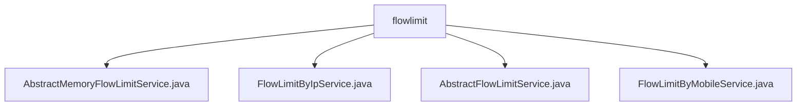

# 基础信息

|      |      |
|------|------|
| 名称 | flowlimit |
| 编码语言 | .java |
| 代码路径 | WeFe/common/java/common-web/src/main/java/com/welab/wefe/common/web/service/flowlimit |
| 包名 | docs.common.java.common-web.src.main.java.com.welab.wefe.common.web.service.flowlimit |
| 概述说明 | AbstractMemoryFlowLimitService是抽象类，继承AbstractFlowLimitService，用ConcurrentHashMap缓存流量记录，后台线程清理过期数据。FlowLimitByIpService基于IP限流，通过请求获取IP生成唯一键。AbstractFlowLimitService提供基础限流机制，含check()方法和抽象策略定义。FlowLimitByMobileService基于手机号限流，从请求参数获取手机号生成限流键。 |

# 说明

## 概述  
该模块提供基于内存的流量限制服务框架，核心职责是通过键值策略（如IP/手机号）控制API访问频率。采用类似令牌桶模式，使用ConcurrentHashMap缓存流量记录并定时清理过期数据。接口规范包含获取限流键、策略类型/值、时间窗口及次数限制等抽象方法，例如FlowLimitByIpService通过注解配置IP策略，FlowLimitByMobileService校验手机号字段。关键数据结构包括FlowLimit内部类（存储访问次数/时间戳等）和策略注解（如FlowLimitByMobile）。依赖项为HttpServletRequest、JSONObject及ConcurrentHashMap。

## 主要业务场景  
模块支持多维度流量控制，典型场景包括：1)IP限流（通过HttpServletRequest提取IP生成唯一键）；2)手机号限流（校验请求参数并拼接策略键）。交互模式统一为同步检查-计数更新-异常阻断流程，例如手机号超限返回"访问过于频繁"。完整功能涵盖策略配置、实时计数、自动清理及定制提示，API集成通过继承抽象类实现（如FlowLimitByIpService）。所有策略均基于时间窗口计数，类似滑动窗口算法。

### 包内部结构视图

该流程图展示了flowlimit目录下的文件结构关系，包含4个Java类文件，它们都直接位于flowlimit服务目录下。这些文件实现了不同的流量限制服务功能，包括基于IP和手机号的限流服务，以及抽象基础服务类。

# 文件列表

| 名称   | 类型  | 说明 |
|-------|------|-------------|
| [AbstractMemoryFlowLimitService.java](AbstractMemoryFlowLimitService.md) | file | 抽象类AbstractMemoryFlowLimitService继承AbstractFlowLimitService，使用ConcurrentHashMap缓存流控记录，后台线程定期清理过期缓存，提供获取和更新流控记录的方法。 |
| [FlowLimitByIpService.java](FlowLimitByIpService.md) | file | FlowLimitByIpService类基于IP实现流量限制，通过注解配置限流时间和次数，返回IP访问频繁提示。 |
| [AbstractFlowLimitService.java](AbstractFlowLimitService.md) | file | 抽象类AbstractFlowLimitService实现流量限制功能，通过同步块检查访问次数，超限抛出异常。包含FlowLimit内部类记录访问信息，需子类实现关键方法如获取限制键、策略类型等。 |
| [FlowLimitByMobileService.java](FlowLimitByMobileService.md) | file | FlowLimitByMobileService类基于手机号实现流量限制，通过检查参数中的手机号字段生成限流键，并设置访问频率限制及提示信息。 |

