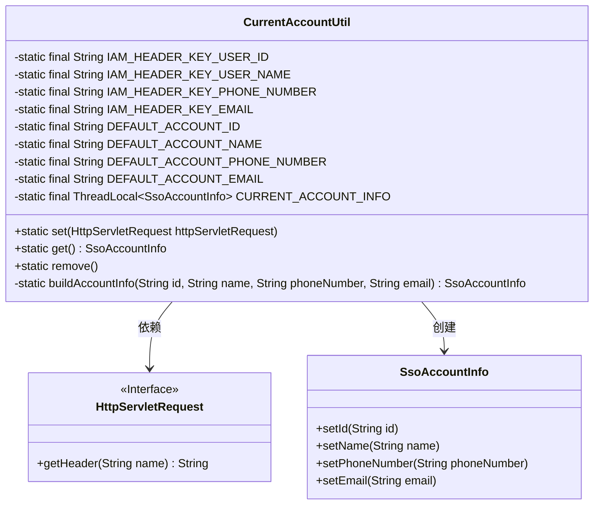
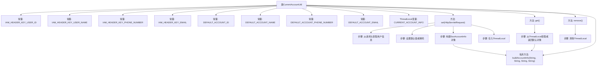

# 基础信息

|      |      |
|------|------|
| 名称 | CurrentAccountUtil |
| 编码语言 | .java |
| 代码路径 | WeFe/common/java/common-web/src/main/java/com/welab/wefe/common/web/util/CurrentAccountUtil.java |
| 包名 | com.welab.wefe.common.web.util |
| 依赖项 | ['com.welab.wefe.common.util.StringUtil', 'com.welab.wefe.common.util.UrlUtil', 'com.welab.wefe.common.web.service.account.SsoAccountInfo', 'javax.servlet.http.HttpServletRequest'] |
| 概述说明 | CurrentAccountUtil类管理当前登录用户信息，包含IAM请求头键和默认值，通过ThreadLocal存储用户数据，提供设置、获取和清除方法。 |

# 说明

CurrentAccountUtil是一个用于管理当前登录用户信息的工具类。它定义了四个IAM请求头常量，用于从HTTP请求头中获取用户ID、名称、手机号和邮箱。同时提供了默认的用户信息值。该类使用ThreadLocal存储当前用户信息，确保线程安全。主要功能包括：通过set方法从请求头中提取用户信息并存储，若信息为空则使用默认值；通过get方法获取当前用户信息，若不存在则返回默认值；通过remove方法清除当前用户信息。buildAccountInfo方法用于构建用户信息对象。

# 类列表 Class Summary

| 名称   | 类型  | 说明 |
|-------|------|-------------|
| CurrentAccountUtil | class | CurrentAccountUtil类管理当前登录用户信息，包含IAM请求头键和默认值，通过ThreadLocal存储用户数据，提供设置、获取和清除方法。 |

## 类 CurrentAccountUtil

|      |      |
|------|------|
| 访问范围 | public |
| 类型 | class |
| 名称 | CurrentAccountUtil |
| 说明 | CurrentAccountUtil类管理当前登录用户信息，包含IAM请求头键和默认值，通过ThreadLocal存储用户数据，提供设置、获取和清除方法。 |

### UML类图

这段代码定义了一个CurrentAccountUtil工具类，用于管理当前登录用户信息。它通过ThreadLocal存储用户数据，提供设置、获取和移除用户信息的方法。当请求头中用户信息缺失时，会使用默认值。类图中展示了CurrentAccountUtil与HttpServletRequest接口和SsoAccountInfo类的关系，体现了从请求头获取信息并构建用户对象的过程。

### 内部方法调用关系图

这段代码是用于管理当前登录用户信息的工具类，主要功能包括：通过HTTP请求头获取用户信息并存储到ThreadLocal中，提供获取和清除用户信息的方法。当请求头信息缺失时，会使用默认值填充。流程图展示了常量定义、核心方法调用关系以及数据处理流程，体现了线程安全的用户信息管理机制。私有方法buildAccountInfo用于统一构建用户信息对象，被set()和get()方法调用。

### 字段列表 Field List

| 名称  | 类型  | 说明 |
|-------|-------|------|
| DEFAULT_ACCOUNT_EMAIL = "12346@163.com" | String | 定义默认账户邮箱常量，值为"12346@163.com"。 |
| DEFAULT_ACCOUNT_PHONE_NUMBER = "18888888888" | String | 定义默认账户电话号码常量，值为"18888888888"。 |
| DEFAULT_ACCOUNT_NAME = "admin" | String | 默认账户名为"admin"。 |
| IAM_HEADER_KEY_EMAIL = "x-jwt-email" | String | 常量字符串IAM_HEADER_KEY_EMAIL定义为JWT邮件头标识"x-jwt-email"。 |
| CURRENT_ACCOUNT_INFO = new InheritableThreadLocal() | ThreadLocal<SsoAccountInfo> | 定义线程局部变量CURRENT_ACCOUNT_INFO，用于存储当前线程的SsoAccountInfo信息，支持子线程继承。 |
| DEFAULT_ACCOUNT_ID = "ac1173fef3bc4d8493f660a66e7f004a" | String | 定义默认账户ID常量，值为"ac1173fef3bc4d8493f660a66e7f004a"。 |
| IAM_HEADER_KEY_USER_ID = "x-jwt-user-id" | String | 定义静态常量IAM_HEADER_KEY_USER_ID，值为"x-jwt-user-id"，用于JWT用户ID的HTTP头标识。 |
| IAM_HEADER_KEY_PHONE_NUMBER = "x-jwt-phone-number" | String | 定义常量IAM_HEADER_KEY_PHONE_NUMBER，值为"x-jwt-phone-number"，用于JWT头部电话号码标识。 |
| IAM_HEADER_KEY_USER_NAME = "x-jwt-user-name" | String | 常量IAM_HEADER_KEY_USER_NAME定义为JWT用户名请求头键"x-jwt-user-name"。 |

### 方法列表

| 名称  | 类型  | 说明 |
|-------|-------|------|
| set | void | 从HTTP请求头获取用户ID、姓名、电话和邮箱信息，为空则使用默认值，构建账户信息并存储。 |
| get | SsoAccountInfo | 获取当前SSO账户信息，若为空则返回默认账户信息。 |
| remove | void | 移除当前账户信息。 |
| buildAccountInfo | SsoAccountInfo | 构建SsoAccountInfo对象，设置id、name、phoneNumber和email属性并返回。 |

