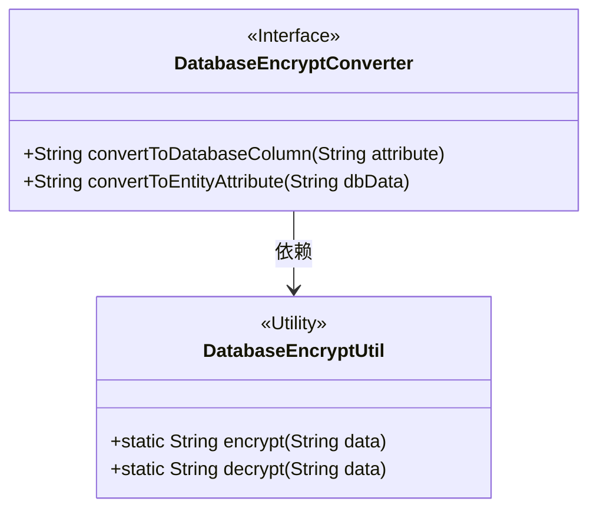
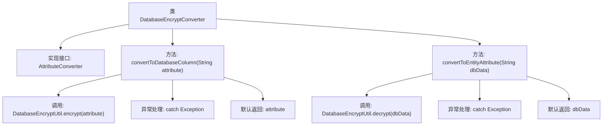

# 基础信息

|      |      |
|------|------|
| 名称 | DatabaseEncryptConverter |
| 编码语言 | .java |
| 代码路径 | WeFe/common/java/common-web/src/main/java/com/welab/wefe/common/web/util/DatabaseEncryptConverter.java |
| 包名 | com.welab.wefe.common.web.util |
| 依赖项 | ['javax.persistence.AttributeConverter'] |
| 概述说明 | DatabaseEncryptConverter类实现AttributeConverter接口，用于数据库字段加密解密转换，加密失败返回原值。 |

# 说明

该内容描述了一个名为DatabaseEncryptConverter的类，实现了AttributeConverter接口，用于在字符串类型属性与数据库列之间进行加密解密转换。该类包含两个方法：convertToDatabaseColumn方法调用DatabaseEncryptUtil.encrypt对属性值加密后存入数据库，若加密失败则返回原值；convertToEntityAttribute方法调用DatabaseEncryptUtil.decrypt对数据库值解密后恢复为实体属性，若解密失败则返回原值。整个过程实现了数据存储时的自动加密和读取时的自动解密功能。

# 类列表 Class Summary

| 名称   | 类型  | 说明 |
|-------|------|-------------|
| DatabaseEncryptConverter | class | DatabaseEncryptConverter类实现AttributeConverter接口，用于字符串的数据库加密和解密转换，加密失败返回原值。 |

## 类 DatabaseEncryptConverter

|      |      |
|------|------|
| 访问范围 | public |
| 类型 | class |
| 名称 | DatabaseEncryptConverter |
| 说明 | DatabaseEncryptConverter类实现AttributeConverter接口，用于字符串的数据库加密和解密转换，加密失败返回原值。 |

### UML类图

这段代码展示了一个数据库加密转换器 `DatabaseEncryptConverter`，它实现了 `AttributeConverter<String, String>` 接口，用于在实体属性和数据库列之间进行加密/解密转换。该类依赖 `DatabaseEncryptUtil` 工具类提供的静态加密/解密方法。当转换过程中发生异常时，会返回原始数据作为降级处理。类图清晰地反映了这种实现关系和工具类依赖。

### 内部方法调用关系图

该流程图展示了DatabaseEncryptConverter类的结构，它实现了AttributeConverter接口，包含两个核心方法：convertToDatabaseColumn用于加密数据存储到数据库，convertToEntityAttribute用于从数据库解密数据。两个方法均采用try-catch结构，异常时返回原始数据，正常流程则调用加密/解密工具类处理。类设计体现了数据库字段加解密的典型模式。

### 字段列表 Field List

| 名称  | 类型  | 说明 |
|-------|-------|------|

### 方法列表

| 名称  | 类型  | 说明 |
|-------|-------|------|
| convertToDatabaseColumn | String | 方法convertToDatabaseColumn调用DatabaseEncryptUtil.encrypt加密输入参数，失败时返回原值。 |
| convertToEntityAttribute | String | 方法convertToEntityAttribute尝试解密dbData，失败则返回原值。 |

