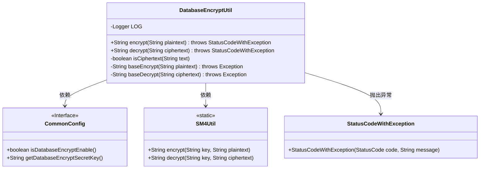
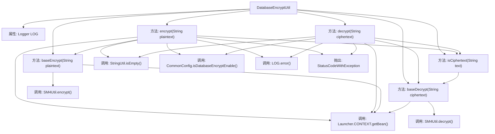

# 基础信息

|      |      |
|------|------|
| 名称 | DatabaseEncryptUtil |
| 编码语言 | .java |
| 代码路径 | WeFe/common/java/common-web/src/main/java/com/welab/wefe/common/web/util/DatabaseEncryptUtil.java |
| 包名 | com.welab.wefe.common.web.util |
| 依赖项 | ['com.welab.wefe.common.StatusCode', 'com.welab.wefe.common.exception.StatusCodeWithException', 'com.welab.wefe.common.util.SM4Util', 'com.welab.wefe.common.util.StringUtil', 'com.welab.wefe.common.web.Launcher', 'com.welab.wefe.common.web.config.CommonConfig', 'org.slf4j.Logger', 'org.slf4j.LoggerFactory'] |
| 概述说明 | DatabaseEncryptUtil类提供数据库加密解密功能，支持SM4算法，根据配置开关控制是否启用，异常处理完善。 |

# 说明

DatabaseEncryptUtil是一个提供数据库加密解密的工具类，包含encrypt和decrypt两个核心方法。加密前会检查明文是否为空或已是密文，解密前会检查密文是否为空或非密文。两者均依赖CommonConfig配置决定是否启用加密功能，实际加解密操作通过SM4Util实现。异常时会记录日志并抛出StatusCodeWithException。isCiphertext方法用于检测字符串是否为有效密文。

# 类列表 Class Summary

| 名称   | 类型  | 说明 |
|-------|------|-------------|
| DatabaseEncryptUtil | class | 数据库加密工具类，提供加密、解密功能，支持SM4算法，根据配置决定是否启用加密，异常时记录日志并抛出错误。 |

## 类 DatabaseEncryptUtil

|      |      |
|------|------|
| 访问范围 | public |
| 类型 | class |
| 名称 | DatabaseEncryptUtil |
| 说明 | 数据库加密工具类，提供加密、解密功能，支持SM4算法，根据配置决定是否启用加密，异常时记录日志并抛出错误。 |

### UML类图

这段代码展示了一个数据库加密工具类DatabaseEncryptUtil，它提供了加密(encrypt)和解密(decrypt)两个主要方法。该类依赖于CommonConfig接口获取加密配置，使用SM4Util进行实际的加密操作，并在出错时抛出StatusCodeWithException异常。私有方法包括判断是否为密文(isCiphertext)和基础的加密/解密方法(baseEncrypt/baseDecrypt)。整个设计采用了静态方法实现工具类功能，通过配置控制加密开关，并具备完善的错误处理和日志记录能力。

### 内部方法调用关系图

这段代码展示了一个数据库加密工具类DatabaseEncryptUtil，主要提供加密(encrypt)和解密(decrypt)功能。流程图中清晰地展示了类结构、方法调用关系和异常处理路径。加密解密过程会检查输入有效性、配置开关状态和密文格式，核心加解密操作委托给SM4Util实现，整个过程包含完善的错误日志记录和异常处理机制。

### 字段列表 Field List

| 名称  | 类型  | 说明 |
|-------|-------|------|
| LOG = LoggerFactory.getLogger(DatabaseEncryptUtil.class) | Logger | 类DatabaseEncryptUtil的私有静态日志常量LOG。 |

### 方法列表

| 名称  | 类型  | 说明 |
|-------|-------|------|
| baseEncrypt | String | 私有静态方法baseEncrypt接收明文参数，使用配置的密钥通过SM4Util加密后返回密文。 |
| isCiphertext | boolean | 检查字符串是否为密文：尝试解密，成功返回真，失败返回假。 |
| decrypt | String | 静态方法decrypt用于解密字符串，检查空值或未启用加密时直接返回原值，否则调用baseDecrypt解密，失败时记录日志并抛出异常。 |
| encrypt | String | 加密方法：空文本或已加密直接返回；配置未启用加密则不处理；否则调用基础加密；失败抛异常并记录日志。 |
| baseDecrypt | String | 该方法使用SM4算法解密字符串，密钥从配置类获取。 |

