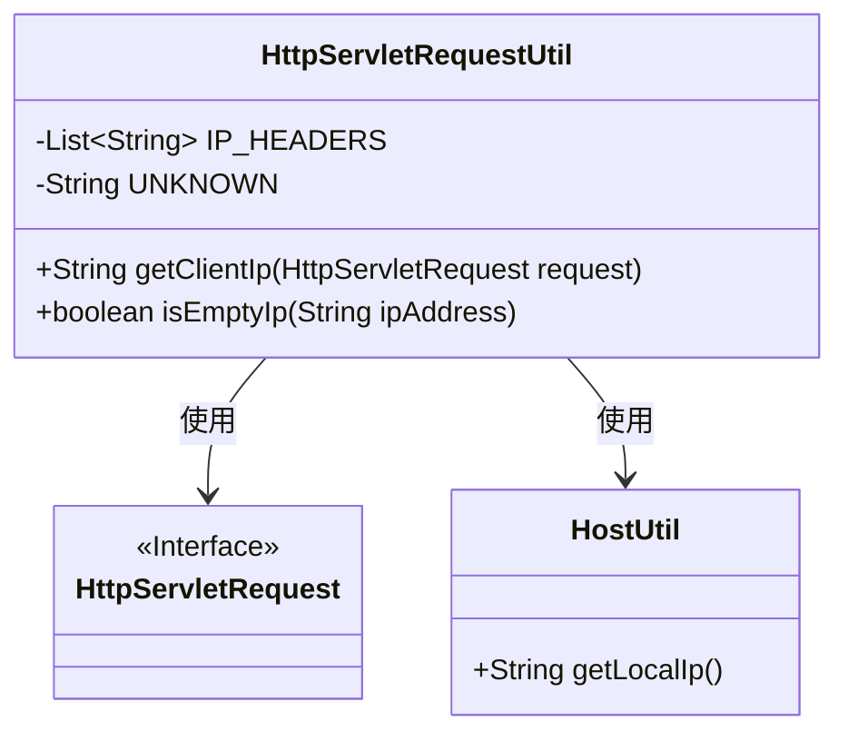
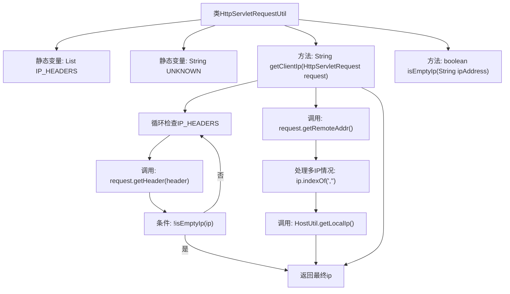

# 基础信息

|      |      |
|------|------|
| 名称 | HttpServletRequestUtil |
| 编码语言 | .java |
| 代码路径 | WeFe/common/java/common-web/src/main/java/com/welab/wefe/common/web/util/HttpServletRequestUtil.java |
| 包名 | com.welab.wefe.common.web.util |
| 依赖项 | ['com.welab.wefe.common.util.HostUtil', 'javax.servlet.http.HttpServletRequest', 'java.util.Arrays', 'java.util.List'] |
| 概述说明 | HttpServletRequestUtil类用于获取客户端IP地址，优先从多个HTTP头中提取，若失败则取远程地址，处理多代理情况并检查本地IP。 |

# 说明

HttpServletRequestUtil是一个用于获取HTTP客户端IP地址的工具类。它首先尝试从多个常见代理头（如x-forwarded-for等）中获取IP，若未获取到则使用远程地址。对于多代理情况，会截取第一个IP。本地地址会替换为真实本地IP。isEmptyIp方法用于检查IP是否为空或无效。整个过程考虑了代理转发和本地测试场景。

# 类列表 Class Summary

| 名称   | 类型  | 说明 |
|-------|------|-------------|
| HttpServletRequestUtil | class | HttpServletRequestUtil类提供获取客户端IP的方法，检查多个代理头，处理多IP和本地地址情况。 |

## 类 HttpServletRequestUtil

|      |      |
|------|------|
| 访问范围 | public |
| 类型 | class |
| 名称 | HttpServletRequestUtil |
| 说明 | HttpServletRequestUtil类提供获取客户端IP的方法，检查多个代理头，处理多IP和本地地址情况。 |

### UML类图

这段代码展示了一个HTTP请求工具类HttpServletRequestUtil，主要用于从HttpServletRequest对象中提取客户端真实IP地址。该类包含两个静态方法：getClientIp()通过检查多个代理头字段来获取IP，并处理多代理情况；isEmptyIp()用于验证IP地址有效性。该类依赖HttpServletRequest接口获取请求信息，并在本地IP情况下调用HostUtil获取本机IP。流程图清晰地展示了类之间的关系和依赖。

### 内部方法调用关系图

该流程图展示了HttpServletRequestUtil类获取客户端IP地址的完整逻辑。流程从检查预设的HTTP头列表开始，依次尝试获取有效IP；若头信息无效则回退到远程地址；处理多代理IP时截取首个地址；特殊本地地址会转换为服务器本地IP。整个过程包含4层判断和3种获取方式，最终返回经过验证的有效IP地址。

### 字段列表 Field List

| 名称  | 类型  | 说明 |
|-------|-------|------|
| UNKNOWN = "unknown" | String | 定义私有静态字符串常量UNKNOWN，值为"unknown"。 |
| IP_HEADERS = Arrays.asList(            "x-forwarded-for",            "Proxy-Client-IP",            "WL-Proxy-Client-IP",            "HTTP_CLIENT_IP",            "HTTP_X_FORWARDED_FOR"    ) | List<String> | 定义常用IP头字段列表，包括x-forwarded-for等五个关键HTTP头部。 |

### 方法列表

| 名称  | 类型  | 说明 |
|-------|-------|------|
| getClientIp | String | 该方法从HTTP请求头获取客户端IP，若失败则取远程地址。处理多代理情况取首个IP，本地地址转为服务器IP。 |
| isEmptyIp | boolean | 检查IP地址是否为空：若为null、长度为零或等于"UNKNOWN"（忽略大小写），则返回true。 |

