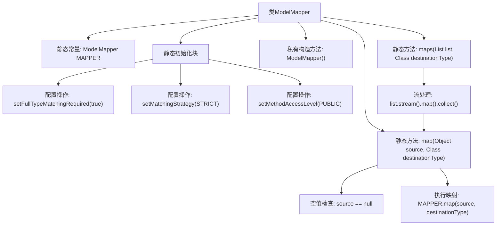

# 基础信息

|      |      |
|------|------|
| 名称 | ModelMapper |
| 编码语言 | .java |
| 代码路径 | WeFe/common/java/common-web/src/main/java/com/welab/wefe/common/web/util/ModelMapper.java |
| 包名 | com.welab.wefe.common.web.util |
| 依赖项 | ['org.modelmapper.config.Configuration', 'org.modelmapper.convention.MatchingStrategies', 'java.util.List', 'java.util.stream.Collectors'] |
| 概述说明 | ModelMapper工具类，线程安全，配置严格匹配策略，提供对象和列表的映射方法。 |

# 说明

该代码定义了一个名为ModelMapper的工具类，用于对象映射转换。类中包含一个静态且线程安全的ModelMapper实例MAPPER，初始化时配置了严格类型匹配策略、公开方法访问级别等参数。提供了两个静态方法：map方法将单个源对象转换为目标类型对象，处理空值情况；maps方法将源对象列表批量转换为目标类型列表。类采用单例模式，构造函数私有化，确保只能通过静态方法使用映射功能。

# 类列表 Class Summary

| 名称   | 类型  | 说明 |
|-------|------|-------------|
| ModelMapper | class | ModelMapper工具类，线程安全，配置严格匹配策略，提供对象和列表的映射方法。 |


## 类 ModelMapper

|      |      |
|------|------|
| 访问范围 | public |
| 类型 | class |
| 名称 | ModelMapper |
| 说明 | ModelMapper工具类，线程安全，配置严格匹配策略，提供对象和列表的映射方法。 |


### UML类图

```mermaid
classDiagram
    class ModelMapper {
        -org.modelmapper.ModelMapper MAPPER
        +map(Object source, Class~T~ destinationType) T
        +maps(List~?~ list, Class~T~ destinationType) List~T~
    }
    class org..modelmapper..ModelMapper {
        <<External>>
    }
    class Configuration {
        <<External>>
    }
    class MatchingStrategies {
        <<External>>
    }

    ModelMapper --> org..modelmapper..ModelMapper : 使用
    ModelMapper --> Configuration : 配置依赖
    ModelMapper --> MatchingStrategies : 策略依赖
```

类图描述：ModelMapper类封装了org.modelmapper.ModelMapper的静态线程安全实例，提供泛型对象映射功能。通过私有构造器确保单例模式，静态初始化块配置严格类型匹配策略和公有方法访问级别。核心方法map()处理单个对象转换，maps()方法通过流式操作批量转换列表元素，两者均支持泛型类型参数。依赖外部库的ModelMapper、Configuration和MatchingStrategies类实现底层映射逻辑。


### 内部方法调用关系图



该流程图展示了ModelMapper工具类的核心结构和工作流程。类包含线程安全的静态ModelMapper实例，在静态初始化块中配置了严格类型匹配、公开方法访问等参数。主要提供两个静态映射方法：单个对象映射（含空值检查）和集合批量映射（使用流处理）。箭头清晰显示了配置加载顺序和方法调用关系，特别是maps方法内部通过stream调用map方法的嵌套逻辑。

### 字段列表 Field List

| 名称  | 类型  | 说明 |
|-------|-------|------|
| MAPPER = new org.modelmapper.ModelMapper() | org.modelmapper.ModelMapper | 私有静态常量ModelMapper实例初始化。 |

### 方法列表

| 名称  | 类型  | 说明 |
|-------|-------|------|
| map | T | 静态方法将源对象映射为目标类型，若源为空则返回空。 |
| maps | List<T> | Java方法：将列表元素映射为指定类型的新列表，使用流处理和收集器。 |


