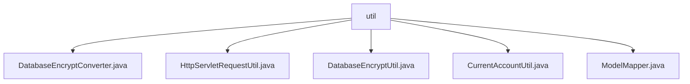

# 基础信息

|      |      |
|------|------|
| 名称 | util |
| 编码语言 | .java |
| 代码路径 | WeFe/common/java/common-web/src/main/java/com/welab/wefe/common/web/util |
| 包名 | docs.common.java.common-web.src.main.java.com.welab.wefe.common.web.util |
| 概述说明 | DatabaseEncryptConverter类实现属性与数据库列的加密解密转换。HttpServletRequestUtil工具类获取客户端IP，处理代理和本地场景。DatabaseEncryptUtil提供数据库加密解密功能，依赖SM4Util实现。CurrentAccountUtil管理登录用户信息，使用ThreadLocal存储。ModelMapper工具类实现对象映射转换，采用单例模式。 |

# 说明

## 概述  
该模块核心职责是提供Web应用基础工具集，包括数据加密转换、HTTP请求处理、用户信息管理和对象映射等功能。接口规范遵循JPA AttributeConverter标准（如DatabaseEncryptConverter）和ThreadLocal线程安全模式（如CurrentAccountUtil）。关键数据结构包含SM4密文格式、用户信息对象和代理IP链。外部依赖包括SM4Util加密库、CommonConfig配置系统和ModelMapper映射框架。例如DatabaseEncryptUtil通过SM4算法实现字段级加密，类似Vault的透明加解密机制。

## 主要业务场景  
模块支持典型Web应用安全场景：数据库字段自动加解密（类似Hibernate拦截器）、多级代理下真实IP提取、线程安全的用户会话管理。交互模式统一采用工具类静态方法调用，如ModelMapper实现DTO转换，类似Spring BeanUtils但支持批量操作。完整功能覆盖从请求入站（HttpServletRequestUtil）到数据持久化（DatabaseEncryptConverter）的全流程。例如CurrentAccountUtil通过请求头注入用户信息，适用于微服务间身份传递场景。所有API均采用防御式编程，对空值和异常情况进行安全处理。

### 包内部结构视图

该流程图展示了WeFe项目中common-web模块下util包的层级结构。根节点为util文件夹，包含5个工具类文件：DatabaseEncryptConverter、HttpServletRequestUtil、DatabaseEncryptUtil、CurrentAccountUtil和ModelMapper。所有文件都直接隶属于util目录下，没有更深层级的子目录结构。

# 文件列表

| 名称   | 类型  | 说明 |
|-------|------|-------------|
| [DatabaseEncryptConverter.java](DatabaseEncryptConverter.md) | file | DatabaseEncryptConverter类实现AttributeConverter接口，用于数据库字段加密解密转换，加密失败返回原值。 |
| [HttpServletRequestUtil.java](HttpServletRequestUtil.md) | file | HttpServletRequestUtil类用于获取客户端IP地址，优先从多个HTTP头中提取，若失败则取远程地址，处理多代理情况并检查本地IP。 |
| [DatabaseEncryptUtil.java](DatabaseEncryptUtil.md) | file | DatabaseEncryptUtil类提供数据库加密解密功能，支持SM4算法，根据配置开关控制是否启用，异常处理完善。 |
| [CurrentAccountUtil.java](CurrentAccountUtil.md) | file | CurrentAccountUtil类管理当前登录用户信息，包含IAM请求头键和默认值，通过ThreadLocal存储用户数据，提供设置、获取和清除方法。 |
| [ModelMapper.java](ModelMapper.md) | file | ModelMapper工具类，线程安全，配置严格匹配策略，提供对象和列表的映射方法。 |

