# 基础信息

|      |      |
|------|------|
| 名称 | common |
| 编码语言 | .java |
| 代码路径 | WeFe/common/java/common-wefe/src/main/java/com/welab/wefe/common |
| 包名 | docs.common.java.common-wefe.src.main.java.com.welab.wefe.common |
| 概述说明 | 服务检查框架实现分层健康检测，枚举模块定义联邦学习类型状态，配置管理模块统一处理多源连接，数据类型推断器分析字段类型。 |

# 说明

## 概述  
该模块是联邦学习系统的核心支撑框架，包含服务健康检查、枚举定义、配置管理和数据类型推断四大功能。采用分层抽象设计，关键接口包括AbstractCheckpoint（检查点）、AbstractConfigModel（配置模型）和Consumer（数据类型推断）。核心数据结构涵盖ServiceCheckPointOutput（检查结果）、11种ServiceType（服务类型枚举）和ColumnDataType（字段类型）。依赖Spring框架、JDBC驱动和云服务SDK。例如通过CheckpointManager并发检测UnionService连通性，或使用ColumnDataTypeInferrer推断字段类型。

## 主要业务场景  
模块支持联邦学习全生命周期管理：1) 服务健康检查采用哨兵模式，例如5秒超时检测；2) 枚举驱动状态机，如JobStatus控制任务流转；3) 工厂模式管理多数据源配置，例如生成特化数据库URL；4) 多线程推断字段类型（类似MapReduce）。典型流程包括配置校验→并行检查→结果聚合，例如UnionService检查失败时逐级上报。集成案例涵盖横向联邦学习（使用XGBoost算法）和云存储切换（如OSS凭证管理）。

### 包内部结构视图

```mermaid
graph TD
    wefe --> checkpoint
    wefe --> enums
    wefe --> dto
    checkpoint --> dto
    checkpoint --> AbstractUnionConnectionCheckpoint.java
    checkpoint --> CheckpointManager.java
    checkpoint --> AbstractCheckpoint.java
    dto --> ServiceCheckPointOutput.java
    dto --> ServiceAvailableCheckOutput.java
    dto --> MemberAvailableCheckOutput.java
    enums --> ServiceType.java
    enums --> env
    enums --> ModelExportLanguage.java
    enums --> BoardUserSource.java
    enums --> DeepLearningJobType.java
    enums --> MessageLevel.java
    enums --> Binning.java
    enums --> VerificationCodeSendChannel.java
    enums --> JobStatus.java
    enums --> HashOptions.java
    enums --> ProjectType.java
    enums --> FederatedLearningModel.java
    enums --> DataResourcePublicLevel.java
    enums --> TaskStatus.java
    enums --> DataResourceType.java
    enums --> ContractName.java
    enums --> SmsBusinessType.java
    enums --> PredictFeatureDataSource.java
    enums --> DataResourceStorageType.java
    enums --> ChatListType.java
    enums --> BloomFilterProgressType.java
    enums --> GatewayProcessorType.java
    enums --> ProducerType.java
    enums --> VerificationCodeBusinessType.java
    enums --> TaskResultType.java
    enums --> ProjectFlowStatisticsStatus.java
    enums --> FileRurpose.java
    enums --> JobMemberRole.java
    enums --> MessageEvent.java
    enums --> ColumnDataType.java
    enums --> FcCloudProvider.java
    enums --> ProjectFlowStatus.java
    enums --> Algorithm.java
    enums --> AuditStatus.java
    enums --> ComponentType.java
    enums --> JobBackendType.java
    enums --> DataResourceUploadStatus.java
    enums --> FlowActionType.java
    enums --> FlowLimitStrategyTypeEnum.java
    enums --> BloomFilterPublicLevel.java
    enums --> PredictType.java
    enums --> DataResourceStorageServiceType.java
    enums --> FederatedLearningType.java
    env --> EnvName.java
    env --> EnvBranch.java
    dto --> global_config
    dto --> storage
    global_config --> storage
    global_config --> calculation_engine
    global_config --> base
    global_config --> GatewayConfigModel.java
    global_config --> ServerCertInfoModel.java
    global_config --> BoardConfigModel.java
    global_config --> DeepLearningConfigModel.java
    global_config --> MailServerModel.java
    global_config --> PrivacyConfigModel.java
    global_config --> ServingConfigModel.java
    global_config --> GlobalConfigFlag.java
    global_config --> AlertConfigModel.java
    global_config --> MemberInfoModel.java
    global_config --> FlowConfigModel.java
    global_config --> AliyunSmsChannelConfigModel.java
    storage --> StorageBaseConfigModel.java
    storage --> ClickHouseStorageConfigModel.java
    calculation_engine --> fc
    calculation_engine --> spark
    calculation_engine --> CalculationEngineBaseConfigModel.java
    fc --> FunctionComputeBaseConfigModel.java
    fc --> AliyunFunctionComputeConfigModel.java
    fc --> TencentServerlessCloudFunctionConfigModel.java
    spark --> SparkStandaloneConfigModel.java
    base --> GlobalConfigInput.java
    base --> ConfigModel.java
    base --> AbstractConfigModel.java
    base --> ConfigGroupConstant.java
    storage --> DataSourceConfig.java
    storage --> ClickhouseConfig.java
    wefe --> ColumnDataTypeInferrer.java
```

该流程图展示了WeFe项目中common模块的复杂层级结构，包含checkpoint、enums和dto三大核心目录及其子内容。enums目录下包含40+枚举类型文件，dto目录则细分为global_config、storage等子模块，其中global_config又包含calculation_engine、base等深度嵌套结构。整体呈现了典型的Java项目分层架构，各模块通过清晰的父子关系组织，体现了高度模块化的设计思想。

# 文件列表

| 名称   | 类型  | 说明 |
|-------|------|-------------|
| [wefe](wefe/_module.md) | package | 服务检查框架实现分层健康检测，枚举模块定义联邦学习类型状态，配置管理模块统一处理多源连接，数据类型推断器分析字段类型。 |

