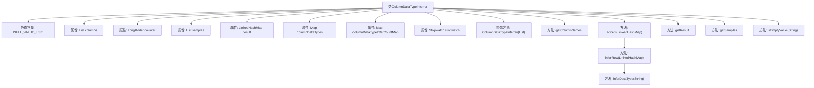
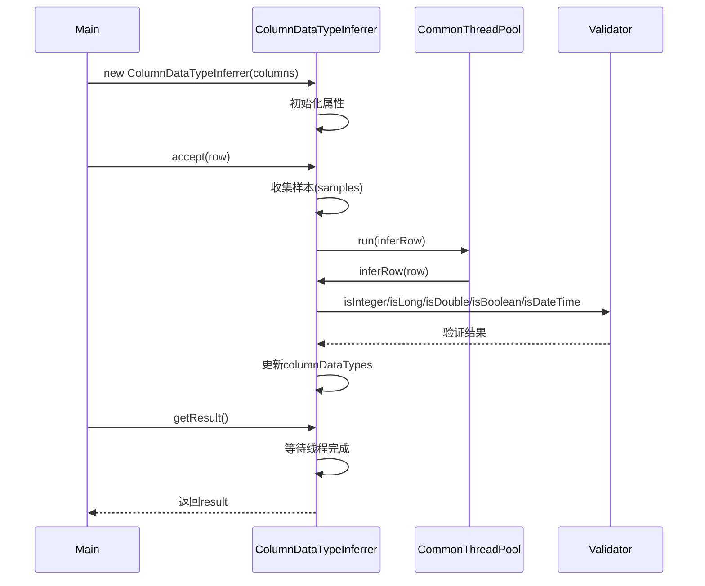

# 基础信息

|      |      |
|------|------|
| 名称 | ColumnDataTypeInferrer |
| 编码语言 | .java |
| 代码路径 | WeFe/common/java/common-wefe/src/main/java/com/welab/wefe/common/wefe/ColumnDataTypeInferrer.java |
| 包名 | com.welab.wefe.common.wefe |
| 依赖项 | ['com.welab.wefe.common.CommonThreadPool', 'com.welab.wefe.common.Stopwatch', 'com.welab.wefe.common.Validator', 'com.welab.wefe.common.util.ThreadUtil', 'com.welab.wefe.common.wefe.enums.ColumnDataType', 'java.util', 'java.util.concurrent.ConcurrentHashMap', 'java.util.concurrent.atomic.LongAdder', 'java.util.function.Consumer'] |
| 概述说明 | ColumnDataTypeInferrer类用于多线程推断字段数据类型，支持常见类型如整数、布尔值等，通过样本分析和并发处理确定最终类型。 |

# 说明

ColumnDataTypeInferrer是一个用于推断字段数据类型的Java类，实现了Consumer接口。它通过多线程方式分析输入数据行，推断各字段的数据类型。主要功能包括：初始化时设置待推断字段列表；使用计数器跟踪处理进度；收集数据样本；维护中间结果如字段类型集合和推断次数统计；提供方法结束推断并返回最终结果。推断逻辑基于字符串值判断数据类型，支持整数、长整型、双精度、布尔、日期时间等类型，并处理空值情况。类中还包含性能调测用的计时器。

# 类列表 Class Summary

| 名称   | 类型  | 说明 |
|-------|------|-------------|
| ColumnDataTypeInferrer | class | ColumnDataTypeInferrer类用于多线程推断字段数据类型，支持常见类型如整数、布尔值等，通过样本分析和并发处理确定最终类型。 |


## 类 ColumnDataTypeInferrer

|      |      |
|------|------|
| 访问范围 | public |
| 类型 | class |
| 名称 | ColumnDataTypeInferrer |
| 说明 | ColumnDataTypeInferrer类用于多线程推断字段数据类型，支持常见类型如整数、布尔值等，通过样本分析和并发处理确定最终类型。 |


### UML类图

```mermaid
classDiagram
    class ColumnDataTypeInferrer {
        -List~String~ NULL_VALUE_LIST
        -List~String~ columns
        -LongAdder counter
        -List~Map~String~Object~~ samples
        -LinkedHashMap~String~ColumnDataType~ result
        -Map~String~Set~ColumnDataType~~ columnDataTypes
        -Map~String~LongAdder~ columnDataTypeInferCountMap
        -Stopwatch stopwatch
        +ColumnDataTypeInferrer(List~String~ columns)
        +List~String~ getColumnNames()
        +void accept(LinkedHashMap~String~Object~ row)
        -void inferRow(LinkedHashMap~String~Object~ row)
        +Map~String~ColumnDataType~ getResult()
        -ColumnDataType inferDataType(String value)
        +List~Map~String~Object~~ getSamples()
        +static boolean isEmptyValue(String value)
    }

    class ColumnDataType {
        <<Enumeration>>
        +String
        +Enum
        +DateTime
        +Double
        +Long
        +Integer
        +Boolean
    }

    class Validator {
        <<Utility>>
        +static boolean isInteger(String value)
        +static boolean isLong(String value)
        +static boolean isDouble(String value)
        +static boolean isBoolean(String value)
        +static boolean isDateTime(String value)
    }

    ColumnDataTypeInferrer --> ColumnDataType : 使用
    ColumnDataTypeInferrer --> Validator : 调用静态方法
    ColumnDataTypeInferrer ..|> Consumer~LinkedHashMap~String~Object~~ : 实现
```

该代码实现了一个列数据类型推断器，通过分析输入数据样本自动推断各列的数据类型。核心类ColumnDataTypeInferrer实现了Consumer接口，采用多线程方式处理数据，使用计数器跟踪处理进度，并通过Validator工具类进行数据类型验证。系统维护多种中间状态映射表，当某列达到100个有效推断样本时即确定其最终类型，支持包括整型、浮点、布尔、日期等常见数据类型的识别。枚举类ColumnDataType定义了所有支持的数据类型类别。


### 内部方法调用关系图





这段代码实现了一个多线程的列数据类型推理器，主要功能是通过分析数据样本自动推断各列的数据类型。流程图展示了类的结构和主要方法调用关系，时序图描述了从初始化、数据接收到结果获取的完整流程。核心逻辑包括：1)通过accept方法接收数据行；2)使用线程池并行处理每行数据；3)通过Validator验证各种数据类型；4)当某列达到100次有效推理时停止该列的推理；5)最终通过getResult汇总所有列的数据类型。整个过程考虑了多线程安全和性能监控，适合处理大规模数据集。

### 字段列表 Field List

| 名称  | 类型  | 说明 |
|-------|-------|------|
| columnDataTypeInferCountMap = new ConcurrentHashMap<>() | Map<String, LongAdder> | 线程安全的并发映射，键为字符串，值为长整型累加器，用于统计列数据类型推断次数。 |
| columns | List<String> | 声明一个私有字符串列表变量columns。 |
| NULL_VALUE_LIST = Arrays.asList("", "null", "NA", "nan", "None") | List<String> | 定义常量列表NULL_VALUE_LIST，包含空值、null、NA、nan、None五种无效字符串。 |
| stopwatch = Stopwatch.startNew() | Stopwatch | 初始化并启动一个私有计时器stopwatch。 |
| result = new LinkedHashMap<>() | LinkedHashMap<String, ColumnDataType> | 声明一个不可变的LinkedHashMap变量result，键为String，值为ColumnDataType类型。 |
| counter = new LongAdder() | LongAdder | 创建线程安全的LongAdder计数器对象。 |
| samples = new ArrayList<>() | List<Map<String, Object>> | 声明一个存储键值对映射的列表变量samples，初始化为空ArrayList。 |
| columnDataTypes = new ConcurrentHashMap<>() | Map<String, Set<ColumnDataType>> | 线程安全的映射，键为字符串，值为列数据类型的集合。 |

### 方法列表

| 名称  | 类型  | 说明 |
|-------|-------|------|
| inferRow | void | 该方法用于推断行数据中各列的数据类型。遍历列名，根据值推断类型并记录。若某列推断次数达到100次，则停止对其继续推断。支持多线程操作。 |
| accept | void | 方法接受行数据，若样本未满10则存储。若字段类型已推断完成则停止处理，否则计数并异步推断该行。 |
| getSamples | List<Map<String, Object>> | 获取样本列表，返回类型为包含字符串和对象的映射列表。 |
| getColumnNames | List<String> | 方法返回列名列表。 |
| getResult | Map<String, ColumnDataType> | 方法等待线程完成后，遍历列数据类型集合，根据类型优先级设置结果映射，最后返回结果。若遇到未知类型则抛出异常。 |
| inferDataType | ColumnDataType | 方法根据输入字符串推断数据类型，空值返回null，依次检查整数、长整型、浮点、布尔、日期时间，均不匹配则返回字符串类型。 |
| isEmptyValue | boolean | 检查字符串是否为预设的空值列表中的忽略大小写匹配项。 |


