# 基础信息

|      |      |
|------|------|
| 名称 | wefe |
| 编码语言 | .java |
| 代码路径 | WeFe/common/java/common-wefe/src/main/java/com/welab/wefe/common/wefe |
| 包名 | docs.common.java.common-wefe.src.main.java.com.welab.wefe.common.wefe |
| 概述说明 | 服务检查框架实现分层健康检测，枚举模块定义联邦学习类型状态，配置管理模块统一处理多源连接，数据类型推断器分析字段类型。 |

# 说明

## 概述  
该模块是联邦学习系统的核心支撑框架，包含服务健康检查、枚举定义、配置管理和数据类型推断四大功能。采用分层抽象设计，关键接口包括AbstractCheckpoint（检查点）、AbstractConfigModel（配置模型）和Consumer（数据类型推断）。核心数据结构涵盖ServiceCheckPointOutput（检查结果）、11种ServiceType（服务类型枚举）和ColumnDataType（字段类型）。依赖Spring框架、JDBC驱动和云服务SDK。例如通过CheckpointManager并发检测UnionService连通性，或使用ColumnDataTypeInferrer推断字段类型。

## 主要业务场景  
模块支持联邦学习全生命周期管理：1) 服务健康检查采用哨兵模式，例如5秒超时检测；2) 枚举驱动状态机，如JobStatus控制任务流转；3) 工厂模式管理多数据源配置，例如生成特化数据库URL；4) 多线程推断字段类型（类似MapReduce）。典型流程包括配置校验→并行检查→结果聚合，例如UnionService检查失败时逐级上报。集成案例涵盖横向联邦学习（使用XGBoost算法）和云存储切换（如OSS凭证管理）。

### 包内部结构视图

```mermaid
graph TD
    wefe --> checkpoint
    wefe --> enums
    wefe --> dto
    wefe --> ColumnDataTypeInferrer.java
    checkpoint --> dto
    checkpoint --> AbstractUnionConnectionCheckpoint.java
    checkpoint --> CheckpointManager.java
    checkpoint --> AbstractCheckpoint.java
    dto --> ServiceCheckPointOutput.java
    dto --> ServiceAvailableCheckOutput.java
    dto --> MemberAvailableCheckOutput.java
    dto --> global_config
    dto --> storage
    global_config --> storage
    global_config --> calculation_engine
    global_config --> base
    global_config --> GatewayConfigModel.java
    global_config --> ServerCertInfoModel.java
    global_config --> BoardConfigModel.java
    global_config --> DeepLearningConfigModel.java
    global_config --> MailServerModel.java
    global_config --> PrivacyConfigModel.java
    global_config --> ServingConfigModel.java
    global_config --> GlobalConfigFlag.java
    global_config --> AlertConfigModel.java
    global_config --> MemberInfoModel.java
    global_config --> FlowConfigModel.java
    global_config --> AliyunSmsChannelConfigModel.java
    storage --> DataSourceConfig.java
    storage --> ClickhouseConfig.java
    calculation_engine --> fc
    calculation_engine --> spark
    calculation_engine --> CalculationEngineBaseConfigModel.java
    fc --> FunctionComputeBaseConfigModel.java
    fc --> AliyunFunctionComputeConfigModel.java
    fc --> TencentServerlessCloudFunctionConfigModel.java
    spark --> SparkStandaloneConfigModel.java
    base --> GlobalConfigInput.java
    base --> ConfigModel.java
    base --> AbstractConfigModel.java
    base --> ConfigGroupConstant.java
    enums --> ServiceType.java
    enums --> env
    enums --> ModelExportLanguage.java
    enums --> BoardUserSource.java
    enums --> DeepLearningJobType.java
    enums --> MessageLevel.java
    enums --> Binning.java
    enums --> VerificationCodeSendChannel.java
    enums --> JobStatus.java
    enums --> HashOptions.java
    enums --> ProjectType.java
    enums --> FederatedLearningModel.java
    enums --> DataResourcePublicLevel.java
    enums --> TaskStatus.java
    enums --> DataResourceType.java
    enums --> ContractName.java
    enums --> SmsBusinessType.java
    enums --> PredictFeatureDataSource.java
    enums --> DataResourceStorageType.java
    enums --> ChatListType.java
    enums --> BloomFilterProgressType.java
    enums --> GatewayProcessorType.java
    enums --> ProducerType.java
    enums --> VerificationCodeBusinessType.java
    enums --> TaskResultType.java
    enums --> ProjectFlowStatisticsStatus.java
    enums --> FileRurpose.java
    enums --> JobMemberRole.java
    enums --> MessageEvent.java
    enums --> ColumnDataType.java
    enums --> FcCloudProvider.java
    enums --> ProjectFlowStatus.java
    enums --> Algorithm.java
    enums --> AuditStatus.java
    enums --> ComponentType.java
    enums --> JobBackendType.java
    enums --> DataResourceUploadStatus.java
    enums --> FlowActionType.java
    enums --> FlowLimitStrategyTypeEnum.java
    enums --> BloomFilterPublicLevel.java
    enums --> PredictType.java
    enums --> DataResourceStorageServiceType.java
    enums --> FederatedLearningType.java
    env --> EnvName.java
    env --> EnvBranch.java
```

该流程图展示了WeFe项目中common-wefe模块的完整目录结构，包含checkpoint、enums、dto三大核心模块及其子文件。其中checkpoint模块包含抽象类和检查点管理文件，enums模块集中了40余个枚举类型定义文件，dto模块则细分为global_config配置体系和storage存储配置。全局配置部分采用多级嵌套结构，包含计算引擎配置、基础配置模型和各类服务配置模型，形成完整的配置管理体系。

# 文件列表

| 名称   | 类型  | 说明 |
|-------|------|-------------|
| [ColumnDataTypeInferrer.java](ColumnDataTypeInferrer.md) | file | ColumnDataTypeInferrer类用于多线程推断字段数据类型，支持常见类型如整数、布尔值等，通过样本分析和并发处理确定最终类型。 |
| [checkpoint](checkpoint/_module.md) | package | 该模块封装服务可用性检查，提供标准化输出结构和状态判断逻辑。包含三类DTO记录检查详情、聚合结果及成员级别映射。通过抽象类和检查点管理器实现服务连通性检查、结果收集与聚合，支持单服务检查、批量聚合及数据清理。 |
| [dto](dto/_module.md) | package | 核心模块统一管理全局配置和数据源连接，支持多场景配置标准化和数据库特化管理。通过基类、注解和继承实现灵活扩展，涵盖校验、版本化和URL生成等全生命周期功能。依赖反射机制和云服务SDK。 |
| [enums](enums/_module.md) | package | 枚举类型集合，包含服务类型、环境分支、模型语言、用户来源、任务状态、数据资源类型、验证码渠道、哈希算法、联邦学习模式等40+业务相关枚举定义，用于系统各模块的状态管理和类型标识。 |

