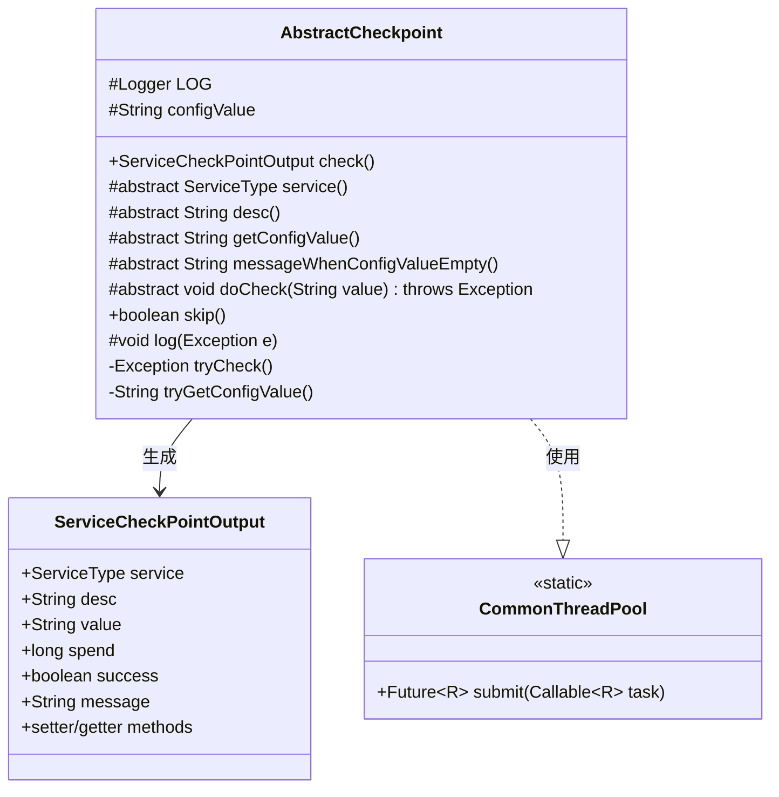
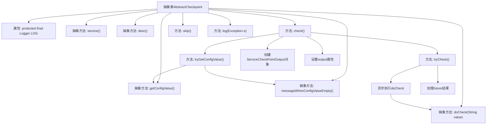

# 基础信息

|      |      |
|------|------|
| 名称 | AbstractCheckpoint |
| 编码语言 | .java |
| 代码路径 | WeFe/common/java/common-wefe/src/main/java/com/welab/wefe/common/wefe/checkpoint/AbstractCheckpoint.java |
| 包名 | com.welab.wefe.common.wefe.checkpoint |
| 依赖项 | ['com.welab.wefe.common.CommonThreadPool', 'com.welab.wefe.common.util.StringUtil', 'com.welab.wefe.common.wefe.checkpoint.dto.ServiceCheckPointOutput', 'com.welab.wefe.common.wefe.enums.ServiceType', 'org.slf4j.Logger', 'org.slf4j.LoggerFactory', 'java.util.concurrent.Future', 'java.util.concurrent.TimeUnit', 'java.util.concurrent.TimeoutException'] |
| 概述说明 | 抽象类AbstractCheckpoint定义检查点框架，含配置获取、校验逻辑及结果输出功能，支持超时控制与异常处理。 |

# 说明

AbstractCheckpoint是一个抽象类，定义了检查点的基本结构和行为。它包含获取配置值、执行检查、处理异常等核心方法。子类需要实现service、desc、getConfigValue等抽象方法。检查过程包括获取配置值、执行检查、记录耗时，并返回包含检查结果的ServiceCheckPointOutput对象。检查操作在异步线程中执行，超时时间为5秒。当配置值为空时，会抛出异常提示用户。类还提供了日志记录和跳过检查的默认实现。

# 类列表 Class Summary

| 名称   | 类型  | 说明 |
|-------|------|-------------|
| AbstractCheckpoint | class | 抽象类AbstractCheckpoint定义了检查点基类，包含获取配置、执行检查、处理异常等核心逻辑，子类需实现服务类型、描述、配置值获取等抽象方法。检查结果通过ServiceCheckPointOutput返回，支持超时处理和跳过检查功能。 |

## 类 AbstractCheckpoint

|      |      |
|------|------|
| 访问范围 | public abstract |
| 类型 | class |
| 名称 | AbstractCheckpoint |
| 说明 | 抽象类AbstractCheckpoint定义了检查点基类，包含获取配置、执行检查、处理异常等核心逻辑，子类需实现服务类型、描述、配置值获取等抽象方法。检查结果通过ServiceCheckPointOutput返回，支持超时处理和跳过检查功能。 |

### UML类图

这段代码定义了一个抽象类`AbstractCheckpoint`，用于实现检查点模式。它通过模板方法`check()`定义了检查流程：获取配置值、执行检查、生成结果。子类需要实现抽象方法来定义具体检查逻辑。检查过程支持超时控制(5秒)和空值校验，结果通过`ServiceCheckPointOutput`对象返回。类图中展示了核心类及其关系，包括与线程池`CommonThreadPool`的协作关系。

### 内部方法调用关系图

这段代码展示了一个抽象检查点类的实现流程。该抽象类定义了检查点的核心逻辑，包括获取配置值、执行检查、处理结果等关键步骤。主要流程从check()方法开始，先尝试获取配置值，然后异步执行检查操作，最后组装输出结果。过程中涉及多个抽象方法需要子类实现，如获取服务类型、描述信息、配置值等。检查操作通过线程池异步执行，并设置了5秒超时机制。整个流程考虑了异常处理和日志记录，是一个典型的模板方法设计模式实现。

### 字段列表 Field List

| 名称  | 类型  | 说明 |
|-------|-------|------|
| configValue | String | 受保护的字符串配置值。 |
| LOG = LoggerFactory.getLogger(this.getClass()) | Logger | 类中定义了一个受保护的final日志对象LOG，用于记录当前类的日志信息。 |

### 方法列表

| 名称  | 类型  | 说明 |
|-------|-------|------|
| tryCheck | Exception | 异步执行检查，超时或异常时返回对应错误，默认等待5秒。 |
| doCheck | void | 抽象方法doCheck，参数为String value，可能抛出异常。 |
| getConfigValue | String | 抽象方法，用于获取配置值，返回字符串类型。 |
| messageWhenConfigValueEmpty | String | 抽象方法，返回配置值为空时的提示信息。 |
| check | ServiceCheckPointOutput | 方法check()执行服务检查：获取配置项，尝试检查操作，记录耗时，返回包含状态、描述、耗时和结果信息的输出对象。成功或失败时设置相应消息。 |
| desc | String | 抽象方法，返回字符串描述。 |
| service | ServiceType | 抽象方法定义服务类型，需子类实现。 |
| tryGetConfigValue | String | 方法尝试获取配置值，若为空且错误信息非空则抛出异常，否则返回配置值。 |
| skip | boolean | 方法skip返回固定值false，表示不跳过。 |
| log | void | 该方法用于记录异常日志，将异常类名、消息及异常对象输出到错误日志中。 |

