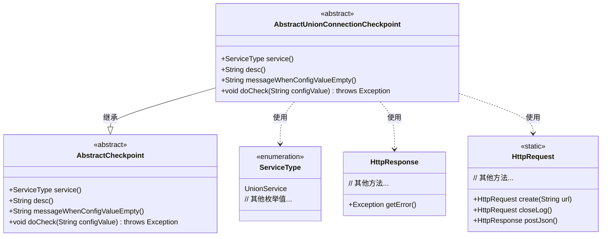
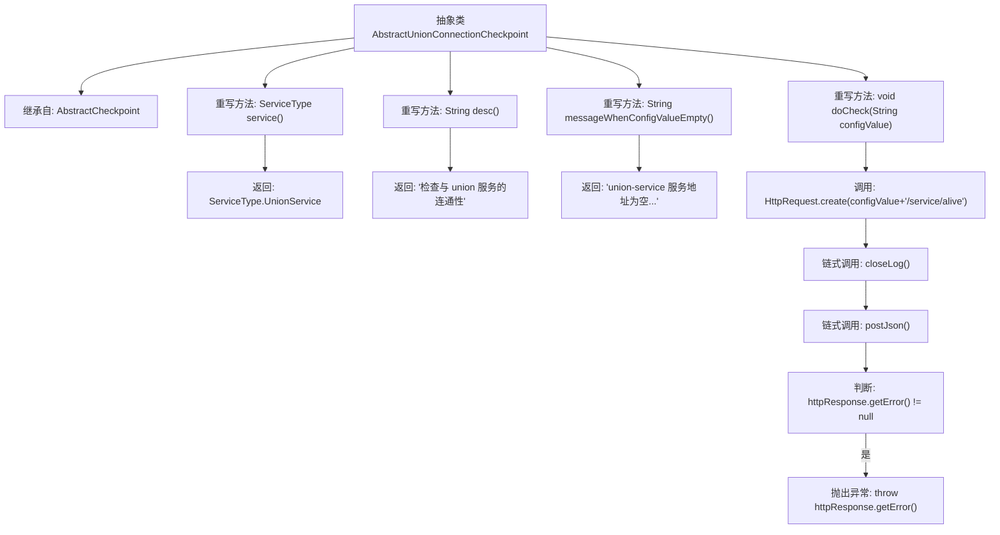

# 基础信息

|      |      |
|------|------|
| 名称 | AbstractUnionConnectionCheckpoint |
| 编码语言 | .java |
| 代码路径 | WeFe/common/java/common-wefe/src/main/java/com/welab/wefe/common/wefe/checkpoint/AbstractUnionConnectionCheckpoint.java |
| 包名 | com.welab.wefe.common.wefe.checkpoint |
| 依赖项 | ['com.welab.wefe.common.http.HttpRequest', 'com.welab.wefe.common.http.HttpResponse', 'com.welab.wefe.common.wefe.enums.ServiceType'] |
| 概述说明 | 抽象类AbstractUnionConnectionCheckpoint继承AbstractCheckpoint，检查UnionService连通性，需配置服务地址，通过HTTP请求验证服务存活状态。 |

# 说明

AbstractUnionConnectionCheckpoint是一个抽象类，继承自AbstractCheckpoint。它重写了service方法，返回ServiceType.UnionService；重写desc方法，返回检查与union服务连通性的描述；重写messageWhenConfigValueEmpty方法，提示配置union-service服务地址。doCheck方法通过HTTP请求检查服务连通性，若配置值为空或请求出错会抛出异常。

# 类列表 Class Summary

| 名称   | 类型  | 说明 |
|-------|------|-------------|
| AbstractUnionConnectionCheckpoint | class | 抽象类AbstractUnionConnectionCheckpoint继承AbstractCheckpoint，定义检查union服务连通性逻辑。服务类型为UnionService，配置为空时报错，通过HTTP请求验证服务存活状态。 |

## 类 AbstractUnionConnectionCheckpoint

|      |      |
|------|------|
| 访问范围 | public abstract |
| 类型 | class |
| 名称 | AbstractUnionConnectionCheckpoint |
| 说明 | 抽象类AbstractUnionConnectionCheckpoint继承AbstractCheckpoint，定义检查union服务连通性逻辑。服务类型为UnionService，配置为空时报错，通过HTTP请求验证服务存活状态。 |

### UML类图

这段代码展示了一个抽象类`AbstractUnionConnectionCheckpoint`，它继承自`AbstractCheckpoint`，专门用于检查与union服务的连通性。类中重写了父类的抽象方法，包括获取服务类型、描述信息、配置为空时的提示消息以及执行检查的核心逻辑。检查过程通过HTTP请求访问union服务的存活接口，并处理可能的错误响应。类图中清晰地展示了继承关系和对`ServiceType`、`HttpRequest`、`HttpResponse`等工具类的依赖关系。

### 内部方法调用关系图

该流程图展示了AbstractUnionConnectionCheckpoint抽象类的结构及其方法调用关系。该类继承自AbstractCheckpoint，重写了四个关键方法：service()返回服务类型，desc()提供检查描述，messageWhenConfigValueEmpty()返回配置错误提示，核心方法doCheck()执行HTTP健康检查流程。检查过程包含创建请求、关闭日志、发送POST请求，并根据响应错误决定是否抛出异常。所有方法都围绕验证Union服务的连通性这一核心功能展开。

### 字段列表 Field List

| 名称  | 类型  | 说明 |
|-------|-------|------|

### 方法列表

| 名称  | 类型  | 说明 |
|-------|-------|------|
| desc | String | 检查与union服务的连通性。 |
| service | ServiceType | 重写service方法，返回UnionService类型。 |
| messageWhenConfigValueEmpty | String | 当union-service服务地址未配置时，提示需在config.properties中设置。 |
| doCheck | void | 检查服务存活状态：通过HTTP请求验证配置地址的服务是否可用，若出错则抛出异常。 |

