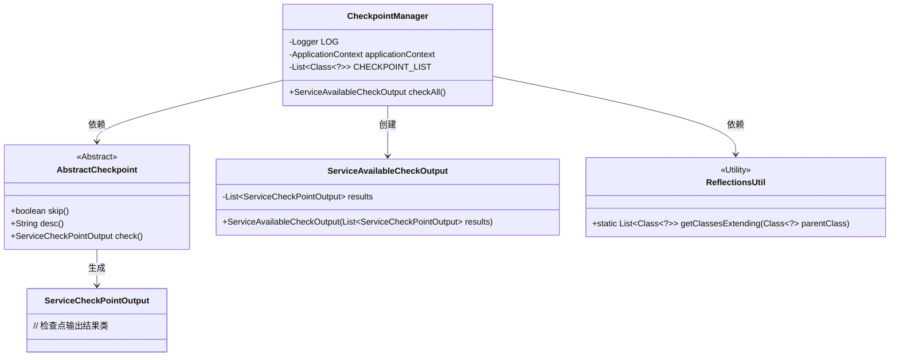
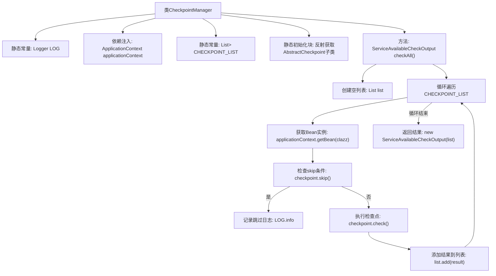

# 基础信息

|      |      |
|------|------|
| 名称 | CheckpointManager |
| 编码语言 | .java |
| 代码路径 | WeFe/common/java/common-wefe/src/main/java/com/welab/wefe/common/wefe/checkpoint/CheckpointManager.java |
| 包名 | com.welab.wefe.common.wefe.checkpoint |
| 依赖项 | ['com.welab.wefe.common.util.ReflectionsUtil', 'com.welab.wefe.common.wefe.checkpoint.dto.ServiceAvailableCheckOutput', 'com.welab.wefe.common.wefe.checkpoint.dto.ServiceCheckPointOutput', 'org.slf4j.Logger', 'org.slf4j.LoggerFactory', 'org.springframework.beans.factory.annotation.Autowired', 'org.springframework.context.ApplicationContext', 'org.springframework.stereotype.Service', 'java.util.ArrayList', 'java.util.List'] |
| 概述说明 | CheckpointManager类通过反射扫描所有继承AbstractCheckpoint的类，并调用其check方法进行服务可用性检查，跳过标记为skip的检查点，最终返回检查结果列表。 |

# 说明

CheckpointManager是一个Spring服务类，用于管理所有继承AbstractCheckpoint的检查点实现。它通过静态代码块使用反射工具ReflectionsUtil扫描获取所有检查点类。核心方法checkAll会遍历这些检查点类，从Spring容器获取实例，跳过标记为skip的检查点，执行其余检查点的check方法并收集结果。最终返回包含所有检查结果的ServiceAvailableCheckOutput对象。过程中会记录跳过的检查点日志信息。

# 类列表 Class Summary

| 名称   | 类型  | 说明 |
|-------|------|-------------|
| CheckpointManager | class | CheckpointManager类通过反射扫描获取所有继承AbstractCheckpoint的检查点，并逐一执行检查逻辑，跳过标记为skip的检查点，最终返回检查结果列表。 |

## 类 CheckpointManager

|      |      |
|------|------|
| 访问范围 | @Service;public |
| 类型 | class |
| 名称 | CheckpointManager |
| 说明 | CheckpointManager类通过反射扫描获取所有继承AbstractCheckpoint的检查点，并逐一执行检查逻辑，跳过标记为skip的检查点，最终返回检查结果列表。 |

### UML类图

这段代码展示了一个检查点管理系统，其中CheckpointManager作为核心服务类，通过反射机制获取所有继承AbstractCheckpoint的检查点类，并依次执行检查逻辑。AbstractCheckpoint是抽象基类，定义了skip()、desc()和check()等抽象方法。ServiceAvailableCheckOutput是最终检查结果的容器类，包含多个ServiceCheckPointOutput实例。整个系统通过Spring容器管理检查点实例，实现了灵活的可扩展检查机制。

### 内部方法调用关系图

该流程图展示了CheckpointManager类的核心逻辑结构。类通过静态初始化块反射加载所有AbstractCheckpoint子类，checkAll方法会遍历这些检查点类，通过Spring容器获取实例后，先判断是否需要跳过检查，若不跳过则执行检查逻辑并收集结果，最终汇总返回所有检查结果。日志记录模块会记录被跳过的检查点信息，整个流程体现了检查点管理的核心控制逻辑。

### 字段列表 Field List

| 名称  | 类型  | 说明 |
|-------|-------|------|
| LOG = LoggerFactory.getLogger(CheckpointManager.class) | Logger | 定义CheckpointManager类的私有静态日志常量LOG。 |
| applicationContext | ApplicationContext | 自动注入Spring应用上下文对象。 |
| CHECKPOINT_LIST | List<Class<?>> | 静态常量CHECKPOINT_LIST，存储待检查的类类型列表。 |

### 方法列表

| 名称  | 类型  | 说明 |
|-------|-------|------|
| checkAll | ServiceAvailableCheckOutput | 方法检查所有服务可用性，遍历检查点列表，跳过标记跳过的检查点，执行检查并收集结果，最后返回汇总输出。 |

