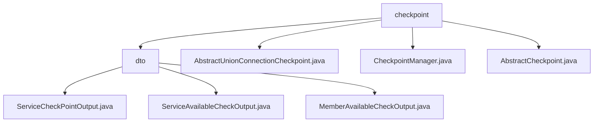

# 基础信息

|      |      |
|------|------|
| 名称 | checkpoint |
| 编码语言 | .java |
| 代码路径 | WeFe/common/java/common-wefe/src/main/java/com/welab/wefe/common/wefe/checkpoint |
| 包名 | docs.common.java.common-wefe.src.main.java.com.welab.wefe.common.wefe.checkpoint |
| 概述说明 | 该模块封装服务可用性检查，提供标准化输出结构和状态判断逻辑。包含三类DTO记录检查详情、聚合结果及成员级别映射。通过抽象类和检查点管理器实现服务连通性检查、结果收集与聚合，支持单服务检查、批量聚合及数据清理。 |

# 说明

## 概述  
该模块核心职责是实现服务可用性检查框架，通过分层抽象和标准化输出结构提供统一的服务健康度评估能力。接口规范包含三层结构：AbstractCheckpoint定义基础检查行为，AbstractUnionConnectionCheckpoint实现具体服务连通性检测，CheckpointManager统一调度检查流程。关键数据结构包括ServiceCheckPointOutput（原子检查结果）、ServiceAvailableCheckOutput（聚合结果）和检查状态枚举。依赖Spring框架和Java反射机制。例如AbstractUnionConnectionCheckpoint通过HTTP检测UnionService连通性，超时或配置缺失会触发异常。

## 主要业务场景  
典型流程为CheckpointManager驱动检查生命周期：反射加载所有AbstractCheckpoint子类，过滤skip标记项后并发执行检查（类似哨兵模式），最终聚合为ServiceAvailableCheckOutput。具体实现如Union服务检查会验证配置地址有效性，超时控制在5秒内。功能覆盖配置校验、多服务并行检测、结果分级汇总，例如当某服务不可达时，错误会通过ServiceCheckPointOutput逐级上报至聚合结果。

### 包内部结构视图

该流程图展示了checkpoint目录下的结构关系，包含一个dto子目录和三个Java类文件。dto目录下又包含三个输出类文件，分别处理不同类型的检查点输出。整体结构清晰地反映了checkpoint模块的代码组织方式，便于理解各组件间的层级关系。

# 文件列表

| 名称   | 类型  | 说明 |
|-------|------|-------------|
| [AbstractUnionConnectionCheckpoint.java](AbstractUnionConnectionCheckpoint.md) | file | 抽象类AbstractUnionConnectionCheckpoint继承AbstractCheckpoint，检查UnionService连通性，需配置服务地址，通过HTTP请求验证服务存活状态。 |
| [CheckpointManager.java](CheckpointManager.md) | file | CheckpointManager类通过反射扫描所有继承AbstractCheckpoint的类，并调用其check方法进行服务可用性检查，跳过标记为skip的检查点，最终返回检查结果列表。 |
| [AbstractCheckpoint.java](AbstractCheckpoint.md) | file | 抽象类AbstractCheckpoint定义检查点框架，含配置获取、校验逻辑及结果输出功能，支持超时控制与异常处理。 |
| [dto](dto/_module.md) | package | ServiceCheckPointOutput类封装服务检查点输出，含类型、状态等属性，提供成功/失败构建方法。ServiceAvailableCheckOutput类检查服务可用性，自动判断整体状态并处理敏感数据。MemberAvailableCheckOutput类检查成员可用性，管理服务类型与结果映射，自动更新错误状态。 |

