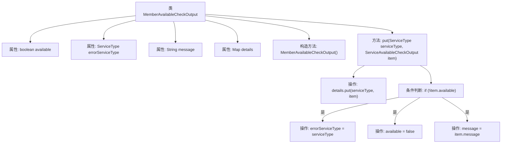

# 基础信息

|      |      |
|------|------|
| 名称 | MemberAvailableCheckOutput |
| 编码语言 | .java |
| 代码路径 | WeFe/common/java/common-wefe/src/main/java/com/welab/wefe/common/wefe/checkpoint/dto/MemberAvailableCheckOutput.java |
| 包名 | com.welab.wefe.common.wefe.checkpoint.dto |
| 依赖项 | ['com.welab.wefe.common.wefe.enums.ServiceType', 'java.util.LinkedHashMap', 'java.util.Map'] |
| 概述说明 | 类MemberAvailableCheckOutput检查成员可用性，含可用状态、错误类型、消息及服务详情。不可用时更新错误信息。 |

# 说明

MemberAvailableCheckOutput类用于检查成员可用性状态，包含可用标志、错误服务类型、消息及详细检查结果映射。构造函数初始化对象，put方法添加服务类型及其检查结果，若服务不可用则更新错误类型、可用状态及错误消息。

# 类列表 Class Summary

| 名称   | 类型  | 说明 |
|-------|------|-------------|
| MemberAvailableCheckOutput | class | 类MemberAvailableCheckOutput检查成员可用性，包含可用状态、错误服务类型、消息及详细结果。若子服务不可用，更新错误信息并标记为不可用。 |


## 类 MemberAvailableCheckOutput

|      |      |
|------|------|
| 访问范围 | public |
| 类型 | class |
| 名称 | MemberAvailableCheckOutput |
| 说明 | 类MemberAvailableCheckOutput检查成员可用性，包含可用状态、错误服务类型、消息及详细结果。若子服务不可用，更新错误信息并标记为不可用。 |


### UML类图

```mermaid
classDiagram
    class MemberAvailableCheckOutput {
        +boolean available
        +ServiceType errorServiceType
        +String message
        +Map~ServiceType, ServiceAvailableCheckOutput~ details
        +MemberAvailableCheckOutput()
        +put(ServiceType serviceType, ServiceAvailableCheckOutput item) void
    }

    class ServiceAvailableCheckOutput {
        <<Interface>>
    }
    // MemberAvailableCheckOutput 依赖 ServiceType
    MemberAvailableCheckOutput --> ServiceType : 依赖
    // MemberAvailableCheckOutput 包含 ServiceAvailableCheckOutput
    MemberAvailableCheckOutput "1" *-- "0..*" ServiceAvailableCheckOutput : 包含
```

这段代码定义了一个`MemberAvailableCheckOutput`类，用于检查成员可用性状态。该类包含可用性标志、错误服务类型、消息和详细检查结果的映射。当添加不可用服务时，会自动更新错误状态。类图展示了其与`ServiceType`的依赖关系，以及与`ServiceAvailableCheckOutput`接口的聚合关系（1对多），后者存储具体服务检查结果。结构设计支持灵活扩展不同服务类型的可用性检查。


### 内部方法调用关系图



该流程图展示了MemberAvailableCheckOutput类的结构和主要方法逻辑。类包含4个属性和2个方法，核心方法put()通过LinkedHashMap存储服务检查结果，并在服务不可用时更新错误状态。流程清晰描述了条件判断和属性更新的分支路径，体现了状态变更的完整逻辑链条。

### 字段列表 Field List

| 名称  | 类型  | 说明 |
|-------|-------|------|
| errorServiceType | ServiceType | 定义公共变量errorServiceType，类型为ServiceType。 |
| available = true | boolean | 变量available为布尔类型，初始值为true，表示可用状态。 |
| message | String | 公共字符串变量message。 |
| details = new LinkedHashMap<>() | Map<ServiceType, ServiceAvailableCheckOutput> | 定义了一个名为details的公共映射，键为ServiceType，值为ServiceAvailableCheckOutput，使用LinkedHashMap实现。 |

### 方法列表

| 名称  | 类型  | 说明 |
|-------|-------|------|
| put | void | 方法将服务类型与检查结果存入映射。若服务不可用，记录错误类型、状态及消息。 |


