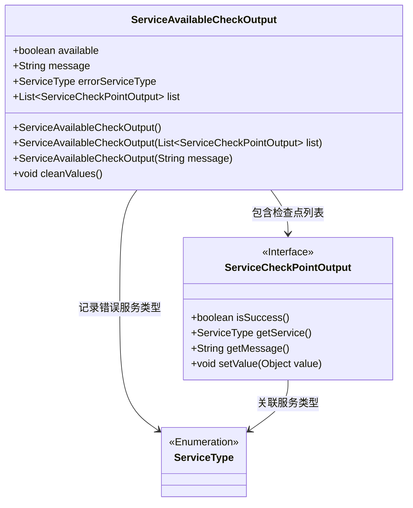
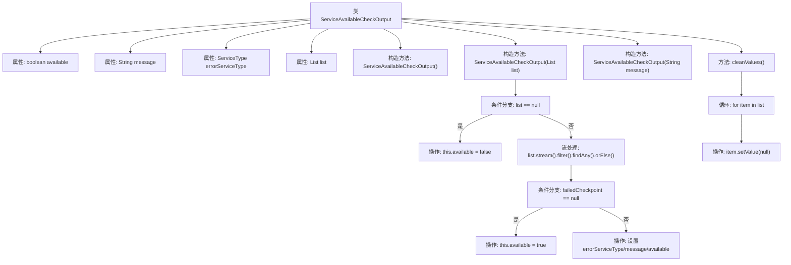

# 基础信息

|      |      |
|------|------|
| 名称 | ServiceAvailableCheckOutput |
| 编码语言 | .java |
| 代码路径 | WeFe/common/java/common-wefe/src/main/java/com/welab/wefe/common/wefe/checkpoint/dto/ServiceAvailableCheckOutput.java |
| 包名 | com.welab.wefe.common.wefe.checkpoint.dto |
| 依赖项 | ['com.welab.wefe.common.wefe.enums.ServiceType', 'java.util.List'] |
| 概述说明 | 服务可用性检查输出类，包含可用状态、消息、错误服务类型及检查点列表。构造函数处理列表判断可用性，提供清理方法清空检查点值。 |

# 说明

ServiceAvailableCheckOutput类用于检查服务可用性，包含四个属性：available表示服务是否可用，message存储状态信息，errorServiceType记录失败服务类型，list保存检查点结果列表。构造函数支持三种初始化方式：默认构造、基于检查点列表构造（自动设置available状态和错误信息）、基于消息构造。cleanValues方法用于清空检查点中的敏感数据。该类通过遍历检查点列表自动判断服务整体状态，若任一检查点失败则标记服务不可用并记录错误信息。

# 类列表 Class Summary

| 名称   | 类型  | 说明 |
|-------|------|-------------|
| ServiceAvailableCheckOutput | class | 服务可用性检查输出类，包含可用状态、消息、错误服务类型及检查点列表。构造函数处理列表状态并设置可用性。提供清理检查点值的方法。 |

## 类 ServiceAvailableCheckOutput

|      |      |
|------|------|
| 访问范围 | public |
| 类型 | class |
| 名称 | ServiceAvailableCheckOutput |
| 说明 | 服务可用性检查输出类，包含可用状态、消息、错误服务类型及检查点列表。构造函数处理列表状态并设置可用性。提供清理检查点值的方法。 |

### UML类图

该类图展示了服务可用性检查输出类(ServiceAvailableCheckOutput)的结构，包含四个公共字段和三个构造函数。核心功能是通过检查点列表(ServiceCheckPointOutput)判断服务可用性，能记录错误服务类型(ServiceType)和相关信息。cleanValues()方法用于清理敏感数据，体现了安全设计考量。类间关系清晰展示了数据流动方向，其中ServiceCheckPointOutput作为接口定义了必要的检查点操作方法。

### 内部方法调用关系图

该流程图展示了ServiceAvailableCheckOutput类的结构和主要逻辑。类包含4个属性和3个构造方法，其中带列表参数的构造方法实现了核心业务逻辑：通过流处理检查列表中是否存在失败项，并据此设置可用状态和相关错误信息。cleanValues方法则用于清空列表中所有项的value值。流程清晰展现了条件分支和循环处理逻辑。

### 字段列表 Field List

| 名称  | 类型  | 说明 |
|-------|-------|------|
| errorServiceType | ServiceType | 定义公共枚举变量errorServiceType，用于标识错误服务类型。 |
| message | String | 声明一个公共字符串变量message。 |
| list | List<ServiceCheckPointOutput> | 这是一个公共列表，存储ServiceCheckPointOutput类型的对象。 |
| available | boolean | 布尔型变量available，表示可用状态。 |

### 方法列表

| 名称  | 类型  | 说明 |
|-------|-------|------|
| cleanValues | void | 清理列表中的值：若列表非空，遍历并将每个项的value设为null。 |

