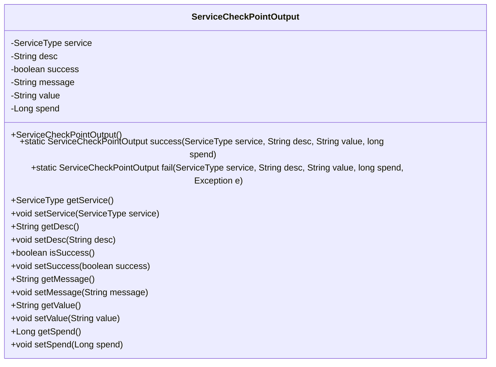
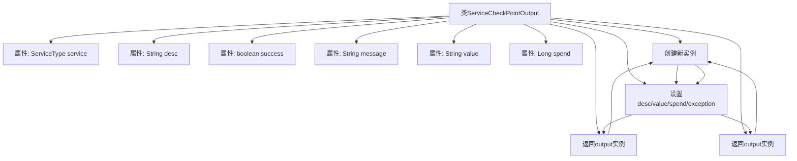

# 基础信息

|      |      |
|------|------|
| 名称 | ServiceCheckPointOutput |
| 编码语言 | .java |
| 代码路径 | WeFe/common/java/common-wefe/src/main/java/com/welab/wefe/common/wefe/checkpoint/dto/ServiceCheckPointOutput.java |
| 包名 | com.welab.wefe.common.wefe.checkpoint.dto |
| 依赖项 | ['com.welab.wefe.common.wefe.enums.ServiceType'] |
| 概述说明 | ServiceCheckPointOutput类用于记录服务检查结果，包含服务类型、描述、成功状态、消息、值和耗时。提供成功和失败的静态构造方法及getter/setter。 |

# 说明

ServiceCheckPointOutput类用于封装服务检查点的输出结果，包含服务类型、描述、成功状态、消息、值和耗时等属性。提供两个静态方法：success用于构建成功结果，fail用于构建失败结果并包含异常信息。类中包含所有属性的getter和setter方法，支持灵活设置和获取各字段值。

# 类列表 Class Summary

| 名称   | 类型  | 说明 |
|-------|------|-------------|
| ServiceCheckPointOutput | class | ServiceCheckPointOutput类用于记录服务检查结果，包含服务类型、描述、成功状态、消息、值和耗时，提供成功和失败的静态构建方法。 |

## 类 ServiceCheckPointOutput

|      |      |
|------|------|
| 访问范围 | public |
| 类型 | class |
| 名称 | ServiceCheckPointOutput |
| 说明 | ServiceCheckPointOutput类用于记录服务检查结果，包含服务类型、描述、成功状态、消息、值和耗时，提供成功和失败的静态构建方法。 |

### UML类图

这段代码定义了一个名为`ServiceCheckPointOutput`的类，用于表示服务检查点的输出结果。该类包含多个私有字段，如`service`、`desc`、`success`等，以及对应的getter和setter方法。此外，还提供了两个静态工厂方法`success`和`fail`，分别用于创建成功和失败的检查点输出实例。该类主要用于封装服务检查点的状态信息，包括服务类型、描述、是否成功、消息、值和耗时等。

### 内部方法调用关系图

这段代码定义了一个服务检查点输出类，包含6个核心属性和两个核心静态工厂方法。success方法用于构建成功响应，会初始化service、desc、value和耗时等字段；fail方法用于构建失败响应，额外接收异常对象并设置错误消息。所有属性都配有标准的getter/setter方法，支持灵活的对象构建和数据访问。该类设计用于封装服务调用的结果状态、耗时和附加信息。

### 字段列表 Field List

| 名称  | 类型  | 说明 |
|-------|-------|------|
| spend | Long | 私有长整型变量spend，用于存储数值。 |
| service | ServiceType | 私有服务类型变量service。 |
| message | String | 私有字符串变量message。 |
| value | String | 声明一个私有字符串变量value。 |
| desc | String | 私有字符串类型变量desc。 |
| success | boolean | 布尔类型变量success，表示操作是否成功。 |

### 方法列表

| 名称  | 类型  | 说明 |
|-------|-------|------|
| getService | ServiceType | 获取当前服务的ServiceType类型对象。 |
| getValue | String | 这是一个Java方法，返回字符串类型的成员变量value的值。 |
| isSuccess | boolean | 这是一个Java方法，返回布尔值success的状态。 |
| getMessage | String | 这是一个Java方法，返回字符串类型的message变量值。 |
| getDesc | String | 获取描述信息的方法，返回字符串类型的desc值。 |
| fail | ServiceCheckPointOutput | 静态方法`fail`创建并返回`ServiceCheckPointOutput`实例，标记服务检查失败，设置描述、错误信息、耗时和异常详情。 |
| setService | void | 设置服务类型的方法，将传入的service赋值给当前对象的service属性。 |
| setDesc | void | 这是一个Java方法，用于设置对象的描述信息。方法接收一个字符串参数desc，并将其赋值给对象的desc属性。 |
| setSuccess | void | 设置操作成功状态的布尔值方法。 |
| setValue | void | 这是一个Java方法，用于设置类成员变量value的值。方法接收一个字符串参数value，并将其赋值给当前对象的value属性。 |
| success | ServiceCheckPointOutput | 创建ServiceCheckPointOutput实例，设置服务类型、描述、值、耗时及成功状态为false，返回输出对象。 |
| getSpend | Long | 这是一个Java方法，返回名为spend的Long类型变量值。 |
| setSpend | void | 这是一个Java方法，用于设置类成员变量spend的值。方法接收一个Long类型参数，并将其赋值给当前对象的spend属性。 |
| setMessage | void | 这是一个Java方法，用于设置类中的message属性值。方法接收一个字符串参数message，并将其赋值给类的成员变量this.message。 |

