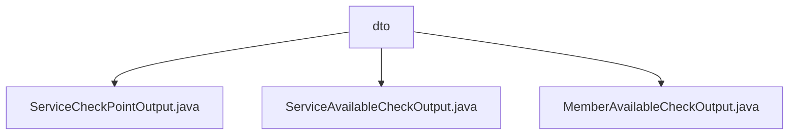

# 基础信息

|      |      |
|------|------|
| 名称 | dto |
| 编码语言 | .java |
| 代码路径 | WeFe/common/java/common-wefe/src/main/java/com/welab/wefe/common/wefe/checkpoint/dto |
| 包名 | docs.common.java.common-wefe.src.main.java.com.welab.wefe.common.wefe.checkpoint.dto |
| 概述说明 | ServiceCheckPointOutput类封装服务检查点输出，含类型、状态等属性，提供成功/失败构建方法。ServiceAvailableCheckOutput类检查服务可用性，自动判断整体状态并处理敏感数据。MemberAvailableCheckOutput类检查成员可用性，管理服务类型与结果映射，自动更新错误状态。 |

# 说明

## 概述  
该模块核心职责是封装服务可用性检查结果，提供标准化的输出结构和状态判断逻辑。接口规范包含三类DTO：ServiceCheckPointOutput记录单次检查详情（如耗时/状态），ServiceAvailableCheckOutput聚合多个检查点并自动计算整体可用性，MemberAvailableCheckOutput扩展为成员级别检查结果映射。关键数据结构包括检查状态标志、错误类型枚举和结果列表/映射。依赖Java基础库，无外部组件。例如ServiceAvailableCheckOutput通过遍历子检查点自动标记失败状态。

## 主要业务场景  
典型流程为：先通过ServiceCheckPointOutput构建原子检查结果（例如耗时统计），再由ServiceAvailableCheckOutput聚合多服务检查结果（类似电路熔断模式），最终通过MemberAvailableCheckOutput形成成员维度视图。交互模式遵循"构建-聚合-上报"链，例如当某服务检查失败时，错误类型会从ServiceCheckPointOutput逐级传递至顶层输出。完整功能覆盖单服务检查、批量结果聚合和敏感数据清理。

### 包内部结构视图

该流程图展示了WeFe项目中checkpoint模块下dto目录的结构关系，包含三个输出类文件：ServiceCheckPointOutput、ServiceAvailableCheckOutput和MemberAvailableCheckOutput，它们都直接隶属于dto目录，没有更深层级的嵌套关系。

# 文件列表

| 名称   | 类型  | 说明 |
|-------|------|-------------|
| [ServiceCheckPointOutput.java](ServiceCheckPointOutput.md) | file | ServiceCheckPointOutput类用于记录服务检查结果，包含服务类型、描述、成功状态、消息、值和耗时。提供成功和失败的静态构造方法及getter/setter。 |
| [ServiceAvailableCheckOutput.java](ServiceAvailableCheckOutput.md) | file | 服务可用性检查输出类，包含可用状态、消息、错误服务类型及检查点列表。构造函数处理列表判断可用性，提供清理方法清空检查点值。 |
| [MemberAvailableCheckOutput.java](MemberAvailableCheckOutput.md) | file | 类MemberAvailableCheckOutput检查成员可用性，含可用状态、错误类型、消息及服务详情。不可用时更新错误信息。 |

