# 基础信息

|      |      |
|------|------|
| 名称 | dto |
| 编码语言 | .java |
| 代码路径 | WeFe/common/java/common-wefe/src/main/java/com/welab/wefe/common/wefe/dto |
| 包名 | docs.common.java.common-wefe.src.main.java.com.welab.wefe.common.wefe.dto |
| 概述说明 | 核心模块统一管理全局配置和数据源连接，支持多场景配置标准化和数据库特化管理。通过基类、注解和继承实现灵活扩展，涵盖校验、版本化和URL生成等全生命周期功能。依赖反射机制和云服务SDK。 |

# 说明

## 概述  
该模块是统一管理全局配置和数据源连接的核心框架，采用类似注册中心与工厂模式的混合设计。通过AbstractConfigModel基类和标准化接口（如非空校验、URL构建）实现多场景配置管理，关键数据结构包括基础配置模型、连接参数（如主机地址）和云商凭证（如阿里云OSS）。外部依赖涵盖JDBC驱动（如ClickHouse）、云服务SDK及Java反射机制。例如通过继承链实现存储类型管理，或重写buildUrl生成特化数据库连接。

## 主要业务场景  
模块支持四类典型场景：1) 基础设施配置（如邮件服务器）的分层管理；2) 云服务集成（如OSS/Spark）的后端切换；3) 业务参数（如网关地址）的版本化更新；4) 多数据源连接（如ClickHouse）的全生命周期管理。交互模式包含注解驱动校验、继承特化（类似工厂模式）和反射查询。例如典型流程：强制参数校验→配置连接池→生成数据库特化URL。API类型涵盖常量引用和反射接口，支持批量插入优化等高级配置。

### 包内部结构视图

```mermaid
graph TD
    dto --> global_config
    dto --> storage
    global_config --> storage
    global_config --> calculation_engine
    global_config --> base
    storage --> StorageBaseConfigModel.java
    storage --> ClickHouseStorageConfigModel.java
    calculation_engine --> fc
    calculation_engine --> spark
    calculation_engine --> CalculationEngineBaseConfigModel.java
    fc --> FunctionComputeBaseConfigModel.java
    fc --> AliyunFunctionComputeConfigModel.java
    fc --> TencentServerlessCloudFunctionConfigModel.java
    spark --> SparkStandaloneConfigModel.java
    base --> GlobalConfigInput.java
    base --> ConfigModel.java
    base --> AbstractConfigModel.java
    base --> ConfigGroupConstant.java
    global_config --> GatewayConfigModel.java
    global_config --> ServerCertInfoModel.java
    global_config --> BoardConfigModel.java
    global_config --> DeepLearningConfigModel.java
    global_config --> MailServerModel.java
    global_config --> PrivacyConfigModel.java
    global_config --> ServingConfigModel.java
    global_config --> GlobalConfigFlag.java
    global_config --> AlertConfigModel.java
    global_config --> MemberInfoModel.java
    global_config --> FlowConfigModel.java
    global_config --> AliyunSmsChannelConfigModel.java
    storage --> DataSourceConfig.java
    storage --> ClickhouseConfig.java
```

该流程图展示了WeFe项目中dto目录下的层级结构，包含global_config和storage两个主要子目录。global_config下又细分为storage、calculation_engine和base三个子模块，其中calculation_engine包含fc和spark两种计算引擎配置。整个结构清晰地呈现了各类配置模型文件的组织关系，包括基础配置、存储配置、计算引擎配置等共计25个节点。

# 文件列表

| 名称   | 类型  | 说明 |
|-------|------|-------------|
| [storage](storage/_module.md) | package | 抽象类DataSourceConfig配置数据源连接参数，含连接池设置和验证功能。ClickhouseConfig继承该类，实现ClickHouse的JDBC连接URL和驱动类名。 |
| [global_config](global_config/_module.md) | package | 存储配置模块管理基础存储和ClickHouse连接参数。计算引擎模块处理多云资源配置和计算后端切换。全局配置模块集中管理各类配置项，支持分组查询。包含网关、证书、深度学习、邮件服务器等具体配置模型类，用于不同业务场景的参数设置。 |

