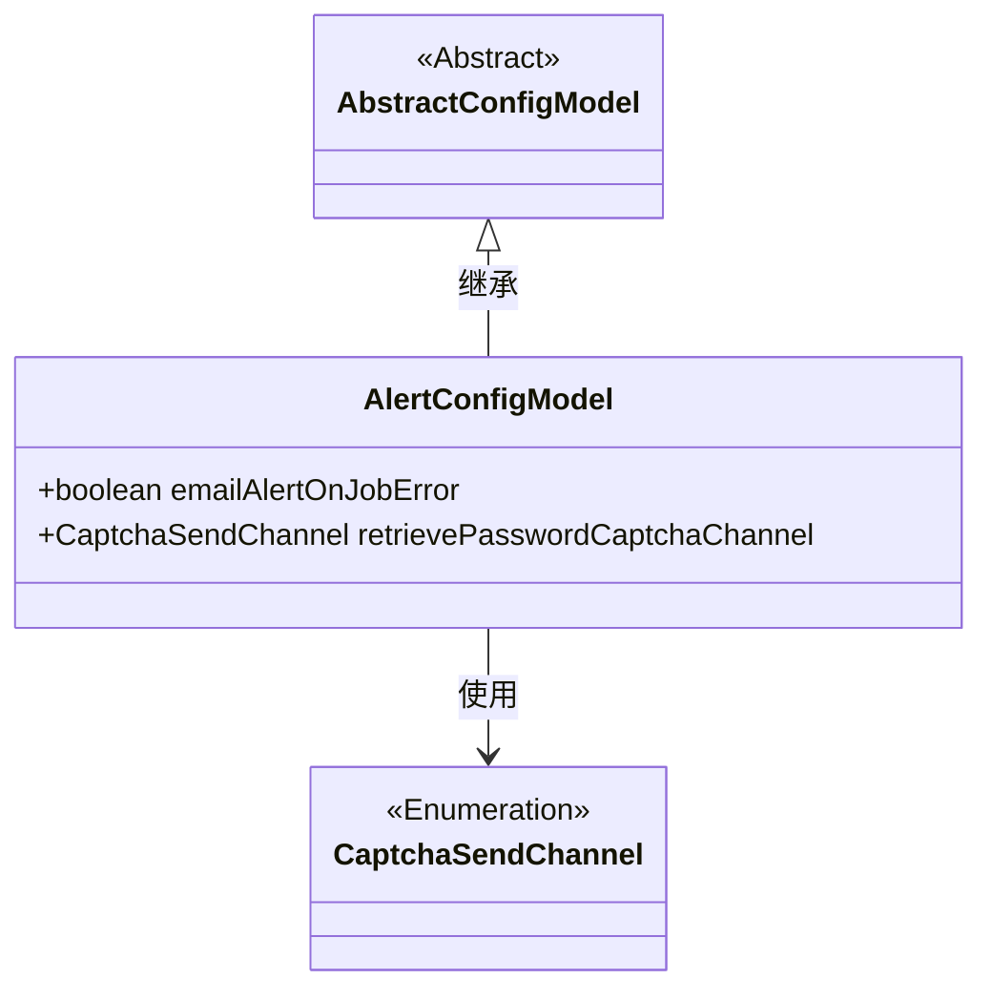
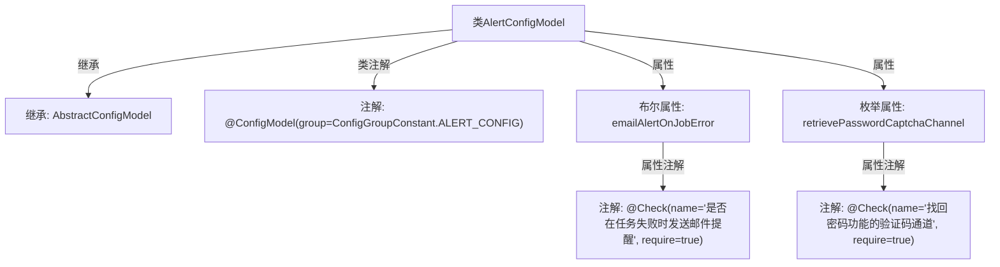

# 基础信息

|      |      |
|------|------|
| 名称 | AlertConfigModel |
| 编码语言 | .java |
| 代码路径 | WeFe/common/java/common-wefe/src/main/java/com/welab/wefe/common/wefe/dto/global_config/AlertConfigModel.java |
| 包名 | com.welab.wefe.common.wefe.dto.global_config |
| 依赖项 | ['com.welab.wefe.common.fieldvalidate.annotation.Check', 'com.welab.wefe.common.verification.code.common.CaptchaSendChannel', 'com.welab.wefe.common.wefe.dto.global_config.base.AbstractConfigModel', 'com.welab.wefe.common.wefe.dto.global_config.base.ConfigGroupConstant', 'com.welab.wefe.common.wefe.dto.global_config.base.ConfigModel'] |
| 概述说明 | AlertConfigModel配置类包含任务失败邮件提醒开关和找回密码验证码发送通道设置。 |

# 说明

该内容定义了一个名为AlertConfigModel的配置模型类，属于ALERT_CONFIG配置组。类中包含两个配置项：第一个是布尔型配置emailAlertOnJobError，用于控制任务失败时是否发送邮件提醒，默认值为false且为必填项；第二个是枚举型配置retrievePasswordCaptchaChannel，用于设置找回密码功能的验证码发送通道，默认通过邮件发送且为必填项。两个配置项都带有校验注解和中文描述。

# 类列表 Class Summary

| 名称   | 类型  | 说明 |
|-------|------|-------------|
| AlertConfigModel | class | AlertConfigModel配置类，包含任务失败邮件提醒开关和找回密码验证码发送通道设置。 |

## 类 AlertConfigModel

|      |      |
|------|------|
| 访问范围 | @ConfigModel(group = ConfigGroupConstant.ALERT_CONFIG);public |
| 类型 | class |
| 名称 | AlertConfigModel |
| 说明 | AlertConfigModel配置类，包含任务失败邮件提醒开关和找回密码验证码发送通道设置。 |

### UML类图

类图描述：该图展示了AlertConfigModel继承自抽象类AbstractConfigModel，并包含两个配置项字段：emailAlertOnJobError布尔值和retrievePasswordCaptchaChannel枚举类型。通过@ConfigModel和@Check注解实现配置分组和校验功能，其中枚举类型CaptchaSendChannel被AlertConfigModel所依赖。整体结构体现了配置模型的继承关系和字段约束机制。

### 内部方法调用关系图

该流程图展示了AlertConfigModel类的结构，包含继承关系、类级配置注解和两个带校验注解的属性。布尔属性控制任务失败邮件提醒，枚举属性定义密码找回验证码发送渠道，均通过@Check强制校验。设计符合配置模型规范，通过注解实现配置项的声明式验证。

### 字段列表 Field List

| 名称  | 类型  | 说明 |
|-------|-------|------|
| retrievePasswordCaptchaChannel = CaptchaSendChannel.email | CaptchaSendChannel | 找回密码功能需验证码，默认通过邮件发送且为必填项。 |
| emailAlertOnJobError = false | boolean | 代码定义布尔变量emailAlertOnJobError，默认false，通过@Check注解强制要求配置任务失败时是否发送邮件提醒。 |

### 方法列表

| 名称  | 类型  | 说明 |
|-------|-------|------|

