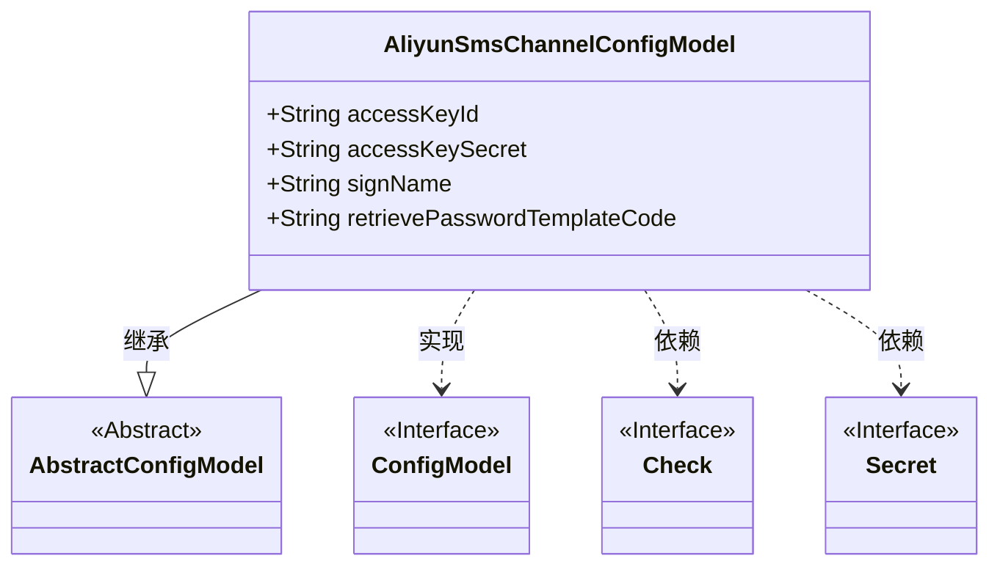
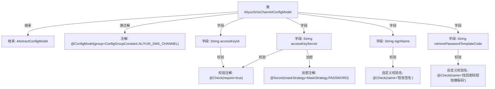

# 基础信息

|      |      |
|------|------|
| 名称 | AliyunSmsChannelConfigModel |
| 编码语言 | .java |
| 代码路径 | WeFe/common/java/common-wefe/src/main/java/com/welab/wefe/common/wefe/dto/global_config/AliyunSmsChannelConfigModel.java |
| 包名 | com.welab.wefe.common.wefe.dto.global_config |
| 依赖项 | ['com.welab.wefe.common.fieldvalidate.annotation.Check', 'com.welab.wefe.common.wefe.dto.global_config.base.AbstractConfigModel', 'com.welab.wefe.common.wefe.dto.global_config.base.ConfigGroupConstant', 'com.welab.wefe.common.wefe.dto.global_config.base.ConfigModel', 'com.welab.wefe.common.fieldvalidate.secret.MaskStrategy', 'com.welab.wefe.common.fieldvalidate.secret.Secret'] |
| 概述说明 | 阿里云短信配置类，包含必填的密钥ID、密钥（加密）、签名和密码找回模板码字段。 |

# 说明

这是一个阿里云短信通道的配置模型类，包含四个必填字段：accessKeyId（访问密钥ID）、accessKeySecret（访问密钥，采用密码掩码策略）、signName（短信签名）和retrievePasswordTemplateCode（找回密码短信模板码）。该类继承自抽象配置模型，并归属于阿里云短信通道配置组。

# 类列表 Class Summary

| 名称   | 类型  | 说明 |
|-------|------|-------------|
| AliyunSmsChannelConfigModel | class | 阿里云短信配置类，包含必填的accessKeyId、加密的accessKeySecret、短信签名signName和找回密码模板retrievePasswordTemplateCode。 |

## 类 AliyunSmsChannelConfigModel

|      |      |
|------|------|
| 访问范围 | @ConfigModel(group = ConfigGroupConstant.ALIYUN_SMS_CHANNEL);public |
| 类型 | class |
| 名称 | AliyunSmsChannelConfigModel |
| 说明 | 阿里云短信配置类，包含必填的accessKeyId、加密的accessKeySecret、短信签名signName和找回密码模板retrievePasswordTemplateCode。 |

### UML类图

这段代码定义了一个阿里云短信通道配置模型类，继承自抽象配置模型基类，并使用了配置模型接口。类中包含四个公有字段：accessKeyId（访问密钥ID）、accessKeySecret（带密码掩码策略的访问密钥）、signName（短信签名）和retrievePasswordTemplateCode（找回密码模板码），所有字段都通过@Check注解标记为必填项。该配置类通过@ConfigModel注解指定了配置组，主要用于阿里云短信服务的参数配置管理。

### 内部方法调用关系图

该流程图展示了AliyunSmsChannelConfigModel类的结构，包括继承关系、类级配置注解和字段级校验规则。类继承自AbstractConfigModel并标注了@ConfigModel注解，四个关键字段均带有@Check必填校验，其中accessKeySecret额外标注了密码掩码策略，signName和retrievePasswordTemplateCode字段包含业务语义的自定义校验名称。整体结构清晰地反映了短信通道配置的元数据约束。

### 字段列表 Field List

| 名称  | 类型  | 说明 |
|-------|-------|------|
| accessKeySecret | String | 代码定义了一个必须校验的敏感字段accessKeySecret，采用密码掩码策略。 |
| accessKeyId | String | 代码定义了一个必须校验的字符串类型变量accessKeyId。 |
| signName | String | 短信签名字段，必填项。 |
| retrievePasswordTemplateCode | String | 检查项为找回密码短信模板码，必填字段，类型为字符串。 |

### 方法列表

| 名称  | 类型  | 说明 |
|-------|-------|------|

