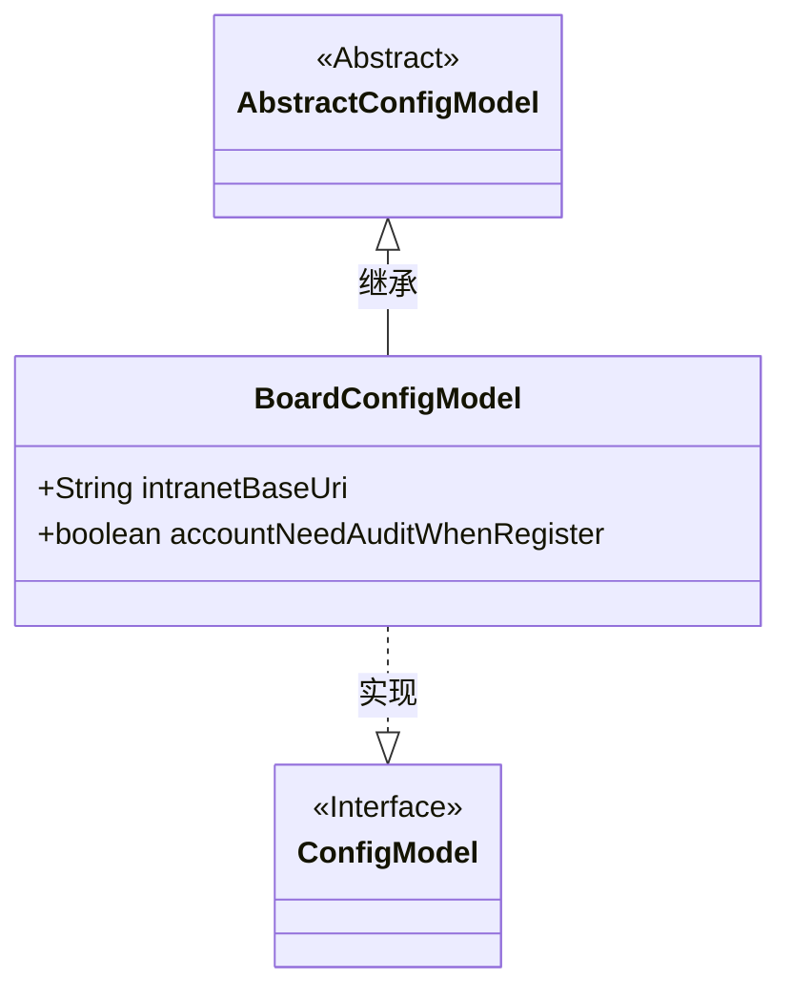
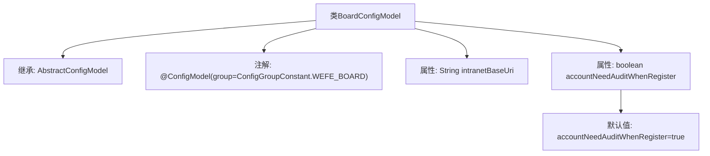

# 基础信息

|      |      |
|------|------|
| 名称 | BoardConfigModel |
| 编码语言 | .java |
| 代码路径 | WeFe/common/java/common-wefe/src/main/java/com/welab/wefe/common/wefe/dto/global_config/BoardConfigModel.java |
| 包名 | com.welab.wefe.common.wefe.dto.global_config |
| 依赖项 | ['com.welab.wefe.common.wefe.dto.global_config.base.AbstractConfigModel', 'com.welab.wefe.common.wefe.dto.global_config.base.ConfigGroupConstant', 'com.welab.wefe.common.wefe.dto.global_config.base.ConfigModel'] |
| 概述说明 | BoardConfigModel配置类，包含内网基础URL和新账号注册需审核的布尔值，默认需审核。 |

# 说明

这是一个名为BoardConfigModel的配置模型类，属于WEFE_BOARD配置组。它继承自AbstractConfigModel基类。类中包含两个配置项：intranetBaseUri字符串变量表示Board服务的内部网络基础URL；accountNeedAuditWhenRegister布尔变量控制新注册账号是否需要管理员审核，默认值为true。

# 类列表 Class Summary

| 名称   | 类型  | 说明 |
|-------|------|-------------|
| BoardConfigModel | class | BoardConfigModel配置类，包含内网基础URL和新注册账号需审核的布尔值，默认需审核。 |

## 类 BoardConfigModel

|      |      |
|------|------|
| 访问范围 | @ConfigModel(group = ConfigGroupConstant.WEFE_BOARD);public |
| 类型 | class |
| 名称 | BoardConfigModel |
| 说明 | BoardConfigModel配置类，包含内网基础URL和新注册账号需审核的布尔值，默认需审核。 |

### UML类图

这段类图展示了BoardConfigModel继承自AbstractConfigModel抽象类并实现ConfigModel接口的结构。BoardConfigModel包含两个公有字段：intranetBaseUri(内网基础URL)和accountNeedAuditWhenRegister(注册账号需审核标志，默认true)。通过@ConfigModel注解标记其所属配置组，体现了Java配置类的典型设计模式，其中抽象基类提供通用功能，具体配置类扩展字段定义，接口规范配置行为。

### 内部方法调用关系图

该流程图展示了BoardConfigModel类的结构，这是一个继承自AbstractConfigModel的配置模型类，带有@ConfigModel注解并指定了配置组。类包含两个主要属性：intranetBaseUri字符串和accountNeedAuditWhenRegister布尔值（默认值为true）。该配置类用于管理看板服务的内部网络基础URL和用户注册时的审核策略配置。

### 字段列表 Field List

| 名称  | 类型  | 说明 |
|-------|-------|------|
| intranetBaseUri | String | 声明一个公共字符串变量intranetBaseUri，用于存储内网基础URI。 |
| accountNeedAuditWhenRegister = true | boolean | 注册时账户需审核 |

### 方法列表

| 名称  | 类型  | 说明 |
|-------|-------|------|

