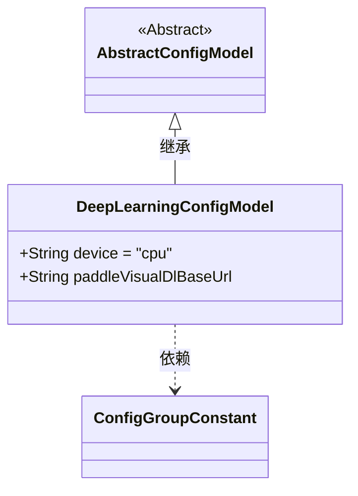
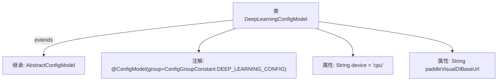

# 基础信息

|      |      |
|------|------|
| 名称 | DeepLearningConfigModel |
| 编码语言 | .java |
| 代码路径 | WeFe/common/java/common-wefe/src/main/java/com/welab/wefe/common/wefe/dto/global_config/DeepLearningConfigModel.java |
| 包名 | com.welab.wefe.common.wefe.dto.global_config |
| 依赖项 | ['com.welab.wefe.common.wefe.dto.global_config.base.AbstractConfigModel', 'com.welab.wefe.common.wefe.dto.global_config.base.ConfigGroupConstant', 'com.welab.wefe.common.wefe.dto.global_config.base.ConfigModel'] |
| 概述说明 | 深度学习的配置模型，设备默认为CPU，包含PaddleVisualDl基础URL配置项。 |

# 说明

该内容定义了一个名为DeepLearningConfigModel的配置模型类，继承自AbstractConfigModel。类上标注了@ConfigModel注解，指定配置组为DEEP_LEARNING_CONFIG。类中包含两个配置项：device默认为"cpu"，paddleVisualDlBaseUrl未设默认值。该配置模型用于深度学习相关参数设置。

# 类列表 Class Summary

| 名称   | 类型  | 说明 |
|-------|------|-------------|
| DeepLearningConfigModel | class | 深度学习配置模型，设备默认为CPU，包含PaddleVisualDl基础URL配置项。 |

## 类 DeepLearningConfigModel

|      |      |
|------|------|
| 访问范围 | @ConfigModel(group = ConfigGroupConstant.DEEP_LEARNING_CONFIG);public |
| 类型 | class |
| 名称 | DeepLearningConfigModel |
| 说明 | 深度学习配置模型，设备默认为CPU，包含PaddleVisualDl基础URL配置项。 |

### UML类图

类图描述：该图展示了一个深度学习配置模型的结构，其中DeepLearningConfigModel继承自抽象基类AbstractConfigModel，并包含两个公有字符串字段device和paddleVisualDlBaseUrl。通过@ConfigModel注解表明其属于DEEP_LEARNING_CONFIG配置组，体现了配置类的层级关系和属性定义。

### 内部方法调用关系图

该流程图展示了DeepLearningConfigModel类的结构，它继承自AbstractConfigModel类并带有@ConfigModel注解。类中包含两个字符串属性：device默认值为"cpu"，paddleVisualDlBaseUrl未初始化。该配置类属于深度学习配置组，用于管理深度学习相关的参数设置。

### 字段列表 Field List

| 名称  | 类型  | 说明 |
|-------|-------|------|
| device = "cpu" | String | 设备设置为CPU。 |
| paddleVisualDlBaseUrl | String | 声明一个公共字符串变量paddleVisualDlBaseUrl，用于存储基础URL。 |

### 方法列表

| 名称  | 类型  | 说明 |
|-------|-------|------|

