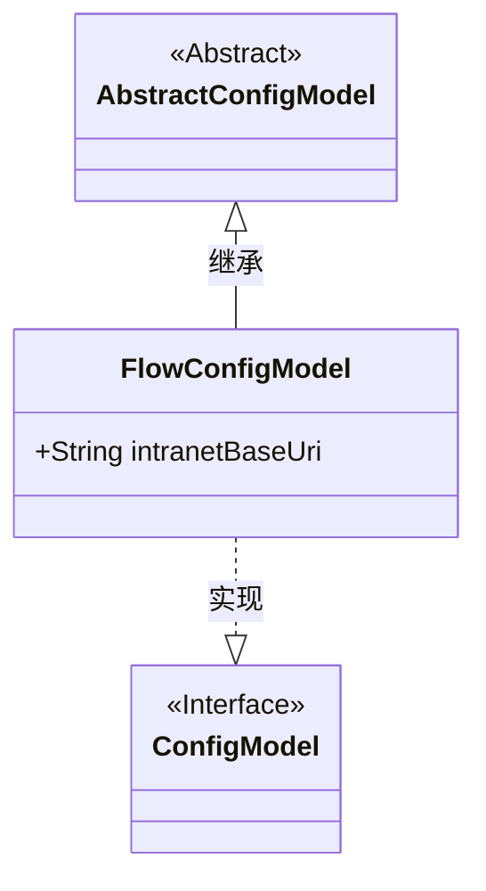
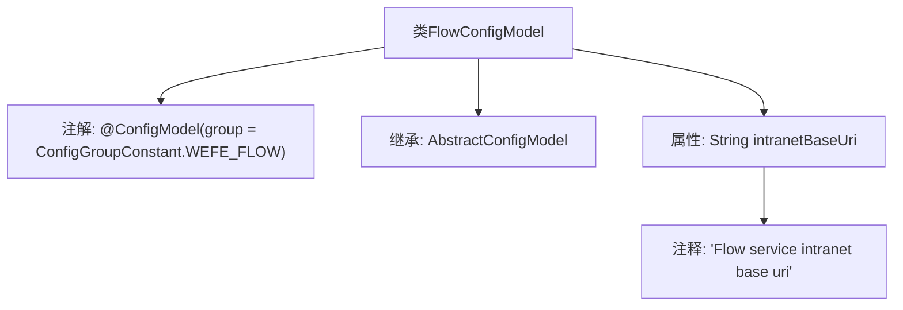

# 基础信息

|      |      |
|------|------|
| 名称 | FlowConfigModel |
| 编码语言 | .java |
| 代码路径 | WeFe/common/java/common-wefe/src/main/java/com/welab/wefe/common/wefe/dto/global_config/FlowConfigModel.java |
| 包名 | com.welab.wefe.common.wefe.dto.global_config |
| 依赖项 | ['com.welab.wefe.common.wefe.dto.global_config.base.AbstractConfigModel', 'com.welab.wefe.common.wefe.dto.global_config.base.ConfigGroupConstant', 'com.welab.wefe.common.wefe.dto.global_config.base.ConfigModel'] |
| 概述说明 | FlowConfigModel类属于WEFE_FLOW配置组，包含内网基础URI字段。 |

# 说明

该内容定义了一个名为FlowConfigModel的配置模型类，属于WEFE_FLOW配置组。该类继承自AbstractConfigModel基类，包含一个字符串类型的intranetBaseUri字段，用于存储Flow服务的内网基础URI地址。该字段通过注释说明其用途为记录Flow服务的内网基础URI。整个类通过@ConfigModel注解标识为配置模型，并指定了所属配置组常量。

# 类列表 Class Summary

| 名称   | 类型  | 说明 |
|-------|------|-------------|
| FlowConfigModel | class | FlowConfigModel是WEFE_FLOW组的配置类，包含内网基础URI字段。 |

## 类 FlowConfigModel

|      |      |
|------|------|
| 访问范围 | @ConfigModel(group = ConfigGroupConstant.WEFE_FLOW);public |
| 类型 | class |
| 名称 | FlowConfigModel |
| 说明 | FlowConfigModel是WEFE_FLOW组的配置类，包含内网基础URI字段。 |

### UML类图

这段类图展示了FlowConfigModel继承自AbstractConfigModel抽象类，并实现了ConfigModel接口的结构。FlowConfigModel包含一个公有字符串字段intranetBaseUri，用于存储流程服务内网基础URI。注解@ConfigModel表明该类属于WEFE_FLOW配置组，体现了Spring Boot风格的配置类设计模式。

### 内部方法调用关系图

该流程图展示了FlowConfigModel类的结构，它是一个带有特定配置组注解的配置模型类，继承自AbstractConfigModel基类。类中包含一个描述内网基础URI的字符串属性intranetBaseUri，并通过注释说明了该属性的用途。整个结构体现了配置类的典型设计模式，通过注解和继承实现配置功能。

### 字段列表 Field List

| 名称  | 类型  | 说明 |
|-------|-------|------|
| intranetBaseUri | String | 声明一个公共字符串变量intranetBaseUri，用于存储内网基础URI。 |

### 方法列表

| 名称  | 类型  | 说明 |
|-------|-------|------|

