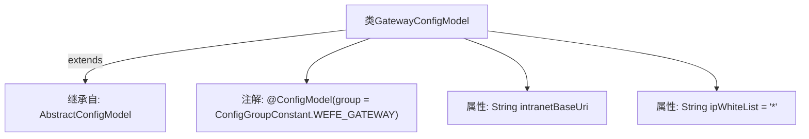

# 基础信息

|      |      |
|------|------|
| 名称 | GatewayConfigModel |
| 编码语言 | .java |
| 代码路径 | WeFe/common/java/common-wefe/src/main/java/com/welab/wefe/common/wefe/dto/global_config/GatewayConfigModel.java |
| 包名 | com.welab.wefe.common.wefe.dto.global_config |
| 依赖项 | ['com.welab.wefe.common.wefe.dto.global_config.base.AbstractConfigModel', 'com.welab.wefe.common.wefe.dto.global_config.base.ConfigGroupConstant', 'com.welab.wefe.common.wefe.dto.global_config.base.ConfigModel'] |
| 概述说明 | GatewayConfigModel配置类，包含内网地址和IP白名单，默认白名单为通配符。 |

# 说明

该内容描述了一个名为GatewayConfigModel的配置模型类，属于WEFE_GATEWAY配置组。该类继承自AbstractConfigModel，包含两个关键配置项：intranetBaseUri表示网关服务的内网地址（ip:port格式），ipWhiteList定义网关服务的IP白名单，默认值为通配符"*"允许所有IP访问。

# 类列表 Class Summary

| 名称   | 类型  | 说明 |
|-------|------|-------------|
| GatewayConfigModel | class | Gateway配置类，定义内网地址和IP白名单，默认白名单为通配符。 |


## 类 GatewayConfigModel

|      |      |
|------|------|
| 访问范围 | @ConfigModel(group = ConfigGroupConstant.WEFE_GATEWAY);public |
| 类型 | class |
| 名称 | GatewayConfigModel |
| 说明 | Gateway配置类，定义内网地址和IP白名单，默认白名单为通配符。 |


### UML类图

```mermaid
classDiagram
    class AbstractConfigModel {
        <<Abstract>>
    }
    
    class GatewayConfigModel {
        +String intranetBaseUri
        +String ipWhiteList = "*"
    }
    
    AbstractConfigModel <|-- GatewayConfigModel : 继承
    GatewayConfigModel ..|> ConfigModel : 实现
    
    interface ConfigModel {
        <<Interface>>
    }
```

这段类图展示了GatewayConfigModel继承自AbstractConfigModel抽象类并实现ConfigModel接口的结构。GatewayConfigModel包含两个公有字段：intranetBaseUri（网关服务内网地址）和ipWhiteList（IP白名单，默认值为"*"）。通过@ConfigModel注解标记该类属于WEFE_GATEWAY配置组，体现了配置中心中网关服务的基础配置项设计，其中IP白名单的默认通配符设置提供了灵活的访问控制基础。


### 内部方法调用关系图



这段代码展示了一个名为GatewayConfigModel的配置类，继承自AbstractConfigModel，并标注了@ConfigModel注解。类中包含两个属性：intranetBaseUri（网关内网地址）和ipWhiteList（IP白名单，默认值为通配符*）。该设计用于网关服务的配置管理，通过注解指定配置组，继承机制复用父类功能。

### 字段列表 Field List

| 名称  | 类型  | 说明 |
|-------|-------|------|
| ipWhiteList = "*" | String | 全局变量ipWhiteList默认值为"*"，表示允许所有IP访问。 |
| intranetBaseUri | String | 声明一个公共字符串变量intranetBaseUri，用于存储内网基础URI。 |

### 方法列表

| 名称  | 类型  | 说明 |
|-------|-------|------|


