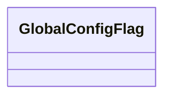

# 基础信息

|      |      |
|------|------|
| 名称 | GlobalConfigFlag |
| 编码语言 | .java |
| 代码路径 | WeFe/common/java/common-wefe/src/main/java/com/welab/wefe/common/wefe/dto/global_config/GlobalConfigFlag.java |
| 包名 | com.welab.wefe.common.wefe.dto.global_config |
| 依赖项 | [] |
| 概述说明 | GlobalConfigFlag是一个空的公共类，可能用于全局配置标志。 |

# 说明

GlobalConfigFlag是一个公共类，用于表示全局配置标志。该类目前为空，未定义任何成员变量或方法，可能作为基础类或占位符供后续扩展使用。其设计意图可能是为了集中管理全局性的配置开关或状态标识。

# 类列表 Class Summary

| 名称   | 类型  | 说明 |
|-------|------|-------------|
| GlobalConfigFlag | class | GlobalConfigFlag是一个空的公共类，可能用于全局配置标志。 |

## 类 GlobalConfigFlag

|      |      |
|------|------|
| 访问范围 | public |
| 类型 | class |
| 名称 | GlobalConfigFlag |
| 说明 | GlobalConfigFlag是一个空的公共类，可能用于全局配置标志。 |

### UML类图

这段类图描述了一个名为GlobalConfigFlag的空类，该类目前没有任何属性或方法。根据类名推断，它可能用于存储全局配置标志，但当前实现为空，需要后续扩展功能。这种类通常作为配置管理的占位符，未来可能包含静态配置参数或全局状态控制方法。

### 内部方法调用关系图

该流程图仅包含一个节点，表示一个空的`GlobalConfigFlag`类。由于类中未定义任何属性或方法，因此没有其他流程步骤或调用关系需要展示。这是一个最简单的类结构示意图，可作为后续扩展的基础框架。

### 字段列表 Field List

| 名称  | 类型  | 说明 |
|-------|-------|------|

### 方法列表

| 名称  | 类型  | 说明 |
|-------|-------|------|

