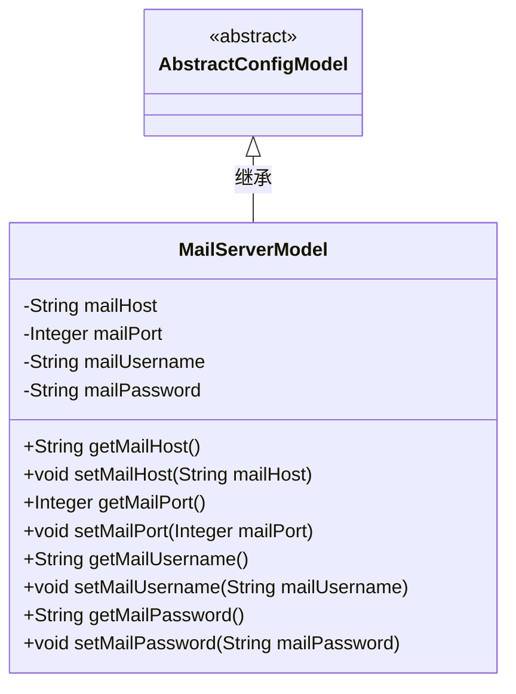

# 基础信息

|      |      |
|------|------|
| 名称 | MailServerModel |
| 编码语言 | .java |
| 代码路径 | WeFe/common/java/common-wefe/src/main/java/com/welab/wefe/common/wefe/dto/global_config/MailServerModel.java |
| 包名 | com.welab.wefe.common.wefe.dto.global_config |
| 依赖项 | ['com.welab.wefe.common.fieldvalidate.annotation.Check', 'com.welab.wefe.common.wefe.dto.global_config.base.AbstractConfigModel', 'com.welab.wefe.common.wefe.dto.global_config.base.ConfigGroupConstant', 'com.welab.wefe.common.wefe.dto.global_config.base.ConfigModel', 'com.welab.wefe.common.fieldvalidate.secret.MaskStrategy', 'com.welab.wefe.common.fieldvalidate.secret.Secret'] |
| 概述说明 | 邮件服务器配置类，包含地址、端口、用户名和密码字段，密码加密处理，提供getter/setter方法。 |

# 说明

这是一个名为MailServerModel的配置模型类，属于邮件服务器配置组。它继承自AbstractConfigModel，包含四个关键属性：邮件服务器地址（mailHost）、邮件服务器端口（mailPort）、邮件用户名（mailUsername）和邮件密码（mailPassword）。其中密码字段使用了密码掩码策略进行保护。类中为每个属性提供了标准的getter和setter方法，便于访问和修改这些配置值。

# 类列表 Class Summary

| 名称   | 类型  | 说明 |
|-------|------|-------------|
| MailServerModel | class | 邮件服务器配置类，包含主机、端口、用户名和密码字段，密码加密处理，提供getter/setter方法。 |

## 类 MailServerModel

|      |      |
|------|------|
| 访问范围 | @ConfigModel(group = ConfigGroupConstant.MAIL_SERVER);public |
| 类型 | class |
| 名称 | MailServerModel |
| 说明 | 邮件服务器配置类，包含主机、端口、用户名和密码字段，密码加密处理，提供getter/setter方法。 |

### UML类图

这段代码描述了一个邮件服务器配置模型MailServerModel，它继承自抽象基类AbstractConfigModel。该类包含四个私有字段：mailHost(服务器地址)、mailPort(端口)、mailUsername(用户名)和mailPassword(密码)，每个字段都有对应的getter和setter方法。特别值得注意的是mailPassword字段使用了@Secret注解进行敏感信息掩码处理。这个配置模型类通过@ConfigModel注解标记为邮件服务器配置组，所有字段都使用@Check注解进行校验。

### 内部方法调用关系图

```mermaid
graph TD
    A["类MailServerModel"]
    B["注解: @ConfigModel(group=ConfigGroupConstant.MAIL_SERVER)"]
    C["父类: AbstractConfigModel"]
    D["属性: String mailHost"]
    E["属性: Integer mailPort"]
    F["属性: String mailUsername"]
    G["属性: String mailPassword"]
    H["方法: getMailHost()"]
    I["方法: setMailHost(String)"]
    J["方法: getMailPort()"]
    K["方法: setMailPort(Integer)"]
    L["方法: getMailUsername()"]
    M["方法: setMailUsername(String)"]
    N["方法: getMailPassword()"]
    O["方法: setMailPassword(String)"]
    P["注解: @Check(name='邮件服务器地址')"]
    Q["注解: @Check(name='邮件服务器端口')"]
    R["注解: @Check(name='邮件用户名')"]
    S["注解: @Check(name='邮件密码')"]
    T["注解: @Secret(maskStrategy=MaskStrategy.PASSWORD)"]

    A --> B
    A --> C
    A --> D
    A --> E
    A --> F
    A --> G
    A --> H
    A --> I
    A --> J
    A --> K
    A --> L
    A --> M
    A --> N
    A --> O
    D --> P
    E --> Q
    F --> R
    G --> S
    G --> T
```

该流程图展示了MailServerModel类的完整结构，包括类注解、继承关系、属性字段及其校验注解、以及getter/setter方法。这个配置模型类专门用于邮件服务器设置，包含主机地址、端口、用户名和密码等敏感信息，其中密码字段使用PASSWORD策略进行脱敏处理。所有字段都通过@Check注解进行配置项合法性校验，并通过@ConfigModel注解归属到邮件服务器配置组。

### 字段列表 Field List

| 名称  | 类型  | 说明 |
|-------|-------|------|
| mailPassword | String | 代码定义了一个私有字符串变量mailPassword，使用@Check注解验证邮件密码，并用@Secret注解以密码策略进行掩码处理。 |
| mailUsername | String | 代码定义了一个私有字符串变量mailUsername，并标注了检查注解，用于验证邮件用户名。 |
| mailPort | Integer | 邮件服务器端口检查字段。 |
| mailHost | String | 邮件服务器地址校验字段。 |

### 方法列表

| 名称  | 类型  | 说明 |
|-------|-------|------|
| getMailPort | Integer | 获取邮件端口的方法，返回整型数值mailPort。 |
| getMailUsername | String | 获取邮件用户名的方法，返回mailUsername变量值。 |
| setMailPort | void | 设置邮件端口的方法，参数为整型mailPort，赋值给类变量this.mailPort。 |
| getMailHost | String | 获取邮件主机地址的方法。 |
| setMailHost | void | 设置邮件主机地址的方法，将参数mailHost赋值给类的成员变量mailHost。 |
| setMailUsername | void | 这是一个Java方法，用于设置邮件用户名属性。方法名为setMailUsername，接收一个字符串参数mailUsername，并将其赋值给类的同名成员变量。 |
| getMailPassword | String | 获取邮箱密码的方法，返回字符串mailPassword。 |
| setMailPassword | void | 设置邮箱密码的方法，将参数mailPassword赋值给类的同名成员变量。 |

