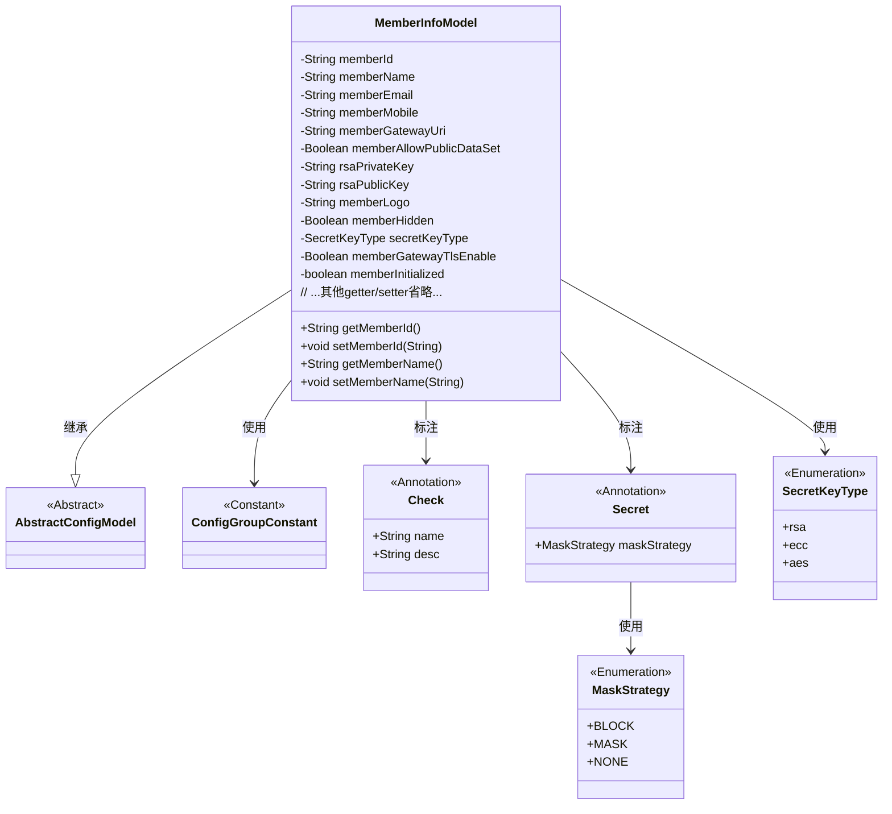

# 基础信息

|      |      |
|------|------|
| 名称 | MemberInfoModel |
| 编码语言 | .java |
| 代码路径 | WeFe/common/java/common-wefe/src/main/java/com/welab/wefe/common/wefe/dto/global_config/MemberInfoModel.java |
| 包名 | com.welab.wefe.common.wefe.dto.global_config |
| 依赖项 | ['com.welab.wefe.common.constant.SecretKeyType', 'com.welab.wefe.common.fieldvalidate.annotation.Check', 'com.welab.wefe.common.wefe.dto.global_config.base.AbstractConfigModel', 'com.welab.wefe.common.wefe.dto.global_config.base.ConfigGroupConstant', 'com.welab.wefe.common.wefe.dto.global_config.base.ConfigModel', 'com.welab.wefe.common.fieldvalidate.secret.MaskStrategy', 'com.welab.wefe.common.fieldvalidate.secret.Secret', 'java.util.UUID'] |
| 概述说明 | 联邦成员信息配置类，包含ID、名称、邮箱、电话、网关地址、密钥对、隐身状态、TLS开关及初始化状态等字段，提供getter/setter方法。 |

# 说明

该内容描述了一个名为MemberInfoModel的配置模型类，属于成员信息配置组。类中包含多个成员属性，包括成员ID（默认UUID生成）、名称、邮箱、电话、网关访问地址、是否公开数据集信息、RSA公私钥（私钥有掩码策略）、成员头像、隐身状态、密钥类型（默认RSA）、网关TLS通信开关及初始化状态。每个属性均有对应的getter和setter方法，部分属性带有校验注解和描述说明。

# 类列表 Class Summary

| 名称   | 类型  | 说明 |
|-------|------|-------------|
| MemberInfoModel | class | 联邦成员信息配置类，包含成员ID、名称、联系方式、网关地址、密钥、隐身状态、TLS开关及初始化状态等属性。 |

## 类 MemberInfoModel

|      |      |
|------|------|
| 访问范围 | @ConfigModel(group = ConfigGroupConstant.MEMBER_INFO);public |
| 类型 | class |
| 名称 | MemberInfoModel |
| 说明 | 联邦成员信息配置类，包含成员ID、名称、联系方式、网关地址、密钥、隐身状态、TLS开关及初始化状态等属性。 |

### UML类图

类图描述：MemberInfoModel类继承自AbstractConfigModel，是一个包含联邦成员各类信息的配置模型。它使用@ConfigModel标注所属配置组，包含成员ID、名称、联系方式等基础信息，以及密钥配置、网关设置等安全相关属性。通过@Check和@Secret注解实现字段校验和敏感信息脱敏，使用SecretKeyType枚举定义密钥类型。该类通过20余个getter/setter方法管理所有属性，典型应用于需要严格配置管理的联邦学习场景。

### 内部方法调用关系图

```mermaid
graph TD
    A["类MemberInfoModel"]
    B["继承: AbstractConfigModel"]
    C["注解: @ConfigModel(group=ConfigGroupConstant.MEMBER_INFO)"]
    D["字段: String memberId = UUID生成"]
    E["字段: String memberName"]
    F["字段: String memberEmail"]
    G["字段: String memberMobile"]
    H["字段: String memberGatewayUri"]
    I["字段: Boolean memberAllowPublicDataSet"]
    J["字段: @Secret String rsaPrivateKey"]
    K["字段: String rsaPublicKey"]
    L["字段: String memberLogo"]
    M["字段: Boolean memberHidden = false"]
    N["字段: SecretKeyType secretKeyType = rsa"]
    O["字段: Boolean memberGatewayTlsEnable"]
    P["字段: boolean memberInitialized = false"]
    Q["方法: getter/setter对(共14对)"]

    A --> B
    A --> C
    A --> D
    A --> E
    A --> F
    A --> G
    A --> H
    A --> I
    A --> J
    A --> K
    A --> L
    A --> M
    A --> N
    A --> O
    A --> P
    A --> Q
```

该流程图展示了MemberInfoModel类的完整结构，这是一个联邦成员信息配置模型。类继承自AbstractConfigModel并带有@ConfigModel注解，包含15个成员字段（含UUID生成的默认memberId、加密私钥等特殊字段）和14对getter/setter方法。字段使用@Check和@Secret等注解进行校验和脱敏控制，涉及成员基本信息、密钥配置、网关设置和状态标志等核心属性，构成完整的联邦成员配置体系。

### 字段列表 Field List

| 名称  | 类型  | 说明 |
|-------|-------|------|
| memberInitialized = false | boolean | 检查成员是否初始化的布尔变量，默认值为false。 |
| secretKeyType = SecretKeyType.rsa | SecretKeyType | 代码定义了一个私有字段secretKeyType，默认值为rsa，并用@Check注解标记字段名称为"密钥类型"。 |
| memberId = UUID.randomUUID().toString().replaceAll("-", "") | String | 联邦成员ID全局唯一，默认使用去除连字符的UUID。 |
| rsaPrivateKey | String | 代码定义了一个私有字符串变量rsaPrivateKey，使用@Check和@Secret注解标记，要求检查私钥有效性并采用屏蔽策略保护敏感信息。 |
| memberAllowPublicDataSet | Boolean | 检查是否允许公开数据集基础信息的布尔类型成员变量。 |
| rsaPublicKey | String | 类成员变量rsaPublicKey，使用@Check注解标记为"公钥"，类型为String。 |
| memberMobile | String | 联邦成员电话字段，使用@Check注解校验，类型为String。 |
| memberName | String | 代码定义了一个私有字符串变量memberName，用于存储联邦成员名称，并通过@Check注解进行校验。 |
| memberHidden = false | Boolean | 成员隐身状态检查，默认值为false。 |
| memberGatewayUri | String | 定义私有字符串变量memberGatewayUri，用于存储联邦成员网关访问地址，并通过@Check注解进行校验。 |
| memberLogo | String | 成员头像字段，使用@Check注解标记。 |
| memberEmail | String | 定义私有字符串变量memberEmail，使用@Check注解标记为"联邦成员邮箱"校验项。 |
| memberGatewayTlsEnable | Boolean | 成员网关TLS通信启用检查 |

### 方法列表

| 名称  | 类型  | 说明 |
|-------|-------|------|
| getMemberName | String | 方法getMemberName返回成员变量memberName的值。 |
| setMemberHidden | void | 设置成员隐藏状态的公共方法，参数为布尔值memberHidden，用于控制成员是否隐藏。 |
| getRsaPublicKey | String | 获取RSA公钥的方法。 |
| getMemberMobile | String | 获取会员手机号的方法，返回成员变量memberMobile。 |
| setSecretKeyType | void | 设置密钥类型的方法，将参数secretKeyType赋值给类的secretKeyType属性。 |
| setRsaPrivateKey | void | 设置RSA私钥的方法，将输入字符串赋值给类变量rsaPrivateKey。 |
| setMemberEmail | void | 这是一个Java方法，用于设置成员变量memberEmail的值。方法接收一个字符串参数memberEmail，并将其赋值给类的同名成员变量。 |
| setMemberName | void | 设置成员名称的方法，将输入参数赋值给成员变量memberName。 |
| setMemberMobile | void | 设置成员手机号的公共方法，参数为字符串类型。 |
| setMemberAllowPublicDataSet | void | 设置成员是否允许公开数据集的布尔值方法。 |
| getMemberHidden | Boolean | 获取成员隐藏状态的布尔值方法。 |
| setMemberId | void | 设置成员ID的方法，将输入参数赋给类的成员变量memberId。 |
| getRsaPrivateKey | String | 获取RSA私钥的方法，返回字符串类型的私钥值。 |
| setRsaPublicKey | void | 设置RSA公钥的方法，将输入字符串赋值给类成员变量rsaPublicKey。 |
| setMemberLogo | void | 这是一个Java方法，用于设置成员logo的字符串值。方法名为setMemberLogo，接受一个String参数memberLogo，并将其赋值给类的成员变量this.memberLogo。 |
| getMemberAllowPublicDataSet | Boolean | 这是一个Java方法，返回成员变量memberAllowPublicDataSet的布尔值。 |
| getSecretKeyType | SecretKeyType | 获取密钥类型的方法，返回secretKeyType。 |
| getMemberEmail | String | 获取成员邮箱的方法，返回成员邮箱字符串。 |
| getMemberGatewayUri | String | 获取成员网关URI的方法，返回成员网关URI字符串。 |
| setMemberGatewayUri | void | 设置成员网关URI的方法，将输入参数赋值给类的成员变量memberGatewayUri。 |
| getMemberId | String | 获取成员ID的方法，返回字符串类型的memberId。 |
| getMemberGatewayTlsEnable | Boolean | 获取成员网关TLS启用状态的布尔值方法。 |
| setMemberGatewayTlsEnable | void | 设置成员网关TLS启用状态的公共方法，参数为布尔类型。 |
| isMemberInitialized | boolean | 检查成员变量是否已初始化的布尔方法。 |
| setMemberInitialized | void | 设置成员初始化状态的公共方法，参数为布尔值。 |
| getMemberLogo | String | 获取成员Logo的字符串值。 |

