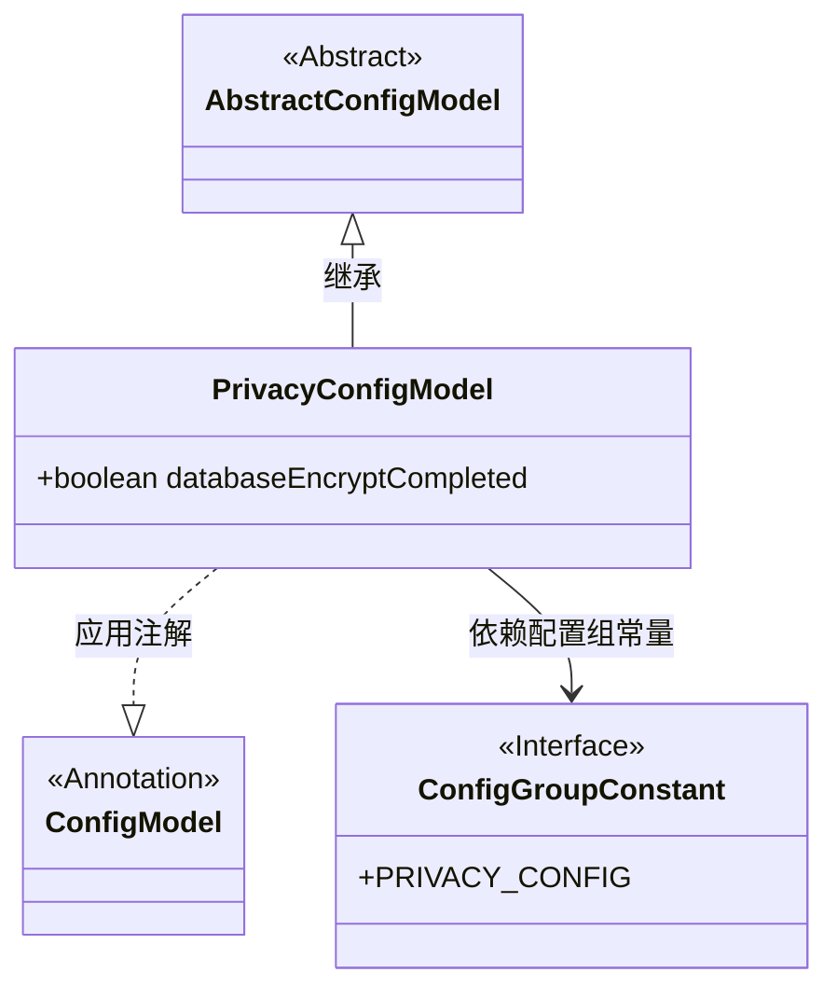
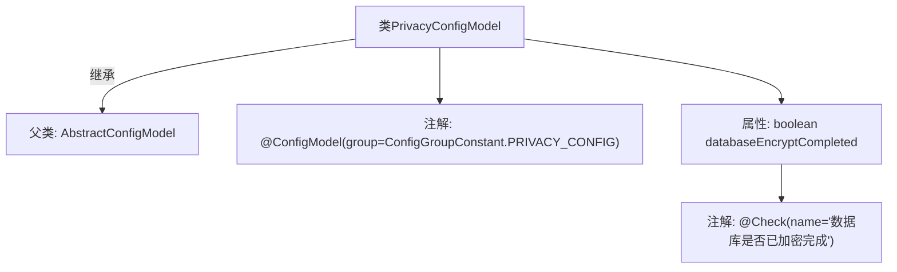

# 基础信息

|      |      |
|------|------|
| 名称 | PrivacyConfigModel |
| 编码语言 | .java |
| 代码路径 | WeFe/common/java/common-wefe/src/main/java/com/welab/wefe/common/wefe/dto/global_config/PrivacyConfigModel.java |
| 包名 | com.welab.wefe.common.wefe.dto.global_config |
| 依赖项 | ['com.welab.wefe.common.fieldvalidate.annotation.Check', 'com.welab.wefe.common.wefe.dto.global_config.base.AbstractConfigModel', 'com.welab.wefe.common.wefe.dto.global_config.base.ConfigGroupConstant', 'com.welab.wefe.common.wefe.dto.global_config.base.ConfigModel'] |
| 概述说明 | 隐私配置模型类，标记数据库加密完成状态。 |

# 说明

这是一个名为PrivacyConfigModel的配置模型类，属于PRIVACY_CONFIG配置组。它继承自AbstractConfigModel基类，包含一个布尔类型字段databaseEncryptCompleted，用于检查数据库加密是否已完成。该字段通过@Check注解标记，表示这是一个需要验证的配置项。整个类通过@ConfigModel注解标识为配置模型。

# 类列表 Class Summary

| 名称   | 类型  | 说明 |
|-------|------|-------------|
| PrivacyConfigModel | class | 隐私配置模型类，标记为隐私配置组，继承抽象配置模型，包含数据库加密完成状态检查字段。 |

## 类 PrivacyConfigModel

|      |      |
|------|------|
| 访问范围 | @ConfigModel(group = ConfigGroupConstant.PRIVACY_CONFIG);public |
| 类型 | class |
| 名称 | PrivacyConfigModel |
| 说明 | 隐私配置模型类，标记为隐私配置组，继承抽象配置模型，包含数据库加密完成状态检查字段。 |

### UML类图

这段类图展示了PrivacyConfigModel继承自AbstractConfigModel，并使用了@ConfigModel注解标注，该注解依赖于ConfigGroupConstant接口中的PRIVACY_CONFIG常量。PrivacyConfigModel包含一个公有布尔字段databaseEncryptCompleted，用于表示数据库加密状态。整体结构体现了配置模型的继承关系和注解使用方式，符合Java配置类设计的典型模式。

### 内部方法调用关系图

这段流程图描述了PrivacyConfigModel类的结构，该类继承自AbstractConfigModel并带有@ConfigModel注解。类中包含一个布尔属性databaseEncryptCompleted，该属性被@Check注解标记，注解参数为'数据库是否已加密完成'。整个结构展示了类继承关系、配置分组标记和属性校验注解的层级关系，体现了配置模型类的基本设计模式。

### 字段列表 Field List

| 名称  | 类型  | 说明 |
|-------|-------|------|
| databaseEncryptCompleted | boolean | 检查数据库加密是否完成的布尔变量。 |

### 方法列表

| 名称  | 类型  | 说明 |
|-------|-------|------|

