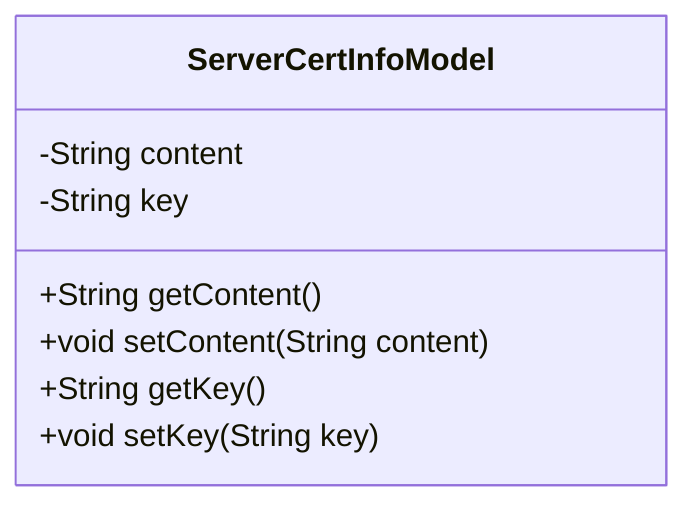
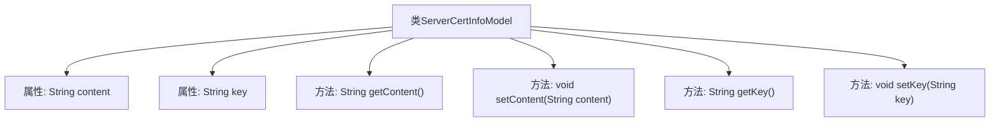

# 基础信息

|      |      |
|------|------|
| 名称 | ServerCertInfoModel |
| 编码语言 | .java |
| 代码路径 | WeFe/common/java/common-wefe/src/main/java/com/welab/wefe/common/wefe/dto/global_config/ServerCertInfoModel.java |
| 包名 | com.welab.wefe.common.wefe.dto.global_config |
| 依赖项 | [] |
| 概述说明 | ServerCertInfoModel类包含content和key两个私有属性，提供对应的getter和setter方法。 |

# 说明

该内容定义了一个名为ServerCertInfoModel的Java类，用于存储服务器证书信息。类中包含两个私有字符串类型成员变量：content和key，分别表示证书内容和密钥。提供了标准的getter和setter方法用于访问和修改这两个变量。这是一个典型的POJO类，用于封装证书相关数据。

# 类列表 Class Summary

| 名称   | 类型  | 说明 |
|-------|------|-------------|
| ServerCertInfoModel | class | ServerCertInfoModel类包含content和key两个私有属性，提供对应的getter和setter方法。 |

## 类 ServerCertInfoModel

|      |      |
|------|------|
| 访问范围 | public |
| 类型 | class |
| 名称 | ServerCertInfoModel |
| 说明 | ServerCertInfoModel类包含content和key两个私有属性，提供对应的getter和setter方法。 |

### UML类图

这段类图描述了一个简单的数据模型类ServerCertInfoModel，用于存储服务器证书信息。该类包含两个私有字符串属性content和key，分别表示证书内容和密钥，并提供了对应的getter和setter方法用于访问和修改这些属性。这是一个典型的Java Bean风格的数据封装类，主要用于在应用程序中传递和管理证书相关的数据。

### 内部方法调用关系图

这段代码定义了一个名为ServerCertInfoModel的类，包含两个私有字符串属性content和key，以及对应的getter和setter方法。流程图清晰地展示了类与属性、方法之间的从属关系，其中类作为根节点，分别关联到两个属性和四个方法。该模型主要用于存储服务器证书信息，通过getter方法获取内容或密钥，通过setter方法设置相应值，适用于需要动态管理证书数据的场景。

### 字段列表 Field List

| 名称  | 类型  | 说明 |
|-------|-------|------|
| content | String | 私有字符串变量content |
| key | String | 私有字符串类型变量key。 |

### 方法列表

| 名称  | 类型  | 说明 |
|-------|-------|------|
| getContent | String | 方法getContent返回字符串content的值。 |
| getKey | String | 获取key值的公开方法。 |
| setContent | void | 设置内容属性的方法，将输入字符串赋值给类的content变量。 |
| setKey | void | 这是一个Java方法，用于设置类的key属性值。方法接收一个String参数key，并将其赋值给类的成员变量this.key。 |

