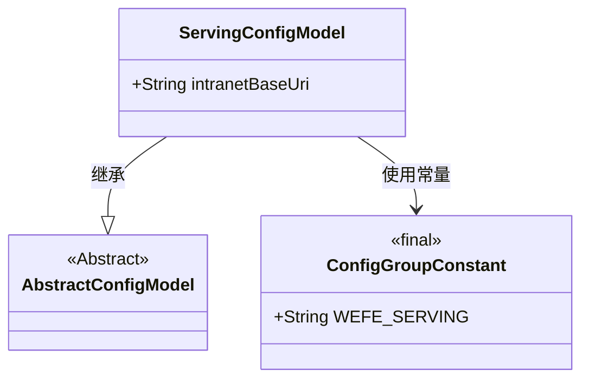
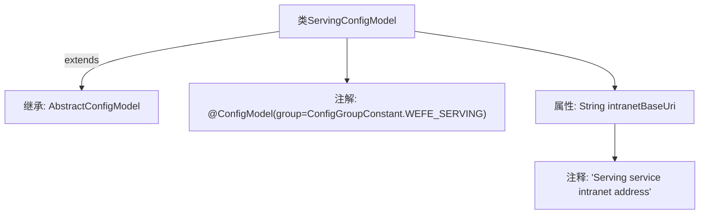

# 基础信息

|      |      |
|------|------|
| 名称 | ServingConfigModel |
| 编码语言 | .java |
| 代码路径 | WeFe/common/java/common-wefe/src/main/java/com/welab/wefe/common/wefe/dto/global_config/ServingConfigModel.java |
| 包名 | com.welab.wefe.common.wefe.dto.global_config |
| 依赖项 | ['com.welab.wefe.common.wefe.dto.global_config.base.AbstractConfigModel', 'com.welab.wefe.common.wefe.dto.global_config.base.ConfigGroupConstant', 'com.welab.wefe.common.wefe.dto.global_config.base.ConfigModel'] |
| 概述说明 | 这是一个配置模型类，用于定义服务内网地址的配置项，属于WEFE_SERVING组。 |

# 说明

这是一个名为ServingConfigModel的配置模型类，属于WEFE_SERVING配置组。它继承自AbstractConfigModel基类。该类包含一个字符串类型的公共字段intranetBaseUri，用于存储Serving服务的内部网络基础地址。该字段通过注释说明其用途是记录Serving服务的内部网络地址。整个类通过@ConfigModel注解标识为配置模型，并指定了所属配置组。

# 类列表 Class Summary

| 名称   | 类型  | 说明 |
|-------|------|-------------|
| ServingConfigModel | class | 配置类ServingConfigModel，归属WEFE_SERVING组，包含内网地址字段intranetBaseUri。 |

## 类 ServingConfigModel

|      |      |
|------|------|
| 访问范围 | @ConfigModel(group = ConfigGroupConstant.WEFE_SERVING);public |
| 类型 | class |
| 名称 | ServingConfigModel |
| 说明 | 配置类ServingConfigModel，归属WEFE_SERVING组，包含内网地址字段intranetBaseUri。 |

### UML类图

这段类图展示了ServingConfigModel继承自抽象类AbstractConfigModel，并使用了ConfigGroupConstant中的WEFE_SERVING常量作为配置分组标识。ServingConfigModel作为配置模型类，包含一个公有的intranetBaseUri字符串字段，用于存储服务内网基础地址。通过@ConfigModel注解的group属性与常量关联，体现了配置模型的层级关系和常量依赖。

### 内部方法调用关系图

这段代码展示了一个名为ServingConfigModel的配置类，通过@ConfigModel注解标记为WEFE_SERVING配置组，继承自AbstractConfigModel基类。类中包含一个描述内网服务地址的字符串属性intranetBaseUri，并配有详细注释说明其用途。该结构体现了Java配置类的典型设计模式，通过继承和注解实现配置信息的集中管理。

### 字段列表 Field List

| 名称  | 类型  | 说明 |
|-------|-------|------|
| intranetBaseUri | String | 声明一个公共字符串变量intranetBaseUri，用于存储内网基础URI。 |

### 方法列表

| 名称  | 类型  | 说明 |
|-------|-------|------|

