# 基础信息

|      |      |
|------|------|
| 名称 | global_config |
| 编码语言 | .java |
| 代码路径 | WeFe/common/java/common-wefe/src/main/java/com/welab/wefe/common/wefe/dto/global_config |
| 包名 | docs.common.java.common-wefe.src.main.java.com.welab.wefe.common.wefe.dto.global_config |
| 概述说明 | 存储配置模块管理基础存储和ClickHouse连接参数。计算引擎模块处理多云资源配置和计算后端切换。全局配置模块集中管理各类配置项，支持分组查询。包含网关、证书、深度学习、邮件服务器等具体配置模型类，用于不同业务场景的参数设置。 |

# 说明

## 概述  
该模块是统一管理全局配置的核心系统，采用类似注册中心的设计模式，涵盖存储配置、多云计算引擎、服务网关等场景。通过AbstractConfigModel基类和@ConfigModel/@Check注解实现标准化接口，关键数据结构包括基础配置模型（如StorageBaseConfigModel）、服务地址（如intranetBaseUri）和云商凭证（如阿里云OSS）。外部依赖包括DataResourceStorageType枚举、Java反射机制及云服务SDK（如阿里云OSS）。例如通过继承链实现多存储类型管理，或通过注解自动发现配置类。

## 主要业务场景  
模块支持三类典型场景：1) 基础设施配置（如邮件服务器、IP白名单），类似策略模式的分层管理；2) 云服务集成（如阿里云短信、Spark引擎），通过JobBackendType切换计算后端；3) 业务系统参数（如网关地址、数据库加密状态）。交互模式包含配置转换（如转ClickhouseConfig）、字段校验（如密码掩码）和版本化更新。例如初始化流程：设置费用阈值→绑定云存储→配置计算参数（如executorMemory）。API类型涵盖常量引用（ConfigGroupConstant）和反射查询接口（getModelClasses）。

### 包内部结构视图

```mermaid
graph TD
    global_config --> storage
    global_config --> calculation_engine
    global_config --> base
    global_config --> GatewayConfigModel.java
    global_config --> ServerCertInfoModel.java
    global_config --> BoardConfigModel.java
    global_config --> DeepLearningConfigModel.java
    global_config --> MailServerModel.java
    global_config --> PrivacyConfigModel.java
    global_config --> ServingConfigModel.java
    global_config --> GlobalConfigFlag.java
    global_config --> AlertConfigModel.java
    global_config --> MemberInfoModel.java
    global_config --> FlowConfigModel.java
    global_config --> AliyunSmsChannelConfigModel.java
    storage --> StorageBaseConfigModel.java
    storage --> ClickHouseStorageConfigModel.java
    calculation_engine --> fc
    calculation_engine --> spark
    calculation_engine --> CalculationEngineBaseConfigModel.java
    fc --> FunctionComputeBaseConfigModel.java
    fc --> AliyunFunctionComputeConfigModel.java
    fc --> TencentServerlessCloudFunctionConfigModel.java
    spark --> SparkStandaloneConfigModel.java
    base --> GlobalConfigInput.java
    base --> ConfigModel.java
    base --> AbstractConfigModel.java
    base --> ConfigGroupConstant.java
```

该流程图展示了global_config目录下的完整层级结构，包含storage、calculation_engine和base三个主要子目录及其各自的具体配置文件。其中calculation_engine又细分为fc和spark两个子模块，每个模块包含对应的配置模型类。顶层还直接包含了多个独立配置文件，如GatewayConfigModel、MailServerModel等，整体呈现了清晰的模块化配置管理结构。

# 文件列表

| 名称   | 类型  | 说明 |
|-------|------|-------------|
| [GatewayConfigModel.java](GatewayConfigModel.md) | file | GatewayConfigModel配置类，包含内网地址和IP白名单，默认白名单为通配符。 |
| [ServerCertInfoModel.java](ServerCertInfoModel.md) | file | ServerCertInfoModel类包含content和key两个私有属性，提供对应的getter和setter方法。 |
| [BoardConfigModel.java](BoardConfigModel.md) | file | BoardConfigModel配置类，包含内网基础URL和新账号注册需审核的布尔值，默认需审核。 |
| [DeepLearningConfigModel.java](DeepLearningConfigModel.md) | file | 深度学习的配置模型，设备默认为CPU，包含PaddleVisualDl基础URL配置项。 |
| [MailServerModel.java](MailServerModel.md) | file | 邮件服务器配置类，包含地址、端口、用户名和密码字段，密码加密处理，提供getter/setter方法。 |
| [PrivacyConfigModel.java](PrivacyConfigModel.md) | file | 隐私配置模型类，标记数据库加密完成状态。 |
| [ServingConfigModel.java](ServingConfigModel.md) | file | 这是一个配置模型类，用于定义服务内网地址的配置项，属于WEFE_SERVING组。 |
| [GlobalConfigFlag.java](GlobalConfigFlag.md) | file | GlobalConfigFlag是一个空的公共类，可能用于全局配置标志。 |
| [AlertConfigModel.java](AlertConfigModel.md) | file | AlertConfigModel配置类包含任务失败邮件提醒开关和找回密码验证码发送通道设置。 |
| [MemberInfoModel.java](MemberInfoModel.md) | file | 联邦成员信息配置类，包含ID、名称、邮箱、电话、网关地址、密钥对、隐身状态、TLS开关及初始化状态等字段，提供getter/setter方法。 |
| [FlowConfigModel.java](FlowConfigModel.md) | file | FlowConfigModel类属于WEFE_FLOW配置组，包含内网基础URI字段。 |
| [AliyunSmsChannelConfigModel.java](AliyunSmsChannelConfigModel.md) | file | 阿里云短信配置类，包含必填的密钥ID、密钥（加密）、签名和密码找回模板码字段。 |
| [base](base/_module.md) | package | GlobalConfigInput类存储全局配置，含分组、名称和值字段。ConfigModel是运行时类注解，需指定分组。AbstractConfigModel通过反射管理配置类。ConfigGroupConstant定义各模块配置组常量。 |
| [calculation_engine](calculation_engine/_module.md) | package | 该模块是多云函数计算配置管理系统，统一管理阿里云/腾讯云资源。支持参数校验、默认值设置，依赖OSS/COS存储。关键配置包括账号凭证、区域信息等，标准化继承体系实现全链路管理。 |
| [storage](storage/_module.md) | package | StorageBaseConfigModel是继承AbstractConfigModel的STORAGE配置组Java类，含默认CLICKHOUSE的storageType字段。ClickHouseStorageConfigModel是其子类，属于CLICKHOUSE_STORAGE组，包含主机、端口、用户名密码等字段，提供转ClickhouseConfig方法并校验必填项。 |

