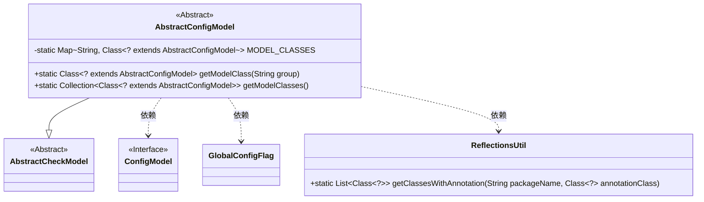
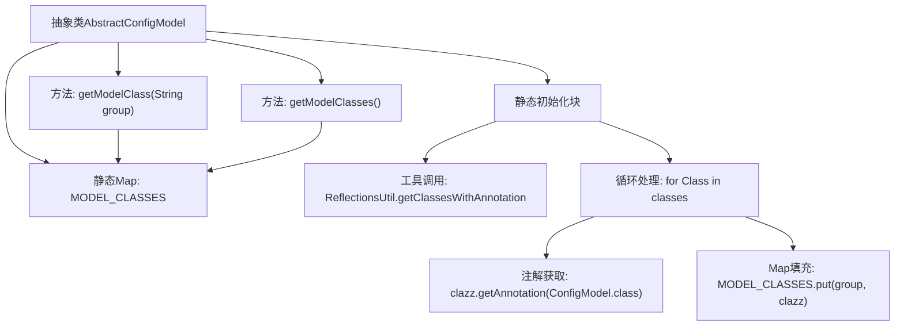

# 基础信息

|      |      |
|------|------|
| 名称 | AbstractConfigModel |
| 编码语言 | .java |
| 代码路径 | WeFe/common/java/common-wefe/src/main/java/com/welab/wefe/common/wefe/dto/global_config/base/AbstractConfigModel.java |
| 包名 | com.welab.wefe.common.wefe.dto.global_config.base |
| 依赖项 | ['com.welab.wefe.common.fieldvalidate.AbstractCheckModel', 'com.welab.wefe.common.util.ReflectionsUtil', 'com.welab.wefe.common.wefe.dto.global_config.GlobalConfigFlag', 'java.util.Collection', 'java.util.HashMap', 'java.util.List', 'java.util.Map'] |
| 概述说明 | 抽象类AbstractConfigModel继承AbstractCheckModel，通过反射收集带ConfigModel注解的类并存入静态Map，提供按组名或全部获取模型类的方法。 |

# 说明

这是一个抽象配置模型基类AbstractConfigModel，继承自AbstractCheckModel。它通过静态代码块使用反射机制扫描带有ConfigModel注解的类，并按注解中的group分组存储到静态Map MODEL_CLASSES中。提供了两个静态方法：getModelClass根据group获取对应配置类，getModelClasses获取所有配置类集合。该类实现了配置模型的集中管理和按需获取功能。

# 类列表 Class Summary

| 名称   | 类型  | 说明 |
|-------|------|-------------|
| AbstractConfigModel | class | 抽象类AbstractConfigModel继承AbstractCheckModel，通过反射收集带ConfigModel注解的类并存入静态Map，提供按组名或全部获取模型类的方法。 |

## 类 AbstractConfigModel

|      |      |
|------|------|
| 访问范围 | public abstract |
| 类型 | class |
| 名称 | AbstractConfigModel |
| 说明 | 抽象类AbstractConfigModel继承AbstractCheckModel，通过反射收集带ConfigModel注解的类并存入静态Map，提供按组名或全部获取模型类的方法。 |

### UML类图

类图描述：
该图展示了AbstractConfigModel抽象类继承自AbstractCheckModel，并通过静态初始化块使用ReflectionsUtil工具类扫描带有ConfigModel注解的类。AbstractConfigModel维护了一个MODEL_CLASSES静态映射表，存储配置组名与对应模型类的映射关系，提供getModelClass和getModelClasses方法获取配置模型类。GlobalConfigFlag用于限定扫描包范围，ConfigModel作为注解接口标记配置模型类。

### 内部方法调用关系图

该流程图展示了AbstractConfigModel类的核心结构和工作流程。静态初始化块通过反射工具获取带有ConfigModel注解的类，并按照注解分组存储到MODEL_CLASSES映射中。类提供两个静态方法：getModelClass通过分组名获取对应配置类，getModelClasses返回所有配置类集合。整个过程实现了基于注解的配置类自动发现和分类管理机制，为后续动态加载配置提供基础支持。

### 字段列表 Field List

| 名称  | 类型  | 说明 |
|-------|-------|------|
| MODEL_CLASSES | Map<String, Class<? extends AbstractConfigModel>> | 私有静态映射，键为字符串，值为AbstractConfigModel的子类类型。 |

### 方法列表

| 名称  | 类型  | 说明 |
|-------|-------|------|
| getModelClass | Class<? extends AbstractConfigModel> | 获取指定分组对应的配置模型类。 |
| getModelClasses | Collection<Class<? extends AbstractConfigModel>> | 获取配置模型类的集合，返回存储的模型类列表。 |

